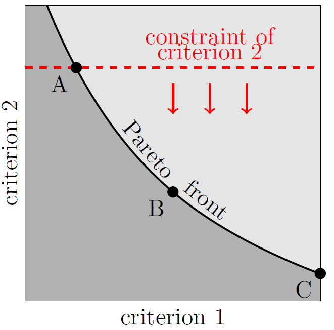

Multi-Objective Optimization
****************************

Constraint Costs
================

The multi-objective optimization approach considered in the SESMG may include up to three optimization criteria:

- The **primary optimization criterion** corresponds to the the `investment costs <https://spreadsheet-energy-system-model-generator.readthedocs.io/en/latest/01.01.00_structure_of_energy_systems.html#investment>`_ of an energy system. Beside financial costs any other linearly scalable target value can be applied (e.g., ghg emissions).

- The optional **secondary optimization criterion** can be used to define allowed limits for a second target value. The values of the secondary optimization criterion are referred to as "constraint costs" and can also stand for any linear scalable quantity.

- With the optional "tertiary optimization criterion", a minimum required reduction of the final energy demand through insulation measures can be defined.

Criterion Switch
================

By using the criterion-switch function the primary optimization criterion and secondary optimization criterion are switched for the entire model definition. In this way, scenarios optimized according to different target values can be compared with each other. The tertiary optimization criterion is not affected by the criterion switch function.

Pareto-Optimization
=================================

By using the Pareto-optimization, the epsilon-constraint-optimization method is applied to vary the weighting the of the applied optimization criteria are varied. The tertiary optimization criterion is not affected automatically, but can, however, be manually adapted by the user.

In this multi-objective approach, at first, the boundary scenarios of the solution space are determined, by identifying those scenarios, which allow the (i) minimization of the primary optimization criterion and (ii) minimization of the secondary optimization criterion. Then, starting from scenario (i), the allowed value of the secondary optimization criterion is step wise decreased until scenario (ii) is reached. The intervals at which the limit value is reduced can be defined by the user. If we combine the scenarios, we obtain a Pareto front of optimal scenarios according to different weights of the criteria.

   Epsilon Constraint Method [1]

[1] Klemm, Christian & Wiese, Frauke (2022): "**Indicators for the optimization of sustainable urban energy systems based on energy system modeling**", *Energy, Sustainability and Society*, 12(1), 1-20, `https://doi.org/10.1186/s13705-021-00323-3 <https://doi.org/10.1186/s13705-021-00323-3>`_.
