Installation
************

Windows
=======

1. Install Python (3.7, 3.8 or 3.9)
Windows users can finde the versions here: `Python download page for windows <https://www.python.org/downloads/windows/>`_

.. note:: 

	Make sure to use the installer referring to your windows version (e.g. "Windows x86-64 executable installer" for windows 64-bit version). You can check the build in bit version following `these steps <https://support.microsoft.com/en-us/windows/32-bit-and-64-bit-windows-frequently-asked-questions-c6ca9541-8dce-4d48-0415-94a3faa2e13d>`_.

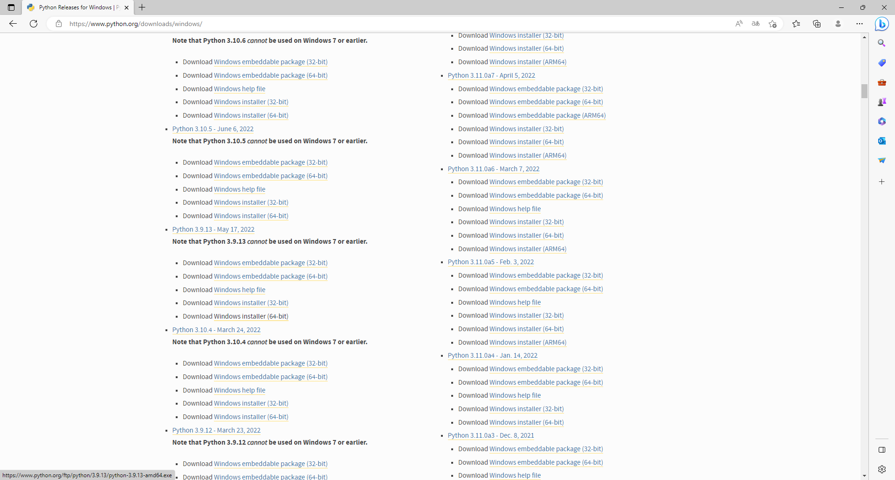
   

.. note:: 

	Make sure to select "Add pyton to PATH" at the beginning of the Python installation.

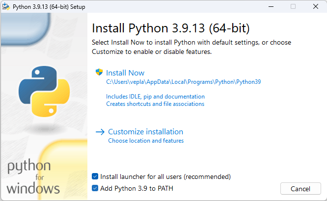
   

2. Download the Spreadsheet Energy System Model Generator from `GitHub <https://github.com/SESMG/SESMG>`_ as .zip folder and extract the .zip folder into any directory on the computer.

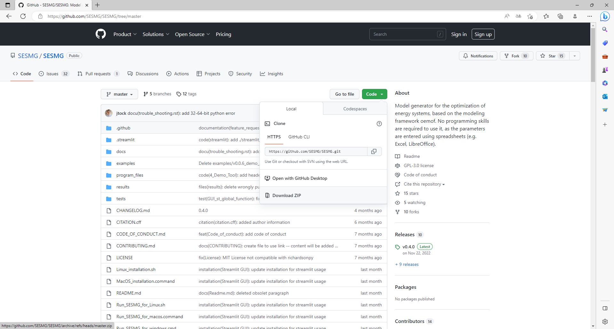

3. Download Graphiz here: `Graphiz download <https://graphviz.org/download/>`_

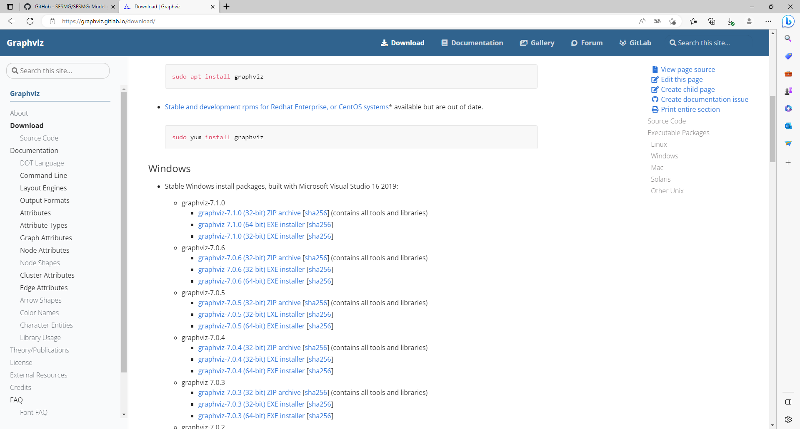

.. note:: 

	Make sure to select "Add Graphiz to system path for all users" at the beginning of the installation, otherwise you can use the default settings.

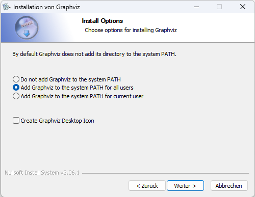
   

4. Download cbc solver here: `cbc solver for windows <https://www.coin-or.org/download/binary/Cbc/>`_. Alternatively you can uses the `direct download link <https://www.coin-or.org/download/binary/Cbc/Cbc-2.10-win64-msvc16-mdd.zip>`_

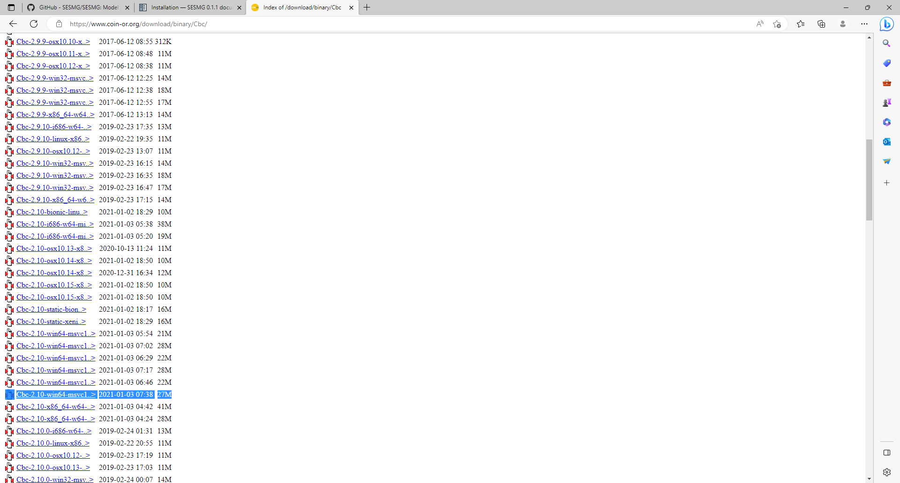
   

.. note:: 

	Extract the .zip file and copy the cbc solver (go to the bin-folder and use the cbc.exe) into the SESMG directory.

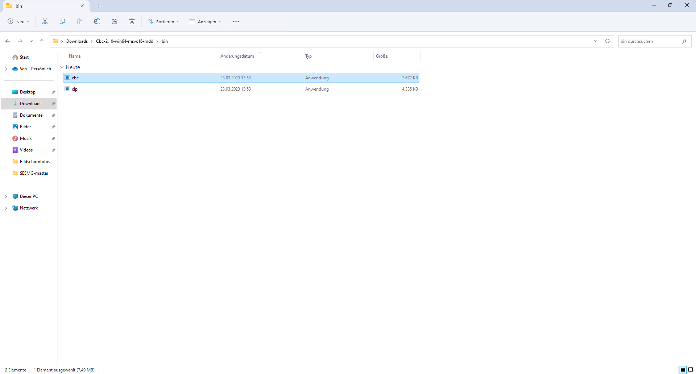
   
The gurobi solver may be used as **alternative** to the cbc-solver. Be aware, that the gurobi-solver is not open-source and a license is required. However, the gurobi may be faster for certain types of optimization problems, especially for those containing binary decisions. The installation procedure of the gurobi solver is described in detail here: https://www.gurobi.com/documentation/quickstart.html

5. Execute the windows_installation.cmd and add your python version (this may take several minutes).

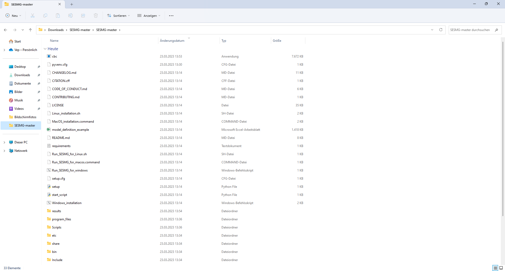
   
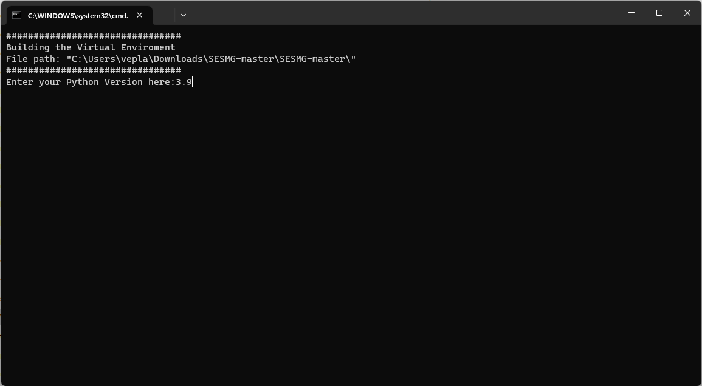

6. Have fun with the SESMG.

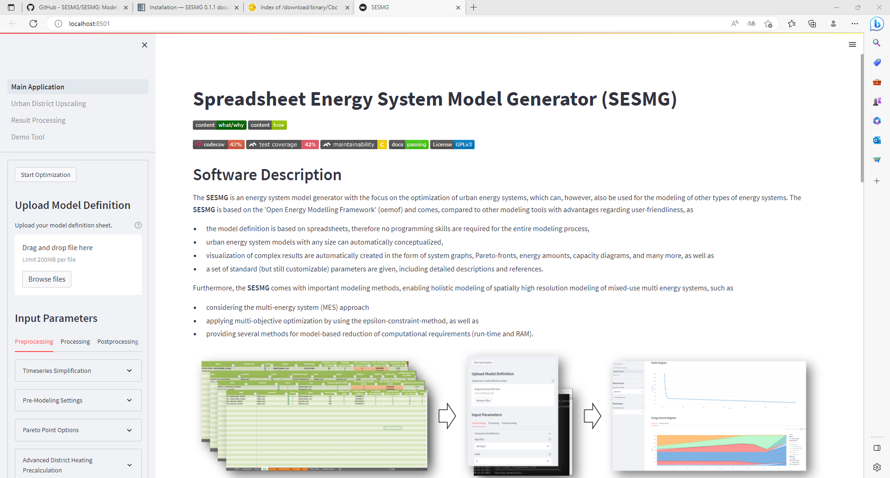

.. note:: 

	If you receive a "Your computer has been protected by Windows" error message, click "More Information," and then "Run Anyway".

MacOS
=====

.. note:: 

	We recommend installing the SESMG as an admin or user with admin rights.

1. Install Python (version 3.7, 3.8 or 3.9) 

Go to the `Python download page for macOS <https://www.python.org/downloads/macos/>`_ and download an installer.

.. note:: 

	Make sure to use the installer referring to your chip (Intel-only or universal2) version (e.g. "macOS 64-bit universal2 installer" for mac with Apple M1 / M2). You can check the kind of buil in chip by opening the "About this Mac" option behind the apple icon in the above left corner.

   
Execute the installer on your computer.

.. note:: 

	Make sure to select "Add pyton to PATH" at the beginning of the Python installation.
	

2. Download the Spreadsheet Energy System Model Generator from `GitHub <https://github.com/SESMG/SESMG>`_ as .zip folder and extract the .zip folder into any directory on the computer.

.. note:: 

	If your device does not have homebrew installed, install it by typing ``/bin/bash -c "$(curl -fsSL https://raw.githubusercontent.com/Homebrew/install/HEAD/install.sh)"`` in your terminal.
	
.. note:: 

	Homebrew requires Xcode command line tools for macOS. Check if you already have it installed by using ``xcode-select --help``. If no error occures it is already installed. Otherwise run ``xcode-select --install`` in your terminal.
	
.. note:: 

	For Apple CPU M1/M2: Make sure to follow the instrutions while installing homebrew. If there is a message to run two lines of code: do so and run them separately in your terminal. Look for: ``(echo; echo 'eval "$(/opt/homebrew/bin/brew shellenv)"') >> /Users/YOURUSERNAME/.zprofile`` and eval "$(/opt/homebrew/bin/brew shellenv)"`` with your username. Do not run those lines if not requested.
	
3. Excecute the "MacOS_installation.command" file and enter your python version to the terminal.

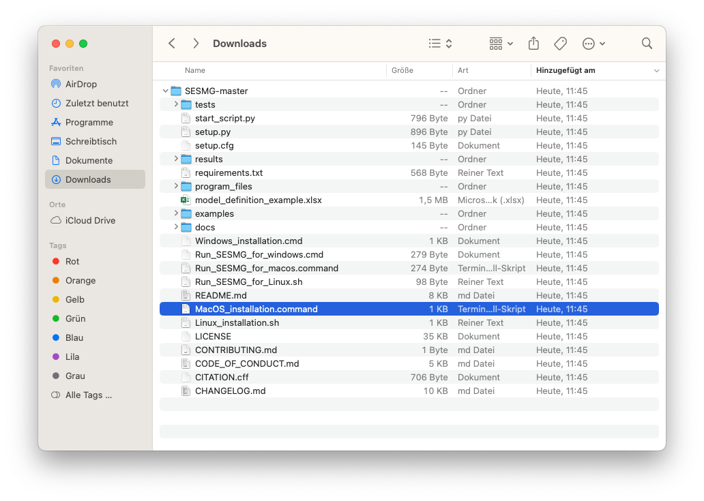
   
   .. note:: 

	You have to confirm the file run in your mac's security settings to be able to run it. Confirm with 'Open Anyway'.

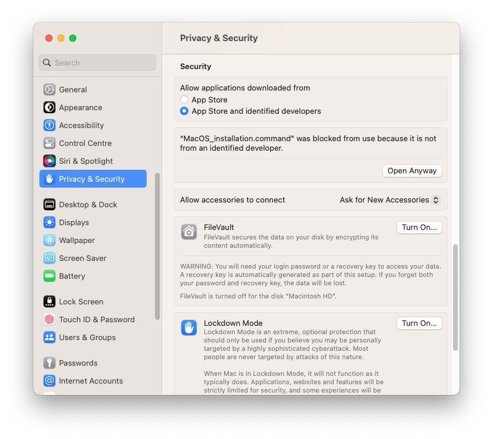
   

Enter your python version.
   
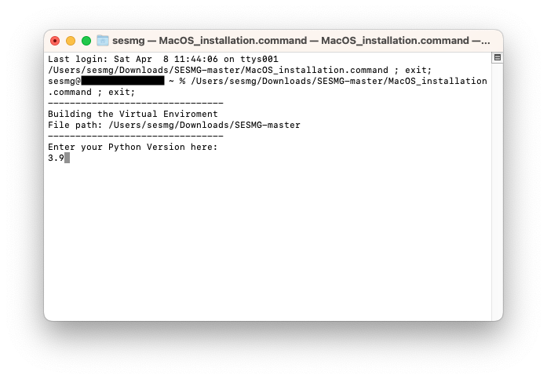

   
.. note::

	During this step, the cbc solver was automatically installed. The gurobi solver may be used as **alternative** to the cbc solver. Be aware, that the gurobi-solver is not open-source and a license is required. However, the gurobi may be faster for certain types of optimization problems, especially for those containing binary decisions. The installation procedure of the gurobi solver is described in detail here: https://www.gurobi.com/documentation/quickstart.html

4. The Spreadsheet Energy System Model Generator has been installed. Have fun with the SESMG.

.. note::

	When running the SESMG for the first time using the Run_SESMG_for_macos.command file you may need to conform again, as described above, in the security settings.

Linux 
=====

1. Install Python (version 3.7, 3.8 or 3.9)

- go to `<https://phoenixnap.com/kb/how-to-install-python-3-ubuntu/>`_

1.1 Make sure a Python 3 Version is installed:

``$ python3 --version``
	 
2. Download the Spreadsheet Energy System Model Generator from `GitHub <https://github.com/SESMG/SESMG>`_ as .zip folder and extract the .zip folder into any directory on the computer.

   
.. note::
	
	If no packages have ever been installed on the computer using apt-get, ``sudo apt-get update`` must be executed first.

3. Install pip: 

``$ sudo apt-get install python3-pip``
	
4. Install Graphviz:

``$ sudo apt-get install graphviz``
	
5. Install the CBC Solver: 

``$ sudo apt-get install coinor-cbc``

6. Install the libpq-dev to avoid a psycopg2 error:

``$ sudo apt-get install libpq-dev``

The gurobi solver may be used as **alternative** to the cbc solver. Be aware, that the gurobi-solver is not open-source and a license is required. However, the gurobi may be faster for certain types of optimization problems, especially for those containing binary decisions. The installation procedure of the gurobi solver is described in detail here: https://www.gurobi.com/documentation/quickstart.html
	
7. Execute the "Linux_installtion.sh" file. By first navigating to the path of the SESMG directory and then running the following:

``$ sudo sh Linux_installation.sh``

8. The Spreadsheet Energy System Model Generator has been installed. Open a browser and open up: ``localhost:8501``.

