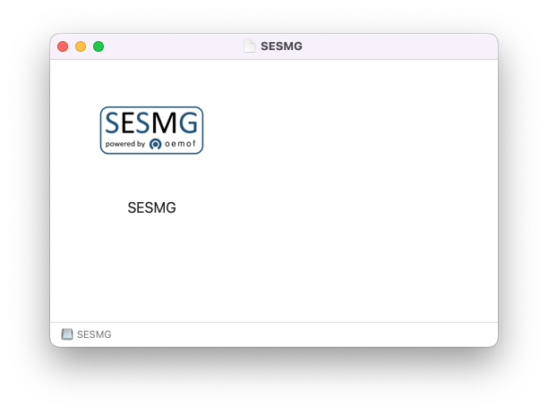
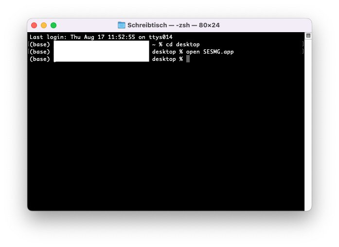

Installation
************

There are two possible ways to install the SESMG application. It can chosen 
between the installation as an independent **application**, which is appropriate 
for common users, and an installation for advanced users or developers. We 
recommend the installation as an independent application for the beginning. 
You can easily switch later on.

We recommend the **extended installation** which will create the SESMG with its
folder structure on your machine allowing you to work on it or adjust settings. 
You can follow the `extended installation instructions <https://spreadsheet-energy-system-model-generator.readthedocs.io/en/latest/02.01.00_installation.html#extended-installation>`_ 
below. If you have programming experience and want to set your own virtual 
environment (e. g. allowing the usage of Anaconda enviroments) you can follow 
`advanced installation instructions <https://spreadsheet-energy-system-model-generator.readthedocs.io/en/latest/02.01.00_installation.html#advanced-installation>`_. 

SESMG as Application
====================

Windows
-------

1. Installing Python (3.8 or 3.9)
Windows users can download the preferred version here: `Python download page for windows <https://www.python.org/downloads/windows/>`_.

.. note:: 

	Make sure to use the installer referring to your windows version (e.g. 
	"Windows x86-64 executable installer" for windows 64-bit version). You can 
	check the build in bit version following `these steps <https://support.microsoft.com/en-us/windows/32-bit-and-64-bit-windows-frequently-asked-questions-c6ca9541-8dce-4d48-0415-94a3faa2e13d>`_.
	
.. note:: 

	The SESMG is not compatible with the python version 3.9.7, due to a 
	confliciting bug in this version to the subpackage streamlit. You need to 
	install another pyhton version or update to another python version e. g. 
	3.9.13, which is widely tested.

.. figure:: images/manual/Installation/sesmg_installation_ms_1.png
   :width: 40 %
   :align: center
   
.. note:: 

	Make sure to select "Add python to PATH" at the beginning of the Python installation.

.. figure:: images/manual/Installation/sesmg_installation_ms_2.png
   :width: 40 %
   :align: center

2. Installing Graphiz
You kann download Graphiz here: `Graphiz download <https://graphviz.org/download/>`_. Restart your computer after succesfully installing graphviz.

.. figure:: images/manual/Installation/sesmg_installation_ms_4.png
   :width: 40 %
   :align: center

.. note:: 

	Make sure to select "Add Graphiz to system path for all users" at the 
	beginning of the installation, otherwise you can use the default settings.

.. note:: 

	Make sure to restart your computer before proceeding with the next steps.

.. figure:: images/manual/Installation/sesmg_installation_ms_5.png
   :width: 40 %
   :align: center

3. Installing a solver

3a. The free and open-source CBC-solver is recommended for new users and users which are not facing any run-time issues. To use the solver, the following steps must be carried out:

	- if not already existing, create a folder called "SESMG" in the following directory: "/users/<your username>/documents/"
	- download the most recent CBC-version for your operating system: `cbc solver for windows <https://www.coin-or.org/download/binary/Cbc/>`_. Alternatively you can uses the `direct download link 		  <https://www.coin-or.org/download/binary/Cbc/Cbc-2.10-win64-msvc16-mdd.zip>`_
	- unzip the downloaded folder
	- copy the "cbc.exe" (stored in the "bin" directory of the unziped folder) file into the following directory: "/users/<your username>/documents/SESMG"

3b. The gurobi-solver may be used as an **alternative** to the CBC-solver. Be 
aware, that the gurobi-solver is not open-source and a license is required. 
However, the gurobi-solver may be faster for certain types of optimization problems, 
especially for those containing binary decisions. The installation procedure of 
the gurobi-solver is described in detail `here <https://www.gurobi.com/documentation/quickstart.html>`_.  

4. Installing the SESMG application
The latest released SESMG version can be accessed here: `SESMG releases on Github <https://github.com/SESMG/SESMG/releases/latest/>`_. 
Download the SESMG.exe and place it in a directory of your choice. Open the SESMG application by running SESMG.exe. The starting process usually takes a few minutes.

.. tip::

	With the first use you may have to confirm in windows-defender or other protection software that the SESMG is trustworthy. 
	The exact warning message may differ depending on the system language and anti-virus software.

.. tip::

	While the SESMG is starting, a message like "the website is not available" may appear. Wait a moment and press "reload". If necessary, repeat this step. 
	The exact warning message may differ depending on the system language and applied browser.

	
.. note:: 

	The application will create a SESMG directory when starting the first model 
	run. By default it will be created in the /user/documents/ directory as 
	/SESMG.

MacOS
-----

1. Installing Python (3.8 or 3.9) 
Mac users can download the installer for the preferred version here: `Python download page for MacOS <https://www.python.org/downloads/macos/>`_. 
Execute the installer on your computer.

.. note:: 

	Make sure to use the installer referring to your chip (Intel-only or 
	universal2) version (e.g. "macOS 64-bit universal2 installer" for mac with 
	Apple M1 / M2). You can check the kind of build in chip by opening the 
	"About this Mac" options.
	
.. note:: 

	The SESMG is not compatible with the python version 3.9.7, due to a 
	confliciting bug in this version to the subpackage streamlit. You need to 
	install another pyhton version or update to another python version e. g. 
	3.9.13, which is widely tested.

.. figure:: images/manual/Installation/sesmg_installation_ms_1.png
   :width: 40 %
   :align: center

.. note:: 

	Make sure to select "Add python to PATH" at the beginning of the Python installation.

2. Installing Graphiz
You kann download Graphiz here: `Graphiz download <https://graphviz.org/download/>`_

.. figure:: images/manual/Installation/sesmg_installation_ms_4.png
   :width: 40 %
   :align: center

3. Installing a solver
You can download the free and open-source CBC-solver here: `cbc solver for MacOS <https://www.coin-or.org/download/binary/Cbc/>`_. 
Alternatively you can use Homebrew to install the CBC-solver by following `the instructions from Brew <https://formulae.brew.sh/formula/cbc/>`_.

The gurobi-solver may be used as an **alternative** to the CBC-solver. Be 
aware, that the gurobi-solver is not open-source and a license is required. 
However, the gurobi-solver may be faster for certain types of optimization problems, 
especially for those containing binary decisions. The installation procedure 
of the gurobi-solver is described in detail `here <https://www.gurobi.com/documentation/quickstart.html>`_.  

4. Installing the SESMG application
You will find the latest released SESMG version here: `SESMG releases on Github <https://github.com/SESMG/SESMG/releases/latest/>`_. 
Download the SESMG.dmg, open it and place the application in a directory of 
your choice. You can change the directory afterwards. 

Due to a bug in a subpackage it is not possible yet to open the SESMG as commum 
by double-clicking it. You need to use the terminal to open the application. 
Navitage to the directory by using the command inputs (e. g. cd) or right-click 
the folder in which the application is placed (e. g. "desktop") and choose 
"new terminal at the folder". Type in the command ``open SESMG.app``.

   
.. note:: 

	You have to confirm the file run in your mac's security settings to be able 
	to run it. Confirm with 'Open Anyway'.

.. figure:: images/manual/Installation/sesmg_installation_mac_3.png
   :width: 40 %
   :align: center

Be aware that it can take several minutes and will be running withouth any 
loading or progress screen. Check your taskmanager to be sure the process 
startet by looking for SESMG.

.. warning::

    A known issue for macOS is that the programm does not close when you close 
    the app. To kill all processes you need to use your taskmanager and stop 
    the "SESMG"-processes manually. Make sure to kill it after each session. 
    Otherwise you will not be able to reopen it by using the way described 
    above. 
    The problem is caused by a subpackage. We are working on a better 
    solution! 

.. note:: 

	The application will create a SESMG directory when starting the first 
	model run. By default it will be created in the /user/documents/ directory 
	as /SESMG.

Linux
-----

1. Installing Python (3.8 or 3.9)

- go to `<https://phoenixnap.com/kb/how-to-install-python-3-ubuntu/>`_

Check your Version with ``$ python3 --version``.

.. note:: 

	The SESMG is not compatible with the python version 3.9.7, due to a 
	confliciting bug in this version to the subpackage streamlit. You need to 
	install another pyhton version or update to another python version e. g. 
	3.9.13, which is widely tested.
	
2. Installing Graphviz:

.. note::
	
	If no packages have ever been installed on the computer using apt-get, 
	``sudo apt-get update`` must be executed first.

``$ sudo apt-get install graphviz``
	
3. Installing the CBC-solver: 

``$ sudo apt-get install coinor-cbc``

The gurobi-solver may be used as **alternative** to the CBC-solver. Be aware, 
that the gurobi-solver is not open-source and a license is required. However, 
the gurobi-solver may be faster for certain types of optimization problems, especially 
for those containing binary decisions. The installation procedure of the 
gurobi-solver is described in detail `here <https://www.gurobi.com/documentation/quickstart.html>`_.  

4. Installing the libpq-dev to avoid a psycopg2 error:

``$ sudo apt-get install libpq-dev``

5. Installing the SESMG application
You will find the latest released SESMG version here: `SESMG releases on Github <https://github.com/SESMG/SESMG/releases/latest/>`_. 
Download the SESMG.deb and place it in a directory of your choice. You can 
change the directory afterwards. Open the SESMG application by running the 
executable file as commum. Be aware that it can take several minutes and will 
be running withouth any loading or progress screen. Check your taskmanager to 
be sure the process startet by looking for SESMG.

.. note:: 

	The application will create a SESMG directory when starting the first 
	model run. By default it will be created in the /user/documents/ directory 
	as /SESMG.

Extended Installation
=====================

Windows
-----

1. Installing Python (3.7, 3.8 or 3.9)
Windows users can find the versions here: `Python download page for windows <https://www.python.org/downloads/windows/>`_

.. note:: 

	Make sure to use the installer referring to your windows version (e.g. 
	"Windows x86-64 executable installer" for windows 64-bit version). You can 
	check the build in bit version following `these steps <https://support.microsoft.com/en-us/windows/32-bit-and-64-bit-windows-frequently-asked-questions-c6ca9541-8dce-4d48-0415-94a3faa2e13d>`_.
	
.. note:: 

	The SESMG is not compatible with the python version 3.9.7, due to a 
	confliciting bug in this version to the subpackage streamlit. You need 
	do install another pyhton version or update to another python version e. g. 
	3.9.13, which is widely tested.

.. figure:: images/manual/Installation/sesmg_installation_ms_1.png
   :width: 40 %
   :align: center
   
.. note:: 

	Make sure to select "Add python to PATH" at the beginning of the Python installation.

.. figure:: images/manual/Installation/sesmg_installation_ms_2.png
   :width: 40 %
   :align: center

2. Downloading the SESMG
Download the Spreadsheet Energy System Model Generator from `GitHub <https://github.com/SESMG/SESMG>`_ 
as .zip folder and extract the .zip folder into any directory on the computer.

.. figure:: images/manual/Installation/sesmg_installation_ms_3.png
   :width: 40 %
   :align: center

3. Installing Graphiz here: `Graphiz download <https://graphviz.org/download/>`_

.. figure:: images/manual/Installation/sesmg_installation_ms_4.png
   :width: 40 %
   :align: center

.. note:: 

	Make sure to select "Add Graphiz to system path for all users" at the 
	beginning of the installation, otherwise you can use the default settings.

.. figure:: images/manual/Installation/sesmg_installation_ms_5.png
   :width: 40 %
   :align: center
   

4. Installing the CBC-solver here: `CBC-solver for windows <https://www.coin-or.org/download/binary/Cbc/>`_. 
Alternatively you can uses the `direct download link <https://www.coin-or.org/download/binary/Cbc/Cbc-2.10-win64-msvc16-mdd.zip>`_

.. figure:: images/manual/Installation/sesmg_installation_ms_6.png
   :width: 40 %
   :align: center
   
.. note:: 

	Extract the .zip file and copy the CBC-solver (go to the bin-folder and 
	use the cbc.exe) into the SESMG directory.

.. figure:: images/manual/Installation/sesmg_installation_ms_7.png
   :width: 40 %
   :align: center
   
The gurobi-solver may be used as **alternative** to the CBC-solver. Be aware, 
that the gurobi-solver is not open-source and a license is required. However, 
the gurobi-solver may be faster for certain types of optimization problems, especially 
for those containing binary decisions. The installation procedure of the 
gurobi-solver is described in detail `here <https://www.gurobi.com/documentation/quickstart.html>`_.  

5. Installing the SESMG
Execute the windows_installation.cmd and add your python version (this may take 
several minutes).

.. figure:: images/manual/Installation/sesmg_installation_ms_8.png
   :width: 40 %
   :align: center

Enter your python version.

.. note:: 

	Please type in your python version in the major.minor format, which means 
	to give 3.X if you have the version 3.X.YY. E.g. 3.9 if you have the python 
	version 3.9.13. 

.. figure:: images/manual/Installation/sesmg_installation_ms_9.png
   :width: 40 %
   :align: center

.. note:: 

	There appears a warning after the installation process about the packages 
	osmx and cartopy. The installation was successful, the SESMG will run 
	normally and you can ignore this warning. Also see 
	`warning-001 troubeshooting <https://spreadsheet-energy-system-model-generator.readthedocs.io/en/latest/03.00.00_trouble_shooting.html#warning-w-001-need-to-install-cartopy>`_.

6. Have fun with the SESMG.

.. figure:: images/manual/Installation/sesmg_installation_ms_10.png
   :width: 40 %
   :align: center

.. note:: 

	If you receive a "Your computer has been protected by Windows" error 
	message, click "More Information," and then "Run Anyway".
	
.. note:: 

	The application will create a SESMG directory when starting the first 
	model run. By default it will be created in the /user/documents/ directory 
	as /SESMG. You can change the folder structure by adjusting the 
	GUI_st_settings.json file which you will find in the /program_files/GUI_st/ 
	directory. You can change the directory by adding the preferred path to the 
	GUI_st_settings.json. Make sure that each subdirectory is defined as its own 
	list entry by following the given layout.

MacOS
-----

.. note:: 

	We recommended installing the SESMG as an admin or user with admin rights.

1. Installing Python (3.7, 3.8 or 3.9) 

Go to the `Python download page for macOS <https://www.python.org/downloads/macos/>`_ 
and download an installer.

.. note:: 

	Make sure to use the installer referring to your chip (Intel-only or 
	universal2) version (e.g. "macOS 64-bit universal2 installer" for mac 
	with Apple M1 / M2). You can check the kind of buil in chip by opening the 
	"About this Mac" option behind the apple icon in the above left corner.
	
.. note:: 

	The SESMG is not compatible with the python version 3.9.7, due to a 
	confliciting bug in this version to the subpackage streamlit. You need to 
	install another pyhton version or update to another python version e. g. 
	3.9.13, which is widely tested.

.. figure:: images/manual/Installation/sesmg_installation_ms_1.png
   :width: 40 %
   :align: center
   
Execute the installer on your computer.

.. note:: 

	Make sure to select "Add python to PATH" at the beginning of the Python installation.
	
2. Downloading the SESMG
Download the Spreadsheet Energy System Model Generator from `GitHub <https://github.com/SESMG/SESMG>`_ 
as .zip folder and extract the .zip folder into any directory on the computer.

.. figure:: images/manual/Installation/sesmg_installation_ms_3.png
   :width: 40 %
   :align: center

.. note:: 

	If your device does not have homebrew installed, install it by typing 
	``/bin/bash -c "$(curl -fsSL https://raw.githubusercontent.com/Homebrew/install/HEAD/install.sh)"`` 
	in your terminal.
	
.. note:: 

	Homebrew requires Xcode command line tools for macOS. Check if you already 
	have it installed by using ``xcode-select --help``. If no error occures it 
	is already installed. Otherwise run ``xcode-select --install`` in your terminal.
	
.. note:: 

	For Apple CPU M1/M2: Make sure to follow the instrutions while installing 
	homebrew. If there is a message to run two lines of code: do so and run them 
	separately in your terminal. Look for: ``(echo; echo 'eval "$(/opt/homebrew/bin/brew shellenv)"') >> /Users/YOURUSERNAME/.zprofile`` 
	and eval ``$(/opt/homebrew/bin/brew shellenv)`` with your username. Do 
	not run those lines if not requested.
	
3. Installing the SESMG 
Excecute the "MacOS_installation.command" file and enter your python version
to the terminal.

.. figure:: images/manual/Installation/sesmg_installation_mac_1.png
   :width: 40 %
   :align: center
   
.. note:: 

	You have to confirm the file run in your mac's security settings to be able 
	to run it. Confirm with 'Open Anyway'.

.. figure:: images/manual/Installation/sesmg_installation_mac_3.png
   :width: 40 %
   :align: center

.. note:: 

	Please type in your python version in the major.minor format, which means to 
	give 3.X if you have the version 3.X.YY. E.g. 3.9 if you have the python 
	version 3.9.13. 
   
.. figure:: images/manual/Installation/sesmg_installation_mac_2.png
   :width: 40 %
   :align: center

.. note:: 

	There appears a warning after the installation process about the packages 
	osmx and cartopy. The installation was successful, the SESMG will run normally 
	and you can ignore this warning. Also see `warning-001 troubeshooting <https://spreadsheet-energy-system-model-generator.readthedocs.io/en/latest/03.00.00_trouble_shooting.html#warning-w-001-need-to-install-cartopy>`_.

.. note::

	During this step, the CBC-solver was automatically installed. The 
	gurobi-solver may be used as **alternative** to the cbc solver. Be 
	aware, that the gurobi-solver is not open-source and a license is required. 
	However, the gurobi-solver may be faster for certain types of optimization problems, 
	especially for those containing binary decisions. The installation procedure 
	of the gurobi-solver is described in detail `here <https://www.gurobi.com/documentation/quickstart.html>`_.  

4. Have fun with the SESMG.
The Spreadsheet Energy System Model Generator has been installed. 

.. figure:: images/manual/Installation/sesmg_installation_ms_10.png
   :width: 40 %
   :align: center

.. note::

	When running the SESMG for the first time using the Run_SESMG_for_macos.command 
	file you may need to confirm again, as described above, in the security settings.

.. note:: 

	The application will create a SESMG directory when starting the first 
	model run. By default it will be created in the /user/documents/ directory 
	as /SESMG. You can change the folder structure by adjusting the 
	GUI_st_settings.json file which you will find in the /program_files/GUI_st/ 
	directory. You can change the directory by adding the preferred path to the 
	GUI_st_settings.json. Make sure that each subdirectory is defined as its own 
	list entry by following the given layout.

Linux 
-----

1. Installing Python (3.7, 3.8 or 3.9)

- go to `<https://phoenixnap.com/kb/how-to-install-python-3-ubuntu/>`_

Check your version with ``$ python3 --version``.

.. note:: 

	The SESMG is not compatible with the python version 3.9.7, due to a 
	confliciting bug in this version to the subpackage streamlit. You need to 
	install another pyhton version or update to another python version e. g. 
	3.9.13, which is widely tested.
	 
2. Downloading the SESMG
Download the Spreadsheet Energy System Model Generator from `GitHub <https://github.com/SESMG/SESMG>`_ 
as .zip folder and extract the .zip folder into any directory on the computer.

.. figure:: images/manual/Installation/sesmg_installation_ms_3.png
   :width: 40 %
   :align: center
   
.. note::
	
	If no packages have ever been installed on the computer using apt-get, 
	``sudo apt-get update`` must be executed first.

3. Install pip: 
Installing
``$ sudo apt-get install python3-pip``
	
4. Installing Graphviz:

``$ sudo apt-get install graphviz``
	
5. Installing the CBC-solver: 

``$ sudo apt-get install coinor-cbc``

6. Installing the libpq-dev to avoid a psycopg2 error:

``$ sudo apt-get install libpq-dev``

The gurobi-solver may be used as **alternative** to the CBC-solver. Be aware, 
that the gurobi-solver is not open-source and a license is required. However, 
the gurobi-solver may be faster for certain types of optimization problems, 
especially for those containing binary decisions. The installation procedure of 
the gurobi-solver is described in detail `here <https://www.gurobi.com/documentation/quickstart.html>`_.  
	
7. Installing the SESMG
Execute the "Linux_installation.sh" file. By first navigating to the path of 
the SESMG directory and then running the following:

``$ sudo sh Linux_installation.sh``

Enter your python version.

.. note:: 

	Please type in your python version in the major.minor format, which means 
	to give 3.X if you have the version 3.X.YY. E.g. 3.9 if you have the python 
	version 3.9.13. 

.. note:: 

	There appears a warning after the installation process about the packages 
	osmx and cartopy. The installation was successful, the SESMG will run 
	normally and you can ignore this warning. Also see 
	`warning-001 troubeshooting <https://spreadsheet-energy-system-model-generator.readthedocs.io/en/latest/03.00.00_trouble_shooting.html#warning-w-001-need-to-install-cartopy>`_.

8. Running the SESMG 
The Spreadsheet Energy System Model Generator has been installed. Open 
``localhost:8501`` in a browser.

.. note:: 

	The application will create a SESMG directory when starting the first 
	model run. By default it will be created in the /user/documents/ directory 
	as /SESMG. You can change the folder structure by adjusting the 
	GUI_st_settings.json file which you will find in the /program_files/GUI_st/ 
	directory. You can change the directory by adding the preferred path to the 
	GUI_st_settings.json. Make sure that each subdirectory is defined as its own 
	list entry by following the given layout.

Advanced 
-----

1. Download the SESMG by using ``git clone https://github.com/SESMG/SESMG.git`` 
OR by downloading it manually from the `SESMG Github repository <https://github.com/SESMG/SESMG/>`_.

2. Create a virtual environment of your choice for the SESMG folder

3. Install the following packages within the virual environment: coincbc, 
graphviz, geos (MacOS only), postgresql (MacOS only), fiona (Windows only), 
gdal (Windows, only)

.. note::
    
    The gurobi-solver may be used as **alternative** to the CBC-solver. Be aware, 
    that the gurobi-solver is not open-source and a license is required. However, 
    the gurobi-solver may be faster for certain types of optimization problems, 
    especially for those containing binary decisions. The installation procedure of 
    the gurobi-solver is described in detail `here <https://www.gurobi.com/documentation/quickstart.html>`_.  

4. Use ``pip install -r requirements.txt`` to install the required sub-packages 
in the virtual environment

5. Start the SESMG by executing start_script.py

.. note:: 

	The application will create a SESMG directory when starting the first 
	model run. By default it will be created in the /user/documents/ directory 
	as /SESMG. You can change the folder structure by adjusting the 
	GUI_st_settings.json file which you will find in the /program_files/GUI_st/ 
	directory. You can change the directory by adding the preferred path to the 
	GUI_st_settings.json. Make sure that each subdirectory is defined as its own 
	list entry by following the given layout.

