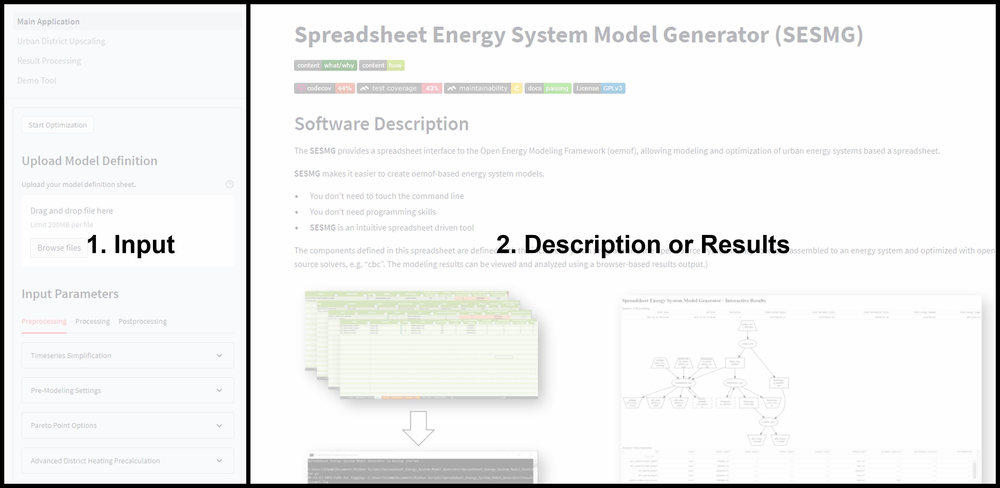
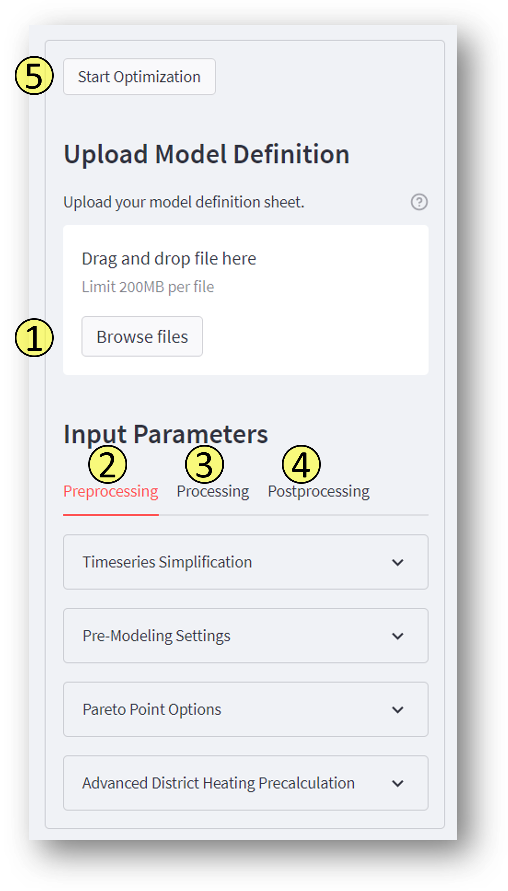
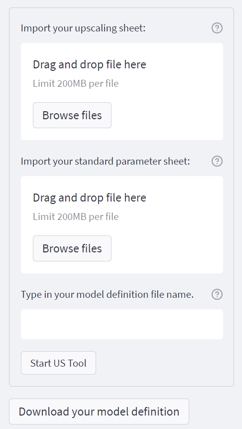

Interface (TK-INTER)
--------------------

1. Fill in the spreadsheet document according to the instructions in the "Scenario Spreadsheet" chapter.

2. Execute the Run_SESMG_for_**your operating System** file in the main folder.

.. note:: 

	If you receive a "Your computer has been protected by Windows" error message or a similiar one, click "More Information," and then "Run Anyway" (or your operating system specific way to run the programm anyway).

.. figure:: ../docs/images/manual/GUI/GUI.png
   :width: 100 %
   :alt: GUI
   :align: center
   
   The display may vary depending on the operating system. The function "Switch Criteria" is not completely implemented.

Description of the GUI functions

Select the xlsx-scenario to be executed.

**With the result processing parameters one has the possibility to decide,**

	- whether xlsx files should be created or not (1) 
	- whether a console log should be created or not (2)
	- whether the Plotly Dash should be created or not (3)

Now there are three functions for eventing with the scenario choosen:
 1. Displays the currently selected xlsx-scenario as graph.
 2. Modeling and optimization of the selected xlsx-scenario with subsequent output of results.  
 3. Display of the latest optimized scenario (only can be used if an optimization run was done in the current session).
 
The functions under the topic **Results** are used to analyze results older then the current session:
 1. Choose the results directory of the results to be displayed.
 2. Execute the programm to start plotly dash.

 
 .. note::
	The detailed modelling results are also stored within the "results" folder.

Interface (Streamlit)
---------------------

The user interface can be used to 

	- create energy system models, 
	- perform optimization and 
	- to process the results.
	
The basis for any application is the so-called *model_definition.xlsx*, wich can be created either manually or automatically. When creating manually, the *model_definition.xlsx* must be filled in as described below (see `model definition`_). In case of automatic creation, the Upscaling-Tool (see `upscaling tool`_) is used. After the *model_definition.xlsx* is filled in, the Main Application (`main application`_) can be started. The structure of the GUI can be seen in the following figure. The sidebar is used to enter input data. The main page is used for description or for displaying results.

.. _`main application`:
Main Application
^^^^^^^^^^^^^^^^^^^^^
The figure shows which steps must be done for optimize an energy system model. At the bottom of the side bar you will find a button that deletes all stored data such as time series reduction values.
	

1. Adding the model definition
""""""""""""""""""""""""""""""
Here you can upload your *model_definition.xlsx*. After the file has been uploaded, you can theoretically continue with step 5. However, it is useful to make settings to reduce the computing time, since only limited computing resources are available.

2. Preprocessing
""""""""""""""""""""""""""""""
There are several ways to simplify the model. The method can be found here: `Modeling Method <https://spreadsheet-energy-system-model-generator.readthedocs.io/en/latest/01.03.00_model_simplification.html>`_. In the following, only the application is briefly described.

Timeseries Simplificaton
''''''''''''''''''''''
Depending on which of the time series preparation algorithms described in the methods section is used, the following specifications must be made:

* **Algorithm**: Indication of the simplification algorithm to be applied.
* **Index**: Algorithm specific configuration.
* **Criterion**: Criterion according to which cluster algorithms are applied.
* **Period**: Time periods which are clustered together (weeks, days, hours)
* **Season**: Time periods within which clustering takes place (year, seasons, months)

The following algorithms are applicable and must be specified with the following additional information. A detailed description of the algorithms can be found in the methods section.

.. csv-table:: Description of the different algorithm.
	:widths: 5 50 15 10 10 10
   	:header: algorithm,description,index,criterion,period,season
   
	k_means,The k-means algorithm clusters the time periods (see period) in such a way; that the squared deviation of the cluster centers is minimal. From the time periods of one cluster the mean is calculated and returned as reference period of the cluster. For the decision the vector of a single parameter (see criterion) over the period duration is considered.,number of clusters to be considered. The number of clusters equals the number of returned reference days.,Clustering criterion to be considered (temperature; dhi; heat demand; electricity demand),Period length to be clustered (hours; days; or weeks),--
	averaging, successive time periods (e.g. two consecutive days) are averaged and combined into one segment.,number of periods to be averaged,--,length of periods to be averaged (hours; days; weeks),--
	slicing A, every n-th period is **selected and considered** within the modeling, index = n (every n-th period is selected in the modeling),--,length of periods to be sliced (hours; days; weeks),--
	slicing B,every n-th period is **deleted and removed** from the modeling, index = n (every n-th period is removed),--,length of periods to be sliced (hours; days; weeks),--
	downsampling A,Adaption of the temporal *resolution*. Every n-th period (selected by index column) is **used** for the modeling. For example; the resolution can be changed from a 1-hourly to a 3-hourly (index = 3) temporal resolution [1].,index = n (setting the new resolution),--,--,--
	downsampling B, Adaption of the temporal *resolution*. Every n-th period (selected by index column) is **deleted** for the modeling. ,index = n (determination of the time steps to be deleted),--,--,--
	heuristic selection,representative time periods of a time series are selected from certain selection criteria, applied selection scheme (available schemes are listed within the sesmg folder SESMG\program_files\technical_data\hierarchical_selection_schemes.xlsx,--,length of periods to be selected (days or weeks),--
	random sampling,a given number of random periods are selected and used as representatives,number of periods to be selected.,--,length of periods to be selected randomly (days or weeks,--

Premodeling Settings
''''''''''''''''''''''
* **Activate Pre-Modeling**: Must be checked, if you want to activate premodelling for your model run.
* **Investment Boundaries Tightening**: Must be checked, if an Investment Tightening Factor is set.
* **Investment Tightening Faktor**: *Description coming soon*
* **Time Series Simplification**: Timeseries simplification for the *pre-model* have to be set (see above for detailed description).

Pareto Point Options
''''''''''''''''''''''
Choose pareto point(s) if you want to start an pareto optimization run. The chosen value defines the constraint reduction in percent refering to the cost minimal pareto point. The values are given in percent.

Advances District Heating Precalculation
''''''''''''''''''''''
*Description coming soon*

Switch Criteria
''''''''''''''''''''''
If you activate this field, you set instead of the primary costs (e. g. monetary costs), the constraining costs (e. g. GHG-Emissions) as the optimization variable, so you perform an e. g. emission-optimized run.

3. Processing
""""""""""""""""""""""""""""""
* **Number of threads**: Number of threads to use for the model run on your machine. You should make sure that the chosen solver supports enough threats (cbc: max. 1 (if no parallelized version), gurobi: max. 8).
* **Optimization Solver**: Chose on of the supported solver. Make sure that the solver is configurated on your machine. We recommend using the gurobi solver if you can use an academic licence.

4. Postprocessing
""""""""""""""""""""""""""""""
* **Create xlsx-files**:  Must be checked, if you want to get result files of every bus. The field should only be checked if users have in-depth model knowledge.
* **Create console-log**: Must be checked, if you want to get log-files of of the optimization process. The field should only be checked if users have in-depth model knowledge.

5. Starting the optimization
""""""""""""""""""""""""""""""
The button starts the optimization. After the optimization process you will be automatically redirected to the Result Processing page.

.. _`result processing`:
Result Processing
^^^^^^^^^^^^^^^^^^^^^

You will be automatically directed to this page after the optimization process (1) or you may want to analyze existing results (2) again.

1. Result processing after optimization process
""""""""""""""""""""""""""""""
The results differ depending on whether you used only one optimization criterion (a) or whether you did a multi-criteria optimization (b).

a. Single-criteria optimization
'''''''''''''''''''''''''''''''

*Description coming soon*

b. Multi-critertia optimization
'''''''''''''''''''''''''''''''

*Description coming soon*

2. Result processing of existing results
""""""""""""""""""""""""""""""
The difference is that you need to select a folder that you want to analyze.

.. _`urban district upscaling`:
Urban District Upscaling
^^^^^^^^^^^^^^^^^^^^^

The Upscaling-Tool simplifies the creation of the model definition. For more information take a look at the method: `Modeling Method <https://spreadsheet-energy-system-model-generator.readthedocs.io/en/latest/01.04.00_urban_district_upscaling.html>`_.  

1. Uploading the upscaling sheet
""""""""""""""""""""""""""""""
Upload your *upscaling_sheet.xlsx* which contains all building-specific parameters.

2. Uploading the standard parameter sheet
""""""""""""""""""""""""""""""
Upload your *standard_parameter.xlsx* which contains all technological parameters.

3. Naming the model definition
""""""""""""""""""""""""""""""
You can choose any name for your model definition.

4. Starting the Upscaling-Tool
""""""""""""""""""""""""""""""
The model definition is created automatically and can be viewed on the right side.

5. Downloading the xlsx-file
""""""""""""""""""""""""""""""
If you agree with the model definition, it can be downloaded. The model definition serves as a basis for the optimization process and can be used on the Main Application.

