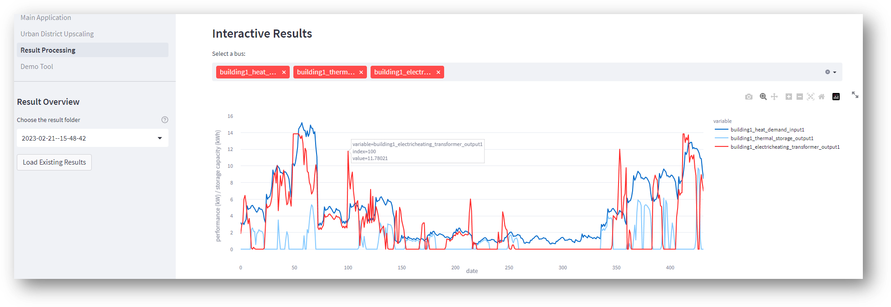
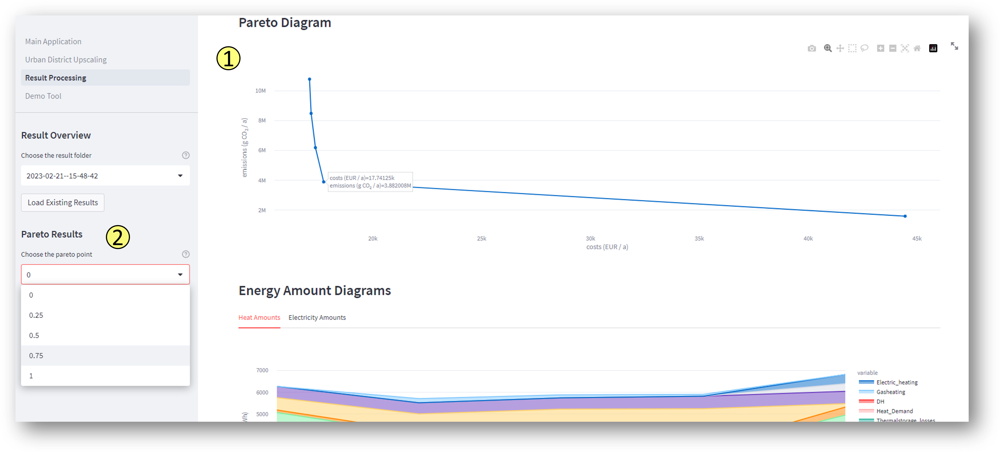

Results
-------------------------------------

.. warning::

	If a time series preparation algorithm was applied for the (main-)model, not every time-step of the model was modeled. This must be considered when analysing *energy amounts*. Simplifying, it can be assumed that the modeled amount of energy multiplied by the variable cost factor (see methods section) corresponds to the actual  amount of energy over the entire period. Changes in the cost structure, on the other hand, are automatically taken into account.

.. _`result processing`:
Interactive Results
^^^^^^^^^^^^^^^^^^^^^

You will be automatically directed to this page after the optimization process (1) or you may want to analyze existing results (2) again.

1. Result processing after optimization process
""""""""""""""""""""""""""""""
The results differ depending on whether you used only one optimization criterion (a) or whether you did a multi-criteria optimization (b).

a. Single-criteria optimization
'''''''''''''''''''''''''''''''
In a single-criteria optimization, the costs, emissions, and energy demands of the neighborhood are displayed. In addition, you can view the system graph and all building-specific load profiles via the interactive results.

b. Multi-criteria optimization
'''''''''''''''''''''''''''''''
In multi-criteria optimization, several scenarios are calculated. For more information take a look at the method: `Modeling Method <https://spreadsheet-energy-system-model-generator.readthedocs.io/en/latest/01.02.00_multi_criteria_optimization.html>`_. For each scenario, the results described for a single-criteria optimization can be displayed by selecting the reduction of the scenario (see (1) figure below). In addition, a Pareto diagram and energy amount diagrams are displayed (see (2) figure below).

2. Result processing of existing results
""""""""""""""""""""""""""""""
The difference is that you need to select a folder that you want to analyze.

Results as Spreadsheets and Log-Files
^^^^^^^^^^^^^^^^^^^^^^^^^^^^^^^^^^^^^

The results of the modeling are stored in the "results" folder in two formats:
- as summarizing log files, under
- as detailed xlsx-files.

The log-file gives an overview of which components are created and which of the investment options should be implemented. 
In addition, it is indicated which costs for the supply of the energy system are incurred in the optimized case.
For each implemented bus, an xlsx-file is created in which incoming and outgoing energy flows are specified for each time step of the model 
are.

