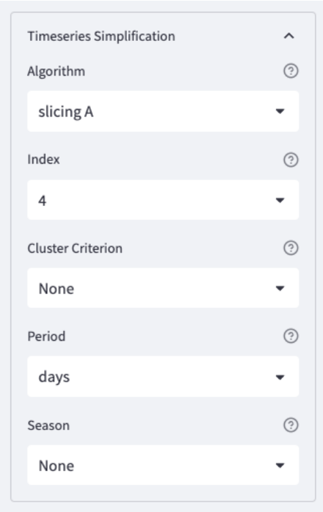
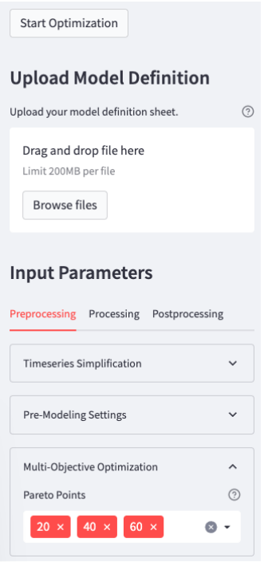
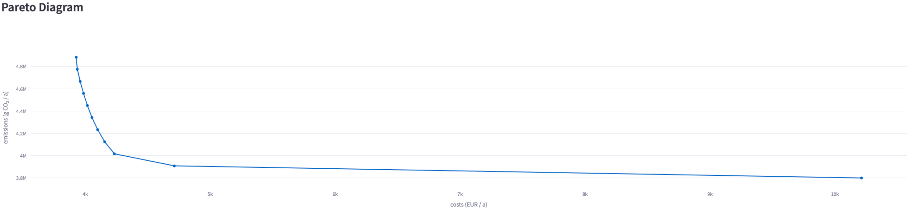

Examples
==============
For the SESMG, a number of examples can be found in `this directory <https://github.com/SESMG/SESMG-Examples>`_. Please make sure that the version indexed with the file/folder name matches your version of the SESMG. In the following, some examples are explained in more detail.

Example 1: Simulation and optimization of a single family house
---------
The template of the model definition (.xlsx) for this exercise you can find `here <https://github.com/SESMG/SESMG-Examples/blob/main/SESMG-v0.5.x-Examples/Task_1_template_model_definition.xlsx>`_. You can find the completed
model definition with solutions `here <https://github.com/SESMG/SESMG-Examples/blob/main/SESMG-v0.5.x-Examples/Task_1_solution_model_definition.xlsx>`_. This example is intended as an introduction and has an exercise
character.

Example 1a: Simulation of a single family house
~~~~~~~~~~
The Müller family has three children and lives in a single-family house with 180 m\ :sup:`2`. They are planning to adapt the energy supply of their house. The entire heating demand of the family is currently provided by a gas heating system. To cover their electricity needs, the Müllers decided last year to install a PV system on the roof of the house. The rest of their electricity needs are met conventionally by connecting to the grid.

Known data:
^^^^^^^^^^^^^^^^^^^^^^^^^^
+---------------------+---------------+
| Data                | Value         |
+=====================+===============+
| Electricity Demand  | 5 100 kWh     |
+---------------------+---------------+
| Heat Demand         | 32 000 kWh    |
+---------------------+---------------+
| PV System           | 5 kWp         |
+---------------------+---------------+

Simplification:
^^^^^^^^^^^^^^^^^^^^^^^^^^
- The PV system should be regarded as a new investment, as only a small portion of the depreciated to a small extent
- Using the time series simplification "Slicing A" with 4 days (for hole example 1)
   

Simulation task: 
^^^^^^^^^^^^^^^^^^^^^^^^^^
- Simulate the given energy system
	- To find out how to start a simulation, click `here <https://spreadsheet-energy-system-model-generator.readthedocs.io/en/latest/02.02.00_application.html#main-application>`
- Activate the given components via the column "active" as binary input. 0 = off, 1 = on

.. attention:: 
- After each change you have to save and upload the model definition again
- Simulation: Min. and max. investment capacity identical. You use the same button for simulation as for optimization.

Example 1b: Cost optimization of the energy system
~~~~~~~~~~
From the results of the simulation of the single-family house, it can be concluded that it makes sense to incorporate additional technologies in order to reduce the cost of energy supply. In this example, the following technologies are available:

- Air source heat pump (ASHP) with max. 20 kW 
- Ground source heat pump (GCHP) with max. 15 kW
- Battery storage with max. 10 kWh
- Thermal storage with max. 20 kWh

Optimization task: 
^^^^^^^^^^^^^^^^^^^^^^^^^^
- Adjusts the templates of the individual technologies in the model definition accordingly and supplements them in the system
	- To find out how to start a optimazation, click `here <https://spreadsheet-energy-system-model-generator.readthedocs.io/en/latest/02.02.00_application.html#main-application>`

.. attention:: 
-  The electricity for a heat pump is purchased at a different price than the normal energy purchase. Therefore, two different buses are used.
- Simulation (Example 1a): Min. and max. investment capacity identical
- Optimization (Example 1b): Interval between min. and max. investment capacity

Example 1c: Pareto optimization of a single family house
~~~~~~~~~~
The Müller family has heard that the emissions caused by energy systems can be significantly reduced by low additional costs.

Pareto-optimization task: 
^^^^^^^^^^^^^^^^^^^^^^^^^^
- Execute a Pareto optimization of the energy system
- Calculate the cost and emission minimums, as well three other Pareto points
- Select the points in such a way that they are as meaningful as possible.

.. attention:: 
- 0 or 0 % represents the cost minimum, since 0 % of the possible emission reduction is exhausted
- 100 or 100 % represents the emission minimum, since 100 % of the possible emission reduction is utilized

Pareto curve: 
^^^^^^^^^^^^^^^^^^^^^^^^^^

Example 2: Simulation and optimization of an industrial company
---------
The template of the model definition (.xlsx) for this exercise you can find `here <https://github.com/SESMG/SESMG-Examples/blob/main/SESMG-v0.5.x-Examples/Task_2_template_model_definition.xlsx>`_. You can find the completed
model definition with solutions `here <https://github.com/SESMG/SESMG-Examples/blob/main/SESMG-v0.5.x-Examples/Task_2_solution_model_definition.xlsx>`_. This example is intended as an introduction and has an exercise
character.

Example 2a: Simulation of an industrial company
~~~~~~~~~~
Schmiede GmbH manufactures various metal goods. It operates a property with several production halls. The systems have a high electricity demand. This follows the standard load profile "Gewerbe
durchlaufend"(Commercial continuous) of the German Association of Energy and Water Industries (BDEW). The heat demand is negligible.

Known data:
^^^^^^^^^^^^^^^^^^^^^^^^^^
+-------------------------------+---------------+
| Data                          | Value         |
+===============================+===============+
| Electricity Demand            | 760,500 kWh   |
+-------------------------------+---------------+
| Price of Electricity Purchase | 0.15 €/kWh    |
+-------------------------------+---------------+

Simplification:
^^^^^^^^^^^^^^^^^^^^^^^^^^
- Using the time series simplification "Slicing A" with 4 days (for hole example 2)

Simulation task: 
^^^^^^^^^^^^^^^^^^^^^^^^^^
- Simulate the given energy system
	- To find out how to start a simulation, click `here <https://spreadsheet-energy-system-model-generator.readthedocs.io/en/latest/02.02.00_application.html#main-application>`
- Copy the sample components for operation and reconfigure them accordingly

.. note::
	- The standard load profile is already stored in the SESMG. You can enter this under "sinks" - "load profile" as "g3"
	- further parameters (e.g. specific costs or emissions) are to be used from the example components for the same technologies

Example 2b: Optimization of an industrial company part I
~~~~~~~~~~
Schmiede GmbH has sufficient land available for regenerative power generation on its own premises. 

Two hall roofs are available to install PV systems:

Hall 1 with Sloped Roof
^^^^^^^^^^^^^^^^^^^^^^^^^^
+-------------------------------------------+------------+
| Parameter                                 | Value      |
+===========================================+============+
| Orientation                               | South-West |
+-------------------------------------------+------------+
| Azimuth                                   | 225°       |
+-------------------------------------------+------------+
| Surface tild                              | 35°        |
+-------------------------------------------+------------+
| Roof Surface Reflectance (albedo)         | 0.20       |
+-------------------------------------------+------------+
| Max. Rated Power Output                   | 200 kW     |
+-------------------------------------------+------------+

Hall 2 with Sloped Roof
^^^^^^^^^^^^^^^^^^^^^^^^^^
+-------------------------------------------+------------+
| Parameter                                 | Value      |
+===========================================+============+
| Orientation                               | East       |
+-------------------------------------------+------------+
| Azimuth                                   | 100°       |
+-------------------------------------------+------------+
| Surface tild                              | 27°        |
+-------------------------------------------+------------+
| Roof Surface Reflectance (albedo)         | 0.18       |
+-------------------------------------------+------------+
| Max. Rated Power Output                   | 150 kW     |
+-------------------------------------------+------------+

Optimization task: 
^^^^^^^^^^^^^^^^^^^^^^^^^^
- Optimise the industrial company with new parameters
	- To find out how to start a optimization, click `here <https://spreadsheet-energy-system-model-generator.readthedocs.io/en/latest/02.02.00_application.html#main-application>`

.. note::
	- Both units can be balanced and billed together
	- The surplus electricity can be sold at a tariff of 0.0635 €/kWh
	- One bus is sufficient for both PV systems

Example 2c: Optimization of an industrial company part II
~~~~~~~~~~
Next to the hall 1 of Schmiede GmbH there is a large open area. A wind turbine can be set up. 
A turbine from the manufacturer Vestas with a rotor diameter of 112 m and a hub height of 140 m was identified as principle suitable.

Optimization task: 
^^^^^^^^^^^^^^^^^^^^^^^^^^
-  Optimise the industrial company with new parameters
- Search for a suitable model in the database and enter it in the same way in the table. The required data can be found in the subpackage "`windpowerlib <https://github.com/wind-python/windpowerlib/blob/dev/windpowerlib/oedb/turbine_data.csv>`_".

.. note::
	- The surplus electricity can be sold at a tariff of 0.057 €/kWh
	- The wind turbine is designed (in this example) as a binary decision. This means that it is is either designed completely or not at all
	- To do this, you must create the plant as a "non-convex investment". You activate this with 0 or 1 in the corresponding cell

Example 2d: Optimization of an industrial company part III
~~~~~~~~~~
The entire vehicle fleet of Schmiede GmbH is to be electrified within the next 5 years. This will not change the driving behavior. The resulting load profile was determined in a preliminary study. This is available in standardized form. Schmiede GmbH has 16 vehicles. The charging power is assumed to be 10 kW.

Optimization task: 
^^^^^^^^^^^^^^^^^^^^^^^^^^
- Optimise the industrial company with new parameters
- Create the vehicle fleet as another consumer (sink)

.. note::
	- You can find the normalised time series `here <https://github.com/SESMG/SESMG-Examples/blob/main/SESMG-v0.5.x-Examples/Task_2_vehicle_fleet_normalised_load_response.xlsx>`_. Insert it into the worksheet "timeseries". The column must have the same name as your sink with the addition .fix
	- Since this is a normalized time series, the "nominal value" of the sink must be determined on the basis of the maximum possible charging capacity of the vehicle fleet

Example 3: Regular example of the documentation
---------
This example is the basis for the documentation and explanation of the `model definition <https://spreadsheet-energy-system-model-generator.readthedocs.io/en/latest/02.02.00_application.html#model-definition>`_. You can find the model definition `here <https://github.com/SESMG/SESMG-Examples/blob/main/SESMG-v0.5.x-Examples/v0.5.0_model_definition_example.xlsx>`_.

