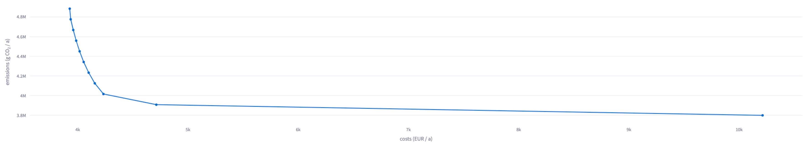
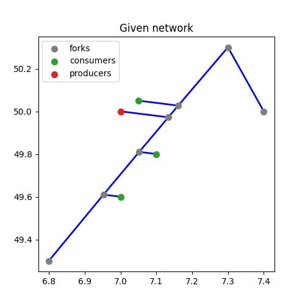

Examples
==============
For the SESMG, a number of examples can be found in `this directory <https://github.com/SESMG/SESMG-Examples>`_. Please make sure that the version indexed with the file/folder name matches your version of the SESMG. It is recommended to take a look at the mathematical graph theory before starting with the examples. Especially the terms sources, sinks, transformers, storages and buses should be understood. Further information can be found `here <https://spreadsheet-energy-system-model-generator.readthedocs.io/en/latest/01.01.00_structure_of_energy_systems.html>`_. In the following, some examples are explained in more detail.

Example 1: Simulation and optimization of a single family house
---------------------------------------------------------------
The model definition template ("Task_1_template_model_definition.xlsx") can be found in `this directory <https://github.com/SESMG/SESMG-Examples>`_ of your version of the SESMG. There you will also find the completed model definition with solutions ("Task_1_solution_model_definition.xlsx") as well as the graphical solutions. Your graphical results can be found directly in the Result Processing page at the menu point Energy System Graph. This example is intended as an introduction and has an exercise character.

Example 1a: Simulation of a single family house
~~~~~~~~~~~~~~~~~~~~~~~~~~~~~~~~~~~~~~~~~~~~~~~
The Müller family has three children and lives in a single-family house with 180 m\ :sup:`2`. They are planning to adapt the energy supply of their house. The entire heating demand of the family is currently provided by a gas heating system. To cover their electricity needs, the Müllers decided last year to install a PV system on the roof of the house. The rest of their electricity needs are met conventionally by connecting to the grid.

Known data:
^^^^^^^^^^^
+---------------------+---------------+
| Data                | Value         |
+=====================+===============+
| Electricity Demand  | 5 100 kWh     |
+---------------------+---------------+
| Heat Demand         | 32 000 kWh    |
+---------------------+---------------+
| PV System           | 5 kWp         |
+---------------------+---------------+

Simplification:
^^^^^^^^^^^^^^^
- The PV system should be regarded as a new investment, as only a small portion of the depreciated to a small extent
- Using the time series simplification "Slicing A" with 4 days (for hole example 1)

.. figure:: ../docs/images/manual/Examples/time_series_simplification.png
   :width: 20 %
   :alt: GUI
   :align: center

Simulation task:
^^^^^^^^^^^^^^^^
- Activate the given components via the column "active" as binary input. 0 = off, 1 = on
- Simulate the given energy system
	- To find out how to start a simulation, click `here <https://spreadsheet-energy-system-model-generator.readthedocs.io/en/latest/02.02.00_application.html#main-application>`_

.. attention::

	- After each change you have to save and upload the model definition again
	- Simulation: Min. and max. investment capacity identical. You use the same button for simulation as for optimization.

Example 1b: Cost optimization of the energy system
~~~~~~~~~~~~~~~~~~~~~~~~~~~~~~~~~~~~~~~~~~~~~~~~~~
From the results of the simulation of the single-family house, it can be concluded that it makes sense to incorporate additional technologies in order to reduce the cost of energy supply. In this example, the following technologies are available:

- Air source heat pump (ASHP) with max. 20 kW
- Ground source heat pump (GCHP) with max. 15 kW
- Battery storage with max. 10 kWh
- Thermal storage with max. 20 kWh

Optimization task:
^^^^^^^^^^^^^^^^^^
- Adjusts the templates of the individual technologies in the model definition accordingly and supplements them in the system
	- To find out how to start a optimization, click `here <https://spreadsheet-energy-system-model-generator.readthedocs.io/en/latest/02.02.00_application.html#main-application>`_

.. attention::

	- The electricity for a heat pump is purchased at a different price than the normal energy purchase. Therefore, two different buses are used.
	- Simulation (Example 1a): Min. and max. investment capacity identical
	- Optimization (Example 1b): Interval between min. and max. investment capacity

Example 1c: Pareto optimization of a single family house
~~~~~~~~~~~~~~~~~~~~~~~~~~~~~~~~~~~~~~~~~~~~~~~~~~~~~~~~
The Müller family has heard that the emissions caused by energy systems can be significantly reduced by low additional costs.

Pareto-optimization task:
^^^^^^^^^^^^^^^^^^^^^^^^^
- Execute a Pareto optimization of the energy system
- Calculate the cost and emission minimums, as well three other Pareto points
- Select the points in such a way that they are as meaningful as possible.

.. attention::

	- 0 or 0 % represents the cost minimum, since 0 % of the possible emission reduction is exhausted
	- 100 or 100 % represents the emission minimum, since 100 % of the possible emission reduction is utilized

.. figure:: ../docs/images/manual/Examples/pareto_optimization.png
   :width: 20 %
   :alt: GUI
   :align: center

Pareto diagram:
^^^^^^^^^^^^^^^
This diagram is an example. Your Pareto curve should look similar.

Example 2: Simulation and optimization of an industrial company
---------------------------------------------------------------
The model definition template ("Task_2_template_model_definition.xlsx") can be found in `this directory <https://github.com/SESMG/SESMG-Examples>`_ of your version of the SESMG. There you will also find the completed model definition with solutions ("Task_2_solution_model_definition.xlsx") as well as the graphical solutions. Your graphical results can be found directly in the Result Processing page at the menu point Energy System Graph. This example is intended as an introduction and has an exercise character.

Example 2a: Simulation of an industrial company
~~~~~~~~~~~~~~~~~~~~~~~~~~~~~~~~~~~~~~~~~~~~~~~
Schmiede GmbH manufactures various metal goods. It operates a property with several production halls. The systems have a high electricity demand. This follows the standard load profile "Gewerbe
durchlaufend"(Commercial continuous) of the German Association of Energy and Water Industries (BDEW). The heat demand is negligible.

Known data:
^^^^^^^^^^^
+-------------------------------+---------------+
| Data                          | Value         |
+===============================+===============+
| Electricity Demand            | 760 500 kWh   |
+-------------------------------+---------------+
| Price of Electricity Purchase | 0.15 €/kWh    |
+-------------------------------+---------------+

Simplification:
^^^^^^^^^^^^^^^
- Using the time series simplification "Slicing A" with 4 days (for hole example 2)

Simulation task:
^^^^^^^^^^^^^^^^
- Copy the sample components for operation and reconfigure them accordingly
- Simulate the given energy system
	- To find out how to start a simulation, click `here <https://spreadsheet-energy-system-model-generator.readthedocs.io/en/latest/02.02.00_application.html#main-application>`_

.. note::

	- The standard load profile is already stored in the SESMG. You can enter this under "sinks" - "load profile" as "g3"
	- further parameters (e.g. specific costs or emissions) are to be used from the example components for the same technologies

Example 2b: Optimization of an industrial company part I
~~~~~~~~~~~~~~~~~~~~~~~~~~~~~~~~~~~~~~~~~~~~~~~~~~~~~~~~
Schmiede GmbH has sufficient land available for regenerative power generation on its own premises.

Two hall roofs are available to install PV systems:

Hall 1 with Sloped Roof
^^^^^^^^^^^^^^^^^^^^^^^
+-------------------------------------------+------------+
| Parameter                                 | Value      |
+===========================================+============+
| Orientation                               | South-West |
+-------------------------------------------+------------+
| Azimuth                                   | 225°       |
+-------------------------------------------+------------+
| Surface tilt                              | 35°        |
+-------------------------------------------+------------+
| Roof Surface Reflectance (albedo)         | 0.20       |
+-------------------------------------------+------------+
| Max. Rated Power Output                   | 200 kW     |
+-------------------------------------------+------------+

Hall 2 with Sloped Roof
^^^^^^^^^^^^^^^^^^^^^^^
+-------------------------------------------+------------+
| Parameter                                 | Value      |
+===========================================+============+
| Orientation                               | East       |
+-------------------------------------------+------------+
| Azimuth                                   | 100°       |
+-------------------------------------------+------------+
| Surface tilt                              | 27°        |
+-------------------------------------------+------------+
| Roof Surface Reflectance (albedo)         | 0.18       |
+-------------------------------------------+------------+
| Max. Rated Power Output                   | 150 kW     |
+-------------------------------------------+------------+

Optimization task:
^^^^^^^^^^^^^^^^^^
- Optimise the industrial company with new parameters
	- To find out how to start a optimization, click `here <https://spreadsheet-energy-system-model-generator.readthedocs.io/en/latest/02.02.00_application.html#main-application>`_

.. note::

	- Both units can be balanced and billed together
	- Create a separate sink for each PV system
	- One bus is sufficient for both PV systems
	- A separate link is necessary to connect the PV system to the local electricity bus
	- The surplus electricity can be sold at a tariff of 0.0635 €/kWh

Example 2c: Optimization of an industrial company part II
~~~~~~~~~~~~~~~~~~~~~~~~~~~~~~~~~~~~~~~~~~~~~~~~~~~~~~~~~
Next to the hall 1 of Schmiede GmbH there is a large open area. A wind turbine can be set up.
A turbine from the manufacturer Vestas with a rotor diameter of 112 m and a hub height of 140 m was identified as principle suitable.

Optimization task:
^^^^^^^^^^^^^^^^^^
- Optimise the industrial company with new parameters
- Search for a suitable model in the database and enter it in the same way in the table. The required data can be found in the subpackage "`windpowerlib <https://github.com/wind-python/windpowerlib/blob/dev/windpowerlib/oedb/turbine_data.csv>`_".

.. note::

	- The surplus electricity can be sold at a tariff of 0.057 €/kWh
	- The wind turbine is designed (in this example) as a binary decision. This means that it is is either designed completely or not at all
	- To do this, you must create the plant as a "non-convex investment". You activate this with 0 or 1 in the corresponding cell
	- The costs are summarised in a periodic cost of 100 €/kW*a

Example 2d: Optimization of an industrial company part III
~~~~~~~~~~~~~~~~~~~~~~~~~~~~~~~~~~~~~~~~~~~~~~~~~~~~~~~~~~
The entire vehicle fleet of Schmiede GmbH is to be electrified within the next 5 years. This will not change the driving behavior. The resulting load profile was determined in a preliminary study. This is available in standardized form. Schmiede GmbH has 16 vehicles. The charging power is assumed to be 10 kW.

Optimization task:
^^^^^^^^^^^^^^^^^^
- Optimise the industrial company with new parameters
- Create the vehicle fleet as another consumer (sink)

.. note::

	- You can find the normalised time series `here <https://github.com/SESMG/SESMG-Examples/blob/main/SESMG-v1.0.x-Examples/Task_2_vehicle_fleet_normalised_load_response.xlsx>`_. Insert it into the worksheet "timeseries". The column must have the same name as your sink with the addition .fix
	- Since this is a normalized time series, the "nominal value" of the sink must be determined on the basis of the maximum possible charging capacity of the vehicle fleet. To achieve this, create a single sink with a nominal value of 160 kW

Example 3: Simple example of a heating network
-----------------------------------------------
This example shows the implementation of a exergy heating network. Three houses are considered and connected to the heating network. Electricity supply technologies were neglected in this case to reduce complexity. A decentralised geothermal heat pump was added for each house as an investment alternative to the heating network. The heating network consists of two pipe sections. 
This example only illustrates the basic structure for implementing a heating network, but can be expanded as required with additional pipe sections, technologies and the number of houses to be connected. You will find the "model_definition_example_heat_network.xlsx" in the `directory <https://github.com/SESMG/SESMG-Examples/tree/main/SESMG-v1.1.x-Examples>`_ for version v.1.1 of the SESMG.

The following table shows how the buses must be set up to implement a heating network. In "district heating conn. (exergy)", a “1” is entered to connect the bus to the heating network. The longitude and latitude of the house connection station are entered in the "lat" and "lon" columns.
At the same time a bus (here: "district_heat_bus") is created, representing the district heat station of the heating network. In "district heating conn. (exergy)" a "dh-system" is entered and in the columns "lat" and "lon" the coordinates of the district heating station are entered. The district heat station is the point at which the central heat supply technologies feed into the heating network.
The house connection points and the district heating station  are automatically connected to the distribution pipe by the shortest route.

.. csv-table:: Exemplary input for the buses sheet 
   :header: label,comment,active,excess,shortage,excess costs,shortage costs,excess constraint costs,shortage constraint costs,district heating conn. (exergy),lat,lon,existing heathouse station,district heating conn. (anergy),flow temperature,electricity bus,sector

   ,,,,,(CU/kWh),(CU/kWh),(CU/kWh),(CU/kWh),,(°),(°),,,(°C),,
   ID_heat_bus_1,"",1,0,0,0,0,0,0,1,50.05,7.05,0,0,60,ID_hp_electricity_bus_1,heat
   ID_heat_bus_2,"",1,0,0,0,0,0,0,1,49.6,7,0,0,60,ID_hp_electricity_bus_2,heat
   ID_heat_bus_3,"",1,0,0,0,0,0,0,1,49.8,7.1,0,0,60,ID_hp_electricity_bus_3,heat
   district_heat_bus,"",1,0,0,0,0,0,0,dh-system,50,7,0,0,0,0,central_heat

The following table shows how a road network is mapped as the basis for the distribution system of a heating network. For this purpose, the road sections are mapped via the starting point and the end point of the road. The coordinates are entered in the columns "lat. 1st intersection", "lat. 2nd intersection", "lon. 1st intersection", "lon. 2nd intersection". The end point of the 1st intersection forms the start point of the 2nd intersection.

.. csv-table:: Exemplary input for district heating
   :header: label,comment,lat. 1st intersection,lat. 2nd intersection,lon. 1st intersection,lon. 2nd intersection,active

   ,,,x,x,x,x
   ID_street1,"",49.30000,50.30000,6.80000,7.30000,1
   ID_street2,"",50.30000,50.00000,7.30000,7.40000,1

The following table shows how the pipes used in the model are mapped for the heating network. In the "active" column, pipes with "1" are included in the model and pipes with "0" are not included in the model. 

.. csv-table:: Exemplary input for pipe types
   :header: label,active,nonconvex,loss factor,loss factor fix,min. investment capacity,max. investment capacity,periodical costs,fix investment costs,periodical constraint costs,fix investment constraint costs,anergy or exergy,distribution pipe,building pipe,efficiency

   ,,,,,,,,,,,,,,
   DN-200,0,1,0,0.032,0,8220,0,114,4112,0,exergy,1,1,0
   DN-250,1,1,0,0.034,0,14210,0,152,0,5765,exergy,1,1,0

The heating network is displayed as a .jpeg in the results. The heating network shown in the example is illustrated in the following figure.

Adjustments for an anergy heating network:
~~~~~~~~~~~~~~~~~~~~~~~~~~~~~~~~~~~~~~~~~~

Anergy heating networks and Exergy heating networks differ in the temperature level. In Anergy heating networks, the temperature level is so low that a water-to-water heat pump is installed in the connected buildings to raise the temperature level. The cost of the heat pump is included in the cost of the house connection station of the Anergy heating network. Due to the low temperature level, uninsulated rather than insulated pipes are used in contrast to the Exergy heating network.
There are only a few adjustments that need to be made in order to consider an Anergy heating network. The pipes for an Anergy heating network have to be defined in the "pipe types" sheet. In addition, the sheet "buses" is adapted in the same way as for the Exergy heating network. For this purpose, in the "district heating conn. (anergy)" column, enter a "1" if the bus is to be connected to the Anergy heating network and "dh-system" if the district heating station is to be defined.

.. csv-table:: Exemplary input for bus connections
   :header: label,comment,active,excess,shortage,excess costs,shortage costs,excess constraint costs,shortage constraint costs,district heating conn. (exergy),lat,lon,existing heathouse station,district heating conn. (anergy),flow temperature,electricity bus,sector

   ,,,,,(CU/kWh),(CU/kWh),(CU/kWh),(CU/kWh),,(°),(°),,,(°C),,
   ID_heat_bus_1,"",1,0,0,0,0,0,0,0,50.05,7.05,0,1,60,ID_hp_electricity_bus_1,heat
   ID_heat_bus_2,"",1,0,0,0,0,0,0,0,49.6,7,0,1,60,ID_hp_electricity_bus_2,heat
   ID_heat_bus_3,"",1,0,0,0,0,0,0,0,49.8,7.1,0,1,60,ID_hp_electricity_bus_3,heat
   district_heat_bus,"",1,0,0,0,0,0,0,0,50,7,0,dh-system,0,0,central_heat

Example 4: Regular example of the documentation
-----------------------------------------------
This example is the basis for the documentation and explanation of the `model definition <https://spreadsheet-energy-system-model-generator.readthedocs.io/en/latest/02.02.00_application.html#model-definition>`_. You can find the "v1.x_model_definition_example.xlsx" in the `directory <https://github.com/SESMG/SESMG-Examples>`_ of your version of the SESMG.
