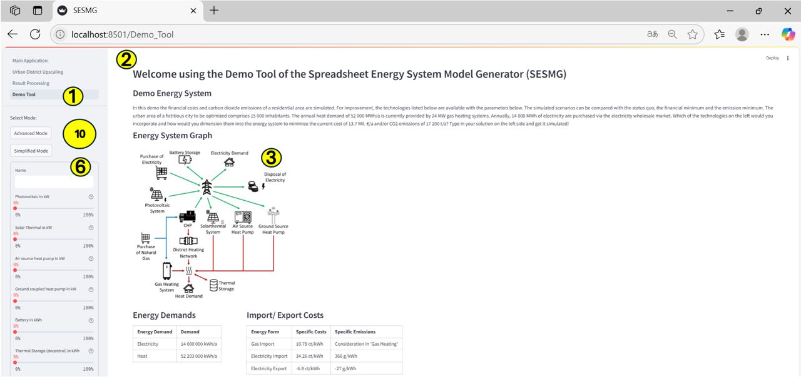

Demo Tool
*************************************************

With the help of the demo tool a descriptive introduction to energy system modeling can be given. 
The demo tool has been implemented for training purposes and is not intended for the actual analysis of a real energy system.

Users have the possibility to integrate different energy supply technologies into a defined municipal energy system. 
If possible, the technologies should be dimensioned in such a way that the monetary costs of the entire system and/or 
the carbon dioxide emissions are reduced. 

With the help of the demo tool the chosen energy supply scenario can be simulated by simply entering performance values 
(monetary costs and CO2 emissions) and then compared graphically with the stored optimized scenarios.

Instruction
=================================================

   User Interface of the Demo Tool
   
1: Tab to select the demo tool.

2: Information is given about the fictitional scenario specifying the kind of district, the energy demands and the status quo. Further information is given about the technologies you can use and its specific parameters.

3: Overview of the system and the possible technologies one can use.

4: Input of the system components to define a energy system to be simulated. 

5: Start of the simulation after designing the system components. 

6: Annual monetary costs of the defined energy system as well as the relative differnce to the status quo.

7: Annual green house gas emissions of defined energy system as well as the relative differnce to the status quo.

