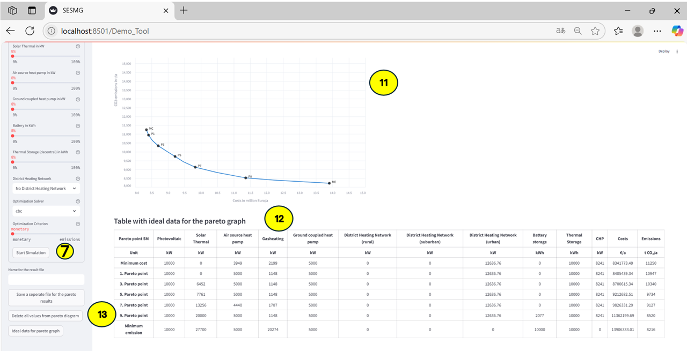

Demo Tool
*********

With the help of the demo tool a descriptive introduction to energy system modeling can be given. 
The demo tool has been implemented for training and academic purposes and is not intended for the actual analysis of a real energy system.

Users have the possibility to integrate different energy supply technologies into a defined municipal energy system. 
The objective is to configure the technologies in such a way that either the monetary costs of the entire system and/or 
the carbon dioxide emissions are reduced.

The tool offers two modes of operation:

- In **Simplified Mode**, users can choose the technology capacities through percentage sliders, making it accessible for non-technical users or teaching purposes.
- In **Advanced Mode**, users can enter exact values for each technology, select optimization solvers, and define the optimization criterion (costs or emissions), allowing for more in-depth exploration.

Once a scenario is defined, the demo tool simulates the resulting energy system and compares it graphically with pre-calculated optimized scenarios. 
In addition to showing the Pareto front, the visualization includes key reference points such as:

- **MC**: Minimum Costs  
- **ME**: Minimum Emissions  
- **P1, P3, P5, P7, P9**: Selected Pareto-optimal trade-off points  

These markers provide a clearer understanding of the compromises between environmental and economic performance. 
The user-defined solution is placed in this context, highlighting its relative performance. All results can be exported for further use.

Instruction
===========
.. figure:: ../docs/images/manual/DemoTool/demo_tool.png
   :width: 90 %
   :alt: Demo Interface
   :align: center

.. figure:: ../docs/images/manual/DemoTool/demo_tool_docu_picture_1.png
   :width: 90 %
   :alt: Demo Interface
   :align: center

.. figure:: ../docs/images/manual/DemoTool/demo_tool_docu_picture_2.png
   :width: 90 %
   :alt: Demo Interface
   :align: center

   User Interface of the Demo Tool

1: Tab to select the demo tool.

2: Information is given about the fictional scenario specifying the kind of district.

3: Overview of the system, the possible technologies one can use, the energy demands and import/export costs.

4: Overview of the technology parameters.

5: Design of the various district heating network alternatives.

6: Input of the system components to define an energy system to be simulated. 

7: Start of the simulation after designing the system components. 

8: Annual monetary costs of the defined energy system as well as the relative difference to the status quo.

9: Annual greenhouse gas emissions of the defined energy system as well as the relative difference to the status quo.

10: Selector to choose between Advanced or Simplified mode for user interaction.

11: Pareto graph showing the trade-off between annual costs and CO₂ emissions.

12: Table displaying ideal configuration data for each Pareto point.

13: Options to export results, reset the Pareto graph, or show/hide the result table.