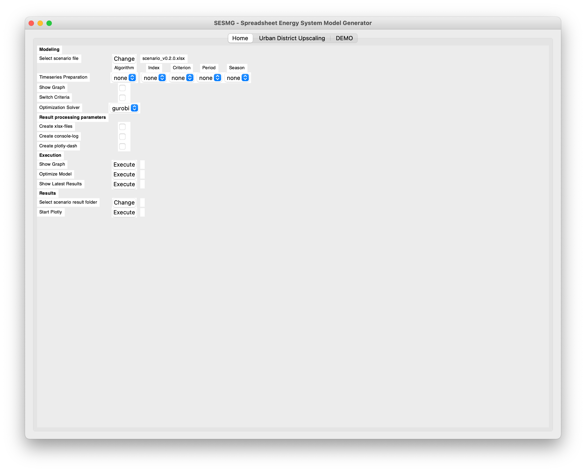

Application of the Model Generator
*************************************************

1. Fill in the spreadsheet document according to the instructions in the "Using th Scenario File" chapter.

2. Execute the Run_SESMG_for_**your operating System** file in the main folder.

.. note:: 

	If you receive a "Your computer has been protected by Windows" error message or a similiar one, click "More Information," and then "Run Anyway" (or your operating system specific way to run the programm anyway).

   
   The display may vary depending on the operating system.

Description of the GUI functions

Select the xlsx-scenario to be executed.

**With the result processing parameters one has the possibility to decide,**

	- whether xlsx files should be created or not (1) 
	- whether a console log should be created or not (2)
	- whether the Plotly Dash should be created or not (3)

Now there are three functions for eventing with the scenario choosen:
 1. Displays the currently selected xlsx-scenario as graph.
 2. Modeling and optimization of the selected xlsx-scenario with subsequent output of results.  
 3. Display of the latest optimized scenario (only can be used if an optimization run was done in the current session).
 
The functions under the topic **Results** are used to analyze results older then the current session:
 1. Choose the results directory of the results to be displayed.
 2. Execute the programm to start plotly dash.

 
 .. note::
	The detailed modelling results are also stored within the "results" folder.

Timeseries preperation 
======================

Using the timeseries preparation-options, the modeled time system can be reduced so that not all time steps are considered with the modeling. Such a simplification allows shorter runtimes, but may lead to a reduction in the quality of the results [1].

.. warning::

	All time series simplifications can currently only be applied at an output time resolution of hours with 8760 time steps (i.e. one whole year).
	
GUI Settings
------------

Different possibilities of time series simplification are applicable, for this the following specifications must be deposited in the SESMG GUI:

* **Algorithm**: Indication of the simplification algorithm to be applied.

* **Index**: Algorithm specific configuration.

* **Criterion**: Criterion according to which cluster algorithms are applied.

* **Period**: Time periods which are clustered together (weeks, days, hours)

* **Season**: Time periods within which clustering takes place (year, seasons, months)

Available Algorithms
--------------------

The following algorithms are applicable and must be specified with the following additional information:

.. csv-table:: 
	:file: ../getting_started/timeseries_preparation.csv
	:header-rows: 1

Further Adjustments
-------------------

Depending on the simplification applied, further adjustments to the energy system must be made automatically.

**Adjustment of time series of non-divisible length:**
For a time series adjustment, the simplification factor should ideally be divisible by the length of the given time series without remainder. For example, out of 365 days, every fifth day can be selected via slicing without any problems (365/5=73), but every tenth day results in a remainder (365/10=36.5). In order to be able to simplify the time series correctly, in such cases the given time series is shortened so far that the calculation is correct. For slicing with every tenth day, for example, the time series would be shortened to 360 days (360/10=36) because the time series length is then divisible by the simplification factor.

**Variable cost factor:**
To ensure that the simplification of the time series correctly takes into account the relationship between periodic and variable costs over the entire simulation period, all variable costs and variable constraint costs in the model are automatically multiplied by the "variable cost factor. It is calculated as follows: 

`variable cost factor = original number of timesteps / new number of timesteps`

References
==========
[1] Klemm C. *Model-based runtime optimization for a spatially high-resolution mixed-used multi-energy system model*, unpublished at the time of publication of this documentation, 2022.
