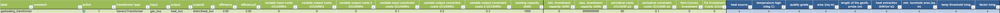
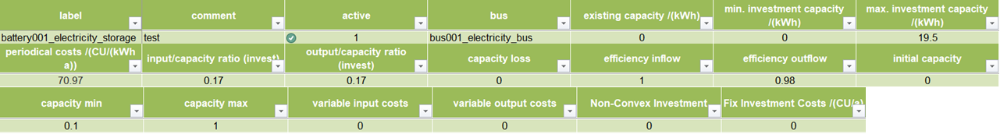

Using the Scenario File
*************************************************

For the modeling and optimization of an energy system, parameters for all system components must be given in the model 
generator using the enclosed .xlsx file (editable with Excel, LibreOffice, …). The .xlsx file is divided into nine 
input sheets. In the "energysystem" sheet, general parameters are defined for the time horizon to be examined, in the 
sheets "buses", "sinks", "sources", "transformers", "storages" and "links" corresponding components are defined. In 
the sheet "time series", the performance of individual components can be stored. In the "weather data" sheet, the 
required weather data is stored. When completing the input file, it is recommended to enter the energy system step by 
step and to perform test runs in between, so that potential input errors are detected early and can be localized more 
easily. In addition to the explanation of the individual input sheets, an example energy system is built step by step 
in the following subchapters. The input file for this example is stored in the program folder "examples" and viewed on 
`GitHub <https://github.com/chrklemm/SESMG/tree/master/examples>`_. The following units are used throughout:

- capacity/performance in kW,
- energy in kWh,
- angles in degrees, and
- costs in cost units (CU).

Cost units are any scalable quantity used to optimize the energy system, such as euros or grams of carbon dioxide emissions.

Energysystem
=================================================

Within this sheet, the time horizon and the temporal resolution of the model is defined. The following parameters have to be entered:

- **start date**: Start of the modelling time horizon. Format: "YYYY-MM-DD hh:mm:ss";
- **end date**: End date of the modelling time horizon. Format: "YYYY-MM-DD hh:mm:ss"; and
- **temporal resolution**: For the modelling considered temporal resolution. Possible inputs: "a" (years), "d" (days), "h" (hours) "min" (minutes), "s" (seconds), "ms" (mili seconds).
- **periods**: Number of periods within the time horizon (one year with hourly resolution equals 8760 periods).
- **constraint costs /(CU)**: Value in order to set a limit for the whole energysystem, e.g. by carbon dioxide emissions. Set this field to "None" in order to ignore the limit. If you want to set a limit, you have to set specific values for each components seen below.

  

   Exemplary input for the time system

Buses
=================================================

Within this sheet, the buses of the energy system are defined. The following parameters need to be entered:

- **label**: Unique designation of the bus. The following format is recommended: "ID_energy sector_bus".
- **comment**: Space for an individual comment, e.g. an indication of which measure this component belongs to.
- **active**: Specifies whether the bus shall be included to the model. 0 = inactive, 1 = active. 
- **excess**: Specifies whether a sink is to be generated, which consumes excess energy. 0 = no excess sink will be generated; 1 = excess sink will be generated.
- **shortage**: Specifies whether to generate a shortage source that can compensate energy deficits or not. 0 = no shortage source will be generated; 1 = shortage source will be generated.
- **shortage costs/(CU/kWh)**: Assigns a price per kWh to the purchase of energy from the shortage source. If the shortage source was deactivated, the fill character "x" is used. 
- **excess costs/(CU/kWh)**: Assigns a price per kWh to the release of energy to the excess sink. If the excess sink was deactivated, the fill character "x" is used. 
	
.. figure:: ../images/BSP_buses.PNG
   :width: 100 %
   :alt: Bus-Example
   :align: center

   Exemplary input for the buses sheet
  

	
.. figure:: ../images/BSP_Graph_Bus.png
   :width: 60 %
   :alt: Bus_Graph
   :align: center

   Graph of the energy system, which is created by entering the example components. Two buses, a shortage source, and an excess sink were created by the input.

Sinks
=================================================

Within this sheet, the sinks of the energy system are defined. The following parameters need to be entered:

- **label**: Unique designation of the sink. The following format is recommended: "ID_energy sector_sinks".
- **comment**: Space for an individual comment, e.g. an indication of which measure this component belongs to.
- **active**: Specifies whether the sink shall be included to the model. 0 = inactive, 1 = active.
- **input**: Space for an individual comment, e.g. an indication of which measure this component belongs to.
- **load profile**: Specifies the basis onto which the load profile of the sink is to be created. If the Richardson tool is to be used, "richardson" has to be inserted. For standard load profiles, its acronym is used. If a time series is used, "timeseries" must be entered. If the source is not fixed, the fill character "x" has to be used.
- **nominal value/(kW)**: Nominal performance of the sink. Required when "time series" has been entered into the "load profile". When SLP or Richardson is used, use the fill character "x" here.
- **annual demand/(kWh/a)**: Annual energy demand of the sink. Required when using the Richardson Tool or standard load profiles. When using time series, the fill character "x" is used. 
- **occupants [RICHARDSON]**: Number of occupants living in the respective building. Only required when using the Richardson tool, use fill character "x" for other load profiles.
- **building class [HEAT SLP ONLY]**: BDEW-building class.
- **wind class [HEAT SLP ONLY]**: wind classification for building location (0=not windy, 1=windy)
- **fixed**: Indicates whether it is a fixed sink or not. 0 = not fixed; 1 = fixed.
 
.. figure:: ../images/BSP_sinks.png
   :width: 100 %
   :alt: Sink-Example
   :align: center

   Exemplary input for the sinks sheet
  

	
.. figure:: ../images/BSP_Graph_sink.png
   :width: 60 %
   :alt: Sink_Graph
   :align: center

   Graph of the energy system, which is created by entering the example components. By the input in the sinks sheet, a photovoltaic source has been created.

Sources
=================================================

Within this sheet, the sources of the energy system are defined. Properties with the addition "PV ONLY" have only to be 
defined if the parameter "technology" is set on "photovoltaic". The following parameters have to be entered:

- **label**: Unique designation of the source. The following format is recommended: "ID_energy sector_source".
- **comment**: Space for an individual comment, e.g. an indication of which measure this component belongs to.
- **active**: Specifies whether the source shall be included to the model. 0 = inactive, 1 = active.
- **output**: Specifies which bus the source is connected to.
- **technology**: Technology type of source. Input options: "photovoltaic", "windpower", "timeseries". Time series are automatically generated for photovoltaic systems and wind turbines. If "timeseries" is selected, a time series must be provided in the "time_series" sheet.
- **Turbine Model (Windpower ONLY)**: Reference wind turbine model. Possible turbine types are listed `here <https://github.com/wind-python/windpowerlib/blob/dev/windpowerlib/oedb/turbine_data.csv>`_. 
- **Hub Height (Windpower ONLY)**: Hub height of the wind turbine. Which hub heights are possible for the selected reference turbine can be viewed `here <https://github.com/wind-python/windpowerlib/blob/dev/windpowerlib/oedb/turbine_data.csv>`_.
- **variable costs/(CU/kWh)**: Defines the variable costs incurred for a kWh of energy drawn from the source.
- **existing capacity/(kW)**: Existing capacity of the source before possible investments.
- **min. investment capacity/(kW)**: Minimum capacity to be installed in case of an investment.
- **max. investment capacity/(kW)**: Maximum capacity that can be added in the case of an investment. If no investment is possible, enter the value "0" here.
- **Non-Convex Investment**: Specifies whether the investment capacity should be defined as a mixed-integer variable, i.e. whether the model can decide whether NOTHING OR THE INVESTMENT should be implemented.
- **Fix Investment Costs /(CU/a)**: Fixed costs of non-convex investments (in addition to the periodic costs)
- **periodical costs/(CU/(kW a))**: Costs incurred per kW for investments within the time horizon
- **technology database (PV ONLY)**: Database, from where module parameters are to be obtained. Recommended Database: "SandiaMod".
- **inverter database (PV ONLY)**: Database, from where inverter parameters are to be obtained. Recommended Database: "sandiainverter".
- **Modul Model (PV ONLY)**: Module name, according to the database used.
- **Inverter Model (PV ONLY)**: Inverter name, according to the database used.
- **Azimuth (PV ONLY)**: Specifies the orientation of the PV module in degrees. Values between 0 and 360 are permissible (0 = north, 90 = east, 180 = south, 270 = west). Only required for photovoltaic sources, use fill character "x" for other technologies.
- **Surface Tilt (PV ONLY)**: Specifies the inclination of the module in degrees (0 = flat). Only required for photovoltaic sources, use fill character "x" for other technologies.
- **Albedo (PV ONLY)**: Specifies the albedo value of the reflecting floor surface. Only required for photovoltaic sources, use fill character "x" for other technologies.
- **Altitude (PV ONLY)**: Height (above mean sea level) in meters of the photovoltaic module. Only required for photovoltaic sources, use fill character "x" for other technologies.
- **Latitude (PV ONLY)**: Geographic latitude (decimal number) of the photovoltaic module. Only required for photovoltaic sources, use fill character "x" for other technologies.
- **Longitude (PV ONLY)**: Geographic longitude (decimal number) of the photovoltaic module. Only required for photovoltaic sources, use fill character "x" for other technologies.
- **fixed**: Indicates whether it is a fixed source or not. 0 = not fixed; 1 = fixed.

.. figure:: ../images/BSP_source.png
   :width: 100 %
   :alt: Source-Example
   :align: center

   Exemplary input for the sources sheet
  

	
.. figure:: ../images/BSP_Graph_source.png
   :width: 60 %
   :alt: Source_Graph
   :align: center

   Graph of the energy system, which is created by entering the example components. By the input in the sources-sheet one sink has been created.
   
Transformers
=================================================

Within this sheet, the transformers of the energy system are defined. Properties with the addition “HP ONLY” have only to be defined if the parameter “transformer type” is set on “HeatPump”. With other transformers, these fields can be left empty or filled with any placeholder. 

The following parameters have to be entered:

- **label**: Unique designation of the transformer. The following format is recommended: "ID_energy sector_transformer".
- **comment**: Space for an individual comment, e.g. an indication of which measure this component belongs to.
- **active**: Specifies whether the transformer shall be included to the model. 0 = inactive, 1 = active.
- **transformer type**: Indicates what kind of transformer it is. Possible entries: "GenericTransformer" for linear transformers with constant efficiencies; "GenericCHP" for transformers with varying efficiencies.
- **input**: Specifies the bus from which the input to the transformer comes from.
- **output**: Specifies bus to which the output of the transformer is forwarded to.
- **output2**: Specifies the bus to which the output of the transformer is forwarded to, if there are several outputs. If there is no second output, the fill character "x" must be entered here.
- **efficiency**: Specifies the efficiency of the first output. Values between 0 and 1 are allowed entries.
- **efficiency2**: Specifies the efficiency of the second output, if there is one. Values  between 0 and 1 are entered. If there is no second output, the fill character "x" must be entered here.
- **variable input costs**: Variable costs incurred per kWh of input energy supplied.
- **existing capacity/(kW)**: Already installed capacity of the transformer.
- **max investment capacity/(kW)**: Maximum  installable transformer capacity in addition to the previously existing one.
- **min investment capacity/(kW)**: Minimum transformer capacity to be installed.
- **periodical costs /(CU/a)**: Costs incurred per kW for investments within the time horizon.
- **Non-Convex Investment**: Specifies whether the investment capacity should be defined as a mixed-integer variable, i.e. whether the model can decide whether NOTHING OR THE INVESTMENT should be implemented.
- **Fix Investment Costs /(CU/a)**: Fixed costs of non-convex investments (in addition to the periodic costs)
- **heat source (HP ONLY)**: Specifies the heat source. At the moment are "GroundWater", "Ground", "Air" and "Water" possible.
- **temperature high /(deg C) (HP ONLY)**: Temperature of the high temperature heat reservoir
- **quality grade (HP ONLY)**: To determine the COP of a real machine a scale-down factor (the quality grade) is applied on the Carnot efficiency (see `oemof.thermal <https://github.com/wind-python/windpowerlib/blob/dev/windpowerlib/oedb/turbine_data.csv>`_).
- **area /(sq m) (HP ONLY)**: Open spaces for ground-coupled heat pumps (GCHP).
- **length of the geoth. probe (m) (HP ONLY)**: Length of the vertical heat exchanger, only for GCHP.
- **heat extraction (kW/(m*a)) (HP ONLY)**: Heat extraction for the heat exchanger referring to the location, only for GCHP.
- **min. borehole area (sq m) (HP ONLY)**: Limited space due to the regeneation of the ground source, only for GCHP.
- **temp threshold icing (HP ONLY)**: Temperature below which icing occurs (see `oemof.thermal <https://github.com/wind-python/windpowerlib/blob/dev/windpowerlib/oedb/turbine_data.csv>`_).
- **factor icing (HP ONLY)**: COP reduction caused by icing (see `oemof.thermal <https://github.com/wind-python/windpowerlib/blob/dev/windpowerlib/oedb/turbine_data.csv>`_).

.. figure:: ../images/BSP_transformers.png
   :width: 100 %
   :alt: Transformer-Example
   :align: center

   Exemplary input for the transformers sheet
  

	
.. figure:: ../images/BSP_Graph_transformer.png
   :width: 60 %
   :alt: Transformer_Graph
   :align: center

   Graph of the energy system, which is created by entering the example components. One transformer has been created by including the transformers sheet 

Storages
=================================================

Within this sheet, the sinks of the energy system are defined. The following parameters have to be entered:

- **label**: Unique designation of the storage. The following format is recommended: "ID_energy sector_storage".
- **comment**: Space for an individual comment, e.g. an indication of which measure this component belongs to.
- **active**: Specifies whether the storage shall be included to the model. 0 = inactive, 1 = active.
- **bus**: Specifies which bus the storage is connected to.
- **input/capacity ratio (invest)**: Indicates the performance with which the memory can be charged.
- **output/capacity ratio (invest)**: Indicates the performance with which the memory can be discharged.
- **capacity loss**: Indicates the storage loss per time unit.
- **efficiency inflow**: Specifies the charging efficiency.
- **efficiency outflow**: Specifies the discharging efficiency.
- **initial capacity**: Specifies how far the memory is loaded at time 0 of the simulation. Value must be between 0 and 1.
- **capacity min**: Specifies the minimum amount of memory that must be loaded at any given time. Value must be between 0 and 1.
- **capacity max**: Specifies the maximum amount of memory that can be loaded at any given time. Value must be between 0 and 1.
- **variable input costs**: Indicates how many costs arise for charging with one kWh.
- **variable output costs**: Indicates how many costs arise for charging with one kWh.
- **existing capacity/(kW)**: Previously installed capacity of the storage.
- **periodical costs /(CU/a)**: Costs incurred per kW for investments within the time horizon.
- **max. investment capacity/(kW)**: Maximum in addition to existing capacity, installable storage capacity.
- **min. investment capacity/(kW)**: Minimum storage capacity to be installed.
- **Non-Convex Investment**: Specifies whether the investment capacity should be defined as a mixed-integer variable, i.e. whether the model can decide whether NOTHING OR THE INVESTMENT should be implemented.
- **Fix Investment Costs /(CU/a)**: Fixed costs of non-convex investments (in addition to the periodic costs)

   Exemplary input for the storages sheet
  

	
.. figure:: ../images/BSP_Graph_Storage.png
   :width: 60 %
   :alt: Transformer_Graph
   :align: center

   Graph of the energy system, which is created after entering the example components. One storage has been created by the storage sheet.
   
Links
=================================================

Within this sheet, the links of the energy system are defined. The following parameters have 
to be entered:

- **label**: Unique designation of the link. The following format is recommended: "ID_energy sector_transformer"
- **comment**: Space for an individual comment, e.g. an indication of  which measure this component belongs to.
- **active**: Specifies whether the link shall be included to the model. 0 = inactive, 1 = active. 
- **bus_1**: First bus to which the link is connected. If it is a directed link, this is the input bus.
- **bus_2**: Second bus to which the link is connected. If it is a directed link, this is the output bus.
- **(un)directed**: Specifies whether it is a directed or an undirected link. Input options: "directed", "undirected".
- **efficiency**: Specifies the efficiency of the link. Values between 0 and 1 are allowed entries.
- **existing capacity/(kW)**: Already installed capacity of the link.
- **min. investment capacity/(kW)**: Minimum, in addition to existing capacity, installable capacity.
- **max. investment capacity/(kW)**: Maximum capacity to be installed.
- **variable costs/(CU/kWh)**: Specifies the efficiency of the first output. Values between 0 and 1 are allowed entries.
- **periodical costs/(CU/(kW a))**: Costs incurred per kW for investments within the time horizon.
- **Non-Convex Investment**: Specifies whether the investment capacity should be defined as a mixed-integer variable, i.e. whether the model can decide whether NOTHING OR THE INVESTMENT should be implemented.
- **Fix Investment Costs /(CU/a)**: Fixed costs of non-convex investments (in addition to the periodic costs)

.. figure:: ../images/BSP_link.png
   :width: 100 %
   :alt: bsp_link_input
   :align: center

   Exemplary input for the input in the storages sheet
  

	
.. figure:: ../images/BSP_Graph_link.png
   :width: 60 %
   :alt: bsp-graph-link
   :align: center

   Graph of the energy system, which is created by entering the example components. One link has been created by the addition of the links sheet
   
Time Series
=================================================

Within this sheet, time series of components of which no automatically created time series exist, are stored. More 
specifically, these are sinks to which the property "load profile" have been assigned as "timeseries" and sources 
with the "technology" property "timeseries". The following parameters have to be entered:

- **timestamp**: Points in time to which the stored time series are related. Should be within the time horizon defined in the sheet "timesystem".
- **timeseries**: Time series of a sink or a source  which has been assigned the property "timeseries" under the attribute "load profile" or "technology. Time series contain a value between 0 and 1 for each point in time, which indicates the proportion of installed capacity accounted for by the capacity produced at that point in time. In the header line, the name must rather be entered in the format "componentID.fix" if the component enters the power system as a fixed component or it requires two columns in the format "componentID.min" and "componentID.max" if it is an unfixed component. The columns "componentID.min/.max" define the range that the solver can use for its optimisation.

 
 
.. figure:: ../images/BSP_timeseries.PNG
   :width: 50 %
   :alt: timeseries-sxample
   :align: center

   Exemplary input for time series sheet

Weather Data
=================================================

If electrical load profiles are simulated with the Richardson tool, heating load profiles with the demandlib or 
photovoltaic systems with the feedinlib, weather data must be stored here. The weather 
data time system should be in conformity with the model’s time system, defined in the sheet "timesystem".

- **timestamp**: Points in time to which the stored weather data are related. 
- **dhi**: diffuse horizontal irradiance in W/m\ :sup:`2`
- **dirhi**: direct horizontal irradiance in W/m\ :sup:`2`
- **pressure**: air pressure in Pa
- **windspeed**: Wind speed, measured at 10 m height, in unit m/s
- **z0**: roughness length of the environment in units m

.. figure:: ../images/BSP_weatherdata.PNG
   :width: 100 %
   :alt: weatherdata-Example
   :align: center

   Exemplary input for weather data
