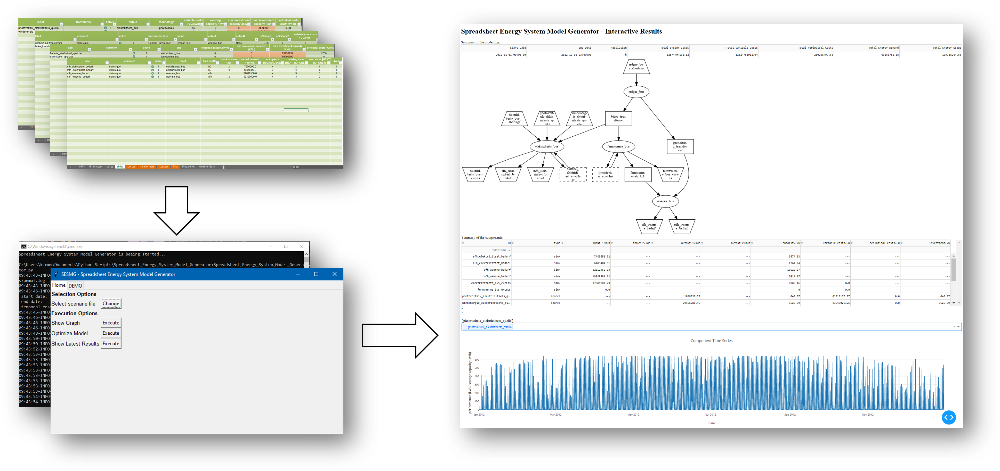

The Spreadsheet Energy System Model Generator 
=================================================

The **SESMG** is an energy system model generator with the focus on the optimization of urban energy systems, which can, however, also be used for the modeling of other types of energy systems. The **SESMG** is based on the 'Open Energy Modelling Framework' (oemof) and comes, compared to other modeling tools with advantages regarding user-friendliness, as
 
 * the model definition is based on spreadsheets, therefore no programming skills are required for the entire modeling process,
 * urban energy system models with any size can automatically conceptualized,
 * visualization of complex results are automatically created in the form of system graphs, Pareto-fronts, energy amounts, capacity diagrams, and many more, as well as
 * a set of standard (but still customizable) parameters are given, including detailed descriptions and references.
 
Furthermore, the **SESMG** comes with important modeling methods, enabling holistic modeling of spatially high resolution modeling of mixed-use multi energy systems, such as
 
 * considering the multi-energy system (MES) approach
 * applying multi-objective optimization by using the epsilon-constraint-method, as well as
 * providing several methods for model-based reduction of computational requirements (run-time and RAM).

   From an input spreadsheet to interactive modelling results: The Spreadsheet Energy System Model Generator

Modeling Methods
-------------------------------------------------
* :doc:`01.01.00_structure_of_energy_systems`
* :doc:`01.02.00_multi_criteria_optimization`
* :doc:`01.03.00_model_simplification`
* :doc:`01.04.00_urban_district_upscaling`
	
	
..	toctree::
	:maxdepth: 2
	:hidden:
	:caption: Modeling Methods
	
	01.01.00_structure_of_energy_systems
	01.02.00_multi_criteria_optimization
	01.03.00_model_simplification
	01.04.00_urban_district_upscaling
	
	
Manual
-------------------------------------------------
* :doc:`02.01.00_installation`
* :doc:`02.02.00_application`
* :doc:`02.02.01_interface`
* :doc:`02.02.02_model_definition`
* :doc:`02.02.03_urban_district_upscaling`
* :doc:`02.02.04_results`
* :doc:`02.02.05_technical_data`
* :doc:`02.03.00_demo`
	
	
..	toctree::
	:maxdepth: 2
	:hidden:
	:caption: Manual
	
	02.01.00_installation
	02.02.00_application
	02.03.00_demo

Troubleshooting 
-------------------------------------------------
* :doc:`03.00.00_trouble_shooting`
	

..	toctree::
	:maxdepth: 2
	:hidden:
	:caption: Troubleshooting
	
	03.00.00_trouble_shooting

Sourcecode Documentation
-------------------------------------------------
* :doc:`04.00.00_sourcecode_documentation`

..	toctree::
	:maxdepth: 3
	:hidden:
	:caption: Sourcecode Documentation
	
	04.00.00_sourcecode_documentation
	

Further Information
-------------------------------------------------
* :doc:`05.01.00_publications`
* :doc:`05.02.00_related_links`
* :doc:`05.03.00_citation`
* :doc:`05.04.00_license`
* :doc:`05.05.00_contact`
* :doc:`05.06.00_contributors`
* :doc:`05.07.00_acknowledgements`
		
..	toctree::
	:maxdepth: 2
	:hidden:
	:caption: Further Information 
	
	05.01.00_publications
	05.02.00_related_links
	05.03.00_citation
	05.04.00_license
	05.05.00_contact
	05.06.00_contributors
	05.07.00_acknowledgements
	
