.. Spreadsheet Energy System Model Generator documentation master file, created by
   sphinx-quickstart on Fri Jan 24 10:13:26 2020.
   You can adapt this file completely to your liking, but it should at least
   contain the root `toctree` directive.

The Spreadsheet Energy System Model Generator
=============================================

.. toctree::
   :maxdepth: 4
   :caption: Contents:
   
About the Model Generator
=========================

The Spreadsheet Energy System Model Generator allows the modeling 
and optimization of energy systems without the need for programming skills. 
The components defined in this spreadsheet are defined with the 
included Python program and the open source Python library "oemof", assembled 
to an energy system and optimized with the open source solver "cbc". The modeling 
results can be viewed and analyzed using a browser-based results output.

Structure of Energy Systems
---------------------------

Energy systems in the sense of the Spreadseet Energy System Model Generator are designed according to the 
specifications of the `oemof <https://oemof.readthedocs.io/en/stable/index.html>`_ library. Accordingly, 
energy systems can be represented with the help of mathematical graph theory. Thus, energy systems are 
exemplified as "graphs" consisting of sets of "vertices" and "edges". In more specific terms, vertices 
stand for components and buses while directed edges connect them. The status variable of the energy flow 
indicates which amount of energy is transported between the individual nodes at what time. Possible 
components of an oemof energy system are 

- sources,
- sinks,
- transformers, and
- storages. 

Buses furthermore form connection points of an energy system. The graph of a simple energy system 
consisting of each one source, one transformer, one sink, as well as two buses, could look like the 
example displayed in the following figure.
  
.. figure:: images/simple_energy_system.png
   :width: 100 %
   :alt: Bus-Example
   :align: center

   Graph of a simple energy system, consisting of one source, two buses, one transformer, and one a sink.
  
An oemof energy system must be in equilibrium at all times. 
Therefore sources must always provide exactly as 
much energy as the sinks and transformer losses consume. 
In turn, the sink must be able to consume the entire amount 
of energy supplied. If there is no balance, 
oemof is not able to solve the energy system.

Buses
^^^^^

The modelling framework oemof does not allow direct connections 
between components. Instead, they must always 
be connected with a bus. The bus in turn can be connected 
to other components, so that energy can be transported via 
the bus. Buses can have any number of incoming and 
outgoing flows. Buses can not directly be connected with 
each other. They do not consider any conversion processes 
or losses.

Sources
^^^^^^^

Sources represent the provision of energy. This can either 
be the exploitation of of an energy source (e.g. 
gas storage reservoir or solar energy, no energy source in 
physical sense), or the simplified energy import from 
adjacent energy systems. While some sources may have 
variable performances, depending on the temporary needs of 
the energy system, others have fixed performances, 
which depend on external circumstances. In the latter case, 
the exact performances must be entered to the model in 
form of time series. With the help of oemofs "feedinlib" 
and "windpowerlib", electrical outputs of photovoltaik 
(pv)-systems and wind power plants can be generated 
automatically. In order to ensure a balance in the energy 
system at all times, it may be useful to add a "shortage"
source to the energy system, which supplies energy 
in the event of an energy deficit. In reality, such a 
source could represent the purchase of energy at a fixed price.

**Photovoltaic Systems**

The following Figure sketches the fractions of radiation
arriving at a PV-module as well as further relevant parameters. 

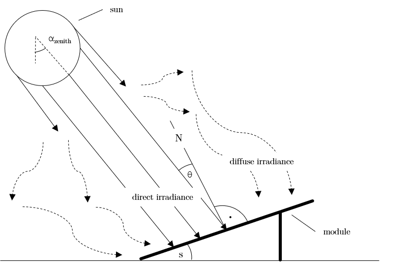

   Radiation on a photovoltaic module.

The global radiation is
composed of direct and diffuse radiation. The "direct horizontal
irradiance" dirhi is the amount of sun radiation as directly
received by a horizontal surface. The "diffuse horizontal irradiance"
dhi is the share of radiation, which arrives via scattering effects
on the same surface. A part of the global radiation is reflected on the ground surface and
can thus cause an additional radiation contribution on the photovoltaic
module. The amount of
the reflected part depends on the magnitude of the albedo of the ground material. Exemplary albedo values are
listed in the following table.

+---------------------------+--------------------------------+
| Material 					| Consumer Group                 |
+===========================+================================+
|   herbage (july, august)	| 0.25                           |
+---------------------------+--------------------------------+
|   pasture		   			| 0.18 - 0.23                    |
+---------------------------+--------------------------------+
|   uncoppied fields	   	| 0.26            		         |
+---------------------------+--------------------------------+
|   woods   				| 0.05 - 0.18 					 |
+---------------------------+--------------------------------+
|   heath area 		  		| 0.10 - 0.25                    |
+---------------------------+--------------------------------+
|   asphalt   				| 0.15                           |
+---------------------------+--------------------------------+
|   concrete, clean   		| 0.30                           |
+---------------------------+--------------------------------+
|   concrete, weathered		| 0.20                           |
+---------------------------+--------------------------------+
|   snow cover, fresh   	| 0.80 - 0.90                    |
+---------------------------+--------------------------------+
|   snow cover, old     	| 0.45 - 0.70                    |
+---------------------------+--------------------------------+

**Wind Turbines**

For the modelilng of wind turbines, the weather data set must 
include wind speeds. The wind speeds must be available for a 
measurement height of 10 m in the unit m/s.

The system data of the wind turbine to be modelled are obtained 
from the `"oedb" <https://github.com/wind-python/windpowerlib/tree/dev/windpowerlib/oedb>`_ 
database.

Sinks
^^^^^

Sinks represent either energy demands within the energy system or 
energy exports to adjacent systems. Like sources, sinks can either
have variable or fixed energy demands. 
Sinks with variable demands adjust their consumption to the amount 
of energy available. This could for example stand for the sale of 
surplus electricity. However, actual consumers usually have fixed 
energy demands, which do not respond to amount of energy available 
in the system. As with sources, the exact demands of sinks can be 
passed to the model with the help of time series. 

In order to ensure a balance in the energy system at all times, 
it may be appropriate to add an "excess" sink to the energy system, 
which consumes energy in the event of energy surplus. In reality, 
this could be the sale of electricity or the give-away of heat to 
the atmosphere.

**Standard Load Profiles**

Oemof's sub-library `demandlib <https://demandlib.readthedocs.io/en/latest/>`_ 
can be used for the estimation of heat and electricity demands of different 
consumer groups, as based on German standard load profiles (SLP). 
The following electrical standard load profiles of the Association 
of the Electricity Industry (VDEW) can be used:

+--------+---------------------------------------------------+
| Profil | Consumer Group                                    |
+========+===================================================+
|   H0   | households                                        |
+--------+---------------------------------------------------+
|   G0   | commercial general                                |
+--------+---------------------------------------------------+
|   G1   | commercial on weeks 8-18 h                        |
+--------+---------------------------------------------------+
|   G2   | commercial with strong consumption in the evening |
+--------+---------------------------------------------------+
|   G3   | commercial continuous                             |
+--------+---------------------------------------------------+
|   G4   | shop/hairdresser                                  |
+--------+---------------------------------------------------+
|   G5   | bakery                                            |
+--------+---------------------------------------------------+
|   G6   | weekend operation                                 |
+--------+---------------------------------------------------+
|   L0   | agriculture general                               |
+--------+---------------------------------------------------+
|   L1   | agriculture with dairy industry/animal breeding   |
+--------+---------------------------------------------------+
|   L2   | other agriculture                                 |
+--------+---------------------------------------------------+

The following heat standard load profiles of the Association of Energy and Water Management (BDEW) can be used:

+---------+----------------------------------------------------------------+
| Profile | House Type                                                     |
+=========+================================================================+
| EFH     | single family house                                            |
+---------+----------------------------------------------------------------+
| MFH     | multi family house                                             |
+---------+----------------------------------------------------------------+
| GMK     | metal and automotive                                           |
+---------+----------------------------------------------------------------+
| GHA     | retail and wholesale                                           |
+---------+----------------------------------------------------------------+
| GKO     | Local authorities, credit institutions and insurance companies |
+---------+----------------------------------------------------------------+
| GBD     | other operational services                                     |
+---------+----------------------------------------------------------------+
| GGA     | restaurants                                                    |
+---------+----------------------------------------------------------------+
| GBH     | accommodation                                                  |
+---------+----------------------------------------------------------------+
| GWA     | laundries, dry cleaning                                        |
+---------+----------------------------------------------------------------+
| GGB     | horticulture                                                   |
+---------+----------------------------------------------------------------+
| GBA     | bakery                                                         |
+---------+----------------------------------------------------------------+
| GPD     | paper and printing                                             |
+---------+----------------------------------------------------------------+
| GMF     | household-like business enterprises                            |
+---------+----------------------------------------------------------------+
| GHD     | Total load profile Business/Commerce/Services                  |
+---------+----------------------------------------------------------------+

In addition, the location of the building and whether the building is located 
in a "windy" or "non-windy" area are taken into account for the application 
of heat standard load profiles. The following location classes may be considered:

+----------+--------------------------------------------------------------------------------+
| Category | Building Location                                             					|
+==========+================================================================================+
| 11       | Germany, nationwide                                           					|
+----------+--------------------------------------------------------------------------------+
| 1        | Bremen                                                       					|
+----------+--------------------------------------------------------------------------------+
| 2        | Hamburg, Saarland                                            					|
+----------+--------------------------------------------------------------------------------+
| 3        | Berlin , Hessen, Lower Saxony, North Rhine-Westphalia         					|
+----------+--------------------------------------------------------------------------------+
| 4        | Baden-Württemberg, Rhineland-Paatinate, Schleswig-Holstein, Saxony 			|
+----------+--------------------------------------------------------------------------------+
| 5        | Brandenburg, Bavaria, Mecklenburg-Western Pomerania, Saxony-Anhalt, Thuringia 	|
+----------+--------------------------------------------------------------------------------+

**Stochastic Load Profiles (Richardson Tool)**

The use of standard load profiles has the disadvantage that they only represent 
the average of a larger number of households (> 200). Load peaks of individual 
households (e.g. through the use of hair dryers or electric kettles) are filtered 
out by this procedure. To counteract this, the Spreadsheet Energy System Model Generator offers the 
possibility to generate stochastic load profiles for residential buildings. 
These are generated on the basis of Richardsonpy. Thereby, an arbitrary number of different realistic load profiles
is simulated under consideration of statistic rules. The mean value of a large-enough
number of profiles should, again, result in the standard load profile. However, if calculations
are continued using the individual values before averaging – as in the above
calculation of costs – different values are obtained than when calculating with SLPs.

Transformers
^^^^^^^^^^^^
Transformers are components with one ore more input flows, which are 
transformed to one or more output flows. Transformers may be power 
plants, energy transforming processes 
(e.g., electrolysis, heat pumps), as well as transport lines with 
losses. The transformers’ efficiencies can be defined for every 
time step (e.g., the efficiency of a thermal 
powerplants in dependence of  the ambient temperature).

Currently only Generic Transformers can be used within the Spreadsheet Energy System Model Generator. 
These may have one or more different outputs, e.g., heat and electricity. For the modelling,
the nominal performance of a generic transformer with several outputs,
the respective output ratios, and an efficiency for each output need to be known.

Links
^^^^^
Links can be used to connect two buses or to display transport losses of
networks. Links are not represented by a separate oemof class, they are
rather represented by transformers. In order to map a loss-free
connection between two buses, an efficiency of 1 is used. If a link is
undirected, a separate transformer must be used for each direction. 
In an energy system, links can represent, for
example, electrical powerlines, gas pipelines, district heating
distribution networks or similar.

.. figure:: images/link.png
   :width: 100 %
   :alt: links
   :align: center

   Representation of directed and undirected links with oemof transformers

Storages
^^^^^^^^
Storages are connected to a bus and can store energy from this bus and return it to a later point in time.

Investment
^^^^^^^^^^
The investment costs help to compare the costs of building new components to the costs of further using existing components instead. The annual savings from building new capacities 
should compensate the investment costs. The investment method can be applied to any new component to be built. In addition to the usual component parameters, the 
maximum installable capacity needs to be known. Further, the periodic costs need to be assigned to the investment costs. The periodic costs refer to the defined 
time horizon. If the time horizon is one year, the periodical costs correspond to the annualized capital costs of an investment.

Getting Started
===============

Installation
------------

.. warning:: 

	Warning! The installation has only been tested under Windows, using Python 3.7.6 (64 bit)! Python 3.8 is currently not supported.

1. Install Python (version 3.5 or higher) 

.. note:: 

	Make sure to select "Add pyton to PATH" at the beginning of the Python installation.

- go to the `Python download page <https://www.python.org/downloads/>`_
- chose a Python version (e.g., "Python 3.7.6") and click "download"
- download an installer (e.g., "Windows x86-64 executable installer")
- execute the installer on your computer
	

2. Download the Spreadsheet Energy System Model Generator from `GIT <https://git.fh-muenster.de/ck546038/spreadsheet-energy-system-model-generator/-/archive/master/spreadsheet-energy-system-model-generator-master.zip>`_ as .zip folder.

3. Extract the .zip folder into any directory on the computer.

4. Download the CBC-solver from `here <http://ampl.com/dl/open/cbc/cbc-win64.zip>`_

5. Extract the CBC solver into the folder of the Spreadsheet Energy System Model Generator

6. Install "Graphviz"

- go to `Graphviz download page <https://graphviz.gitlab.io/download/>`_ 
- select and download the graphviz version for your device (e.g. `graphviz-2.38.msi for Windows <https://graphviz.gitlab.io/_pages/Download/windows/graphviz-2.38.zip>`_ 

.. note:: 

	Make sure to select the correct installation location for Graphviz!!

- Execute the installation manager you just downloaded. Choose the following directory for the installation: "C:\Program Files (x86)\Graphviz2.38\" (should be the default settings)

7. Execute the "installation.cmd" file.

.. note:: 

	If you receive a "Your computer has been protected by Windows" error message, click "More Information," and then "Run Anyway".

7. The Spreadsheet Energy System Model Generator has been installed

Application of the Model Generator
----------------------------------

1. Fill in the spreadsheet document according to the instructions in the following chapter and save it as "scenario.xlsx" in the main folder of the Spreadsheet Energy System Model Generator.

2. Execute the "exe.cmd" file in the main folder of the program. 

.. note:: 

	If you receive a "Your computer has been protected by Windows" error message, click "More Information," and then "Run Anyway".

3. Wait until the modelling is completed. The results are then automatically opened in your Internet browser. 

4. More detailed modelling results are stored within the "results" folder.

Using the Scenario File
----------------------

For the modeling and optimization of an energy system, parameters for all system components must be given in the model 
generator using the enclosed .xlsx file (editable with Excel, LibreOffice, …). The .xlsx file is divided into nine 
input sheets. In the "timesystem" sheet, general parameters are defined for the time horizon to be examined, in the 
sheets "buses", "sinks", "sources", "transformers", "storages" and "links" corresponding components are defined. In 
the sheet "time series", the performance of individual components can be stored. In the "weather data" sheet, the 
required weather data is stored. When completing the input file, it is recommended to enter the energy system step by 
step and to perform test runs in between, so that potential input errors are detected early and can be localized more 
easily. In addition to the explanation of the individual input sheets, an example energy system is built step by step 
in the following subchapters. The input file for this example is stored in the program folder "examples" and viewed on 
`GIT <https://git.fh-muenster.de/ck546038/spreadsheet-energy-system-model-generator/tree/master/examples>`_. The following units are used throughout:

- capacity/performance in kW,
- energy in kWh,
- angles in degrees, and
- costs in cost units (CU).

Cost units are any scalable quantity used to optimize the energy system, such as euros or grams of carbon dioxide emissions.

Timesystem
^^^^^^^^^^^

Within this sheet, the time horizon and the temporal resolution of the model is defined. The following parameters have to be entered:

- **start date**: start of the modelling time horizon. Format: "YYYY-MM-DD hh:mm:ss";
- **end date**: end date of the modelling time horizon. Format: "YYYY-MM-DD hh:mm:ss"; and
- **temporal resolution**: for the modelling considered temporal resolution. Possible inputs: "a" (years), "d" (days), "h" (hours) "min" (minutes), "s" (seconds), "ms" (mili seconds).
- **periods**: Number of periods within the time horizon (one year with hourly resolution equals 8760 periods).

  
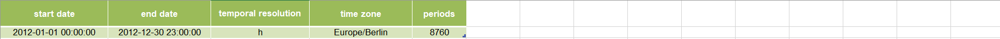

   Exemplary input for the time system

Buses
^^^^^

Within this sheet, the buses of the energy system are defined. The following parameters need to be entered:

- **label**: Unique designation of the bus. The following format is recommended: "ID_energy sector_bus".
- **comment**: Space for an individual comment, e.g. an indication of which measure this component belongs to.
- **active**: Specifies whether the bus shall be included to the model. 0 = inactive, 1 = active. 
- **excess**: Specifies whether a sink is to be generated, which consumes excess energy. 0 = no excess sink will be generated; 1 = excess sink will be generated.
- **shortage**: Specifies whether to generate a shortage source that can compensate energy deficits or not. 0 = no shortage source will be generated; 1 = shortage source will be generated.
- **shortage costs/(CU/kWh)**: Assigns a price per kWh to the purchase of energy from the shortage source. If the shortage source was deactivated, the fill character "x" is used. 
- **excess costs/(CU/kWh)**: Assigns a price per kWh to the release of energy to the excess sink. If the excess sink was deactivated, the fill character "x" is used. 
	
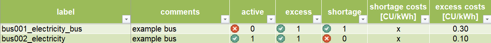

   Exemplary input for the buses sheet
  

	
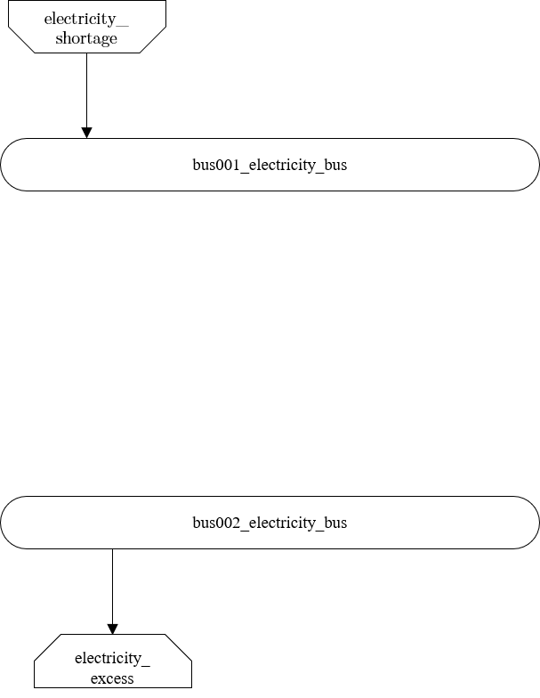

   Graph of the energy system, which is created by entering the example components. Two buses, a shortage source, and an excess sink were created by the input.

Sinks
^^^^^

Within this sheet, the sinks of the energy system are defined. The following parameters need to be entered:

- **label**: Unique designation of the sink. The following format is recommended: "ID_energy sector_sinks".
- **comment**: Space for an individual comment, e.g. an indication of which measure this component belongs to.
- **active**: Specifies whether the sink shall be included to the model. 0 = inactive, 1 = active.
- **input**: Space for an individual comment, e.g. an indication of which measure this component belongs to.
- **load profile**: Specifies the basis onto which the load profile of the sink is to be created. If the Richardson tool is to be used, "richardson" has to be inserted. For standard load profiles, its acronym is used. If a time series is used, "timeseries" must be entered. If the source is not fixed, the fill character "x" has to be used.
- **nominal value/(kW)**: Nominal performance of the sink. Required when "time series" has been entered into the "load profile". When SLP or Richardson is used, use the fill character "x" here.
- **annual demand/(kWh/a)**: Annual energy demand of the sink. Required when using the Richardson Tool or standard load profiles. When using time series, the fill character "x" is used. 
- **occupants [RICHARDSON]**: Number of occupants living in the respective building. Only required when using the Richardson tool, use fill character "x" for other load profiles.
- **building class [HEAT SLP ONLY]**: BDEW-building class.
- **wind class [HEAT SLP ONLY]**: wind classification for building location (0=not windy, 1=windy)
- **fixed**: Indicates whether it is a fixed sink or not. 0 = not fixed; 1 = fixed.
 
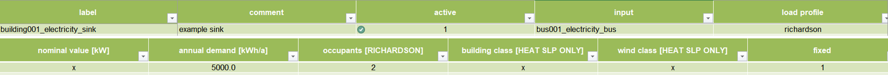

   Exemplary input for the sinks sheet
  

	
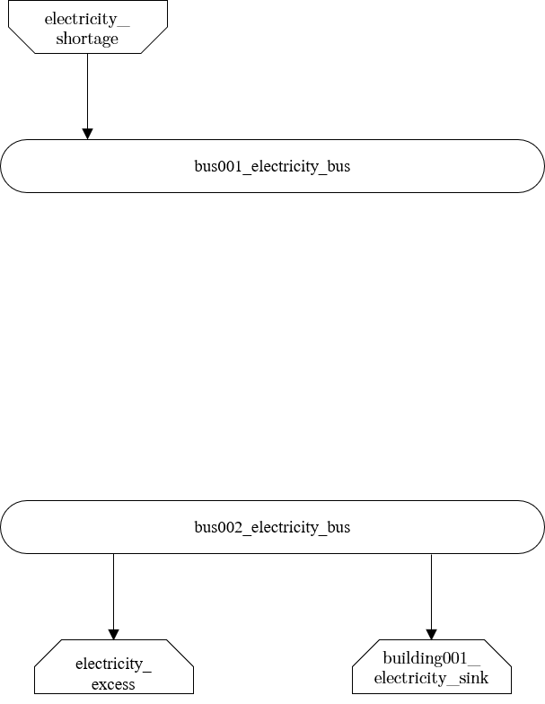

   Graph of the energy system, which is created by entering the example components. By the input in the sinks sheet, a photovoltaic source has been created.

Sources
^^^^^^^

Within this sheet, the sources of the energy system are defined. Properties with the addition "PV ONLY" have only to be 
defined if the parameter "technology" is set on "photovoltaic". The following parameters have to be entered:

- **label**: Unique designation of the source. The following format is recommended: "ID_energy sector_source".
- **comment**: Space for an individual comment, e.g. an indication of which measure this component belongs to.
- **active**: Specifies whether the source shall be included to the model. 0 = inactive, 1 = active.
- **output**: Specifies which bus the source is connected to.
- **technology**: Technology type of source. Input options: "photovoltaic", "windpower", "other". Time series are automatically generated for photovoltaic systems and wind turbines. If "other" is selected, a time series must be provided in the "time_series" sheet.
- **Turbine Model (Windpower ONLY)**: Reference wind turbine model. Possible turbine types are listed `here <https://github.com/wind-python/windpowerlib/blob/dev/windpowerlib/oedb/turbine_data.csv>`_. 
- **Hub Height (Windpower ONLY)**: Hub height of the wind turbine. Which hub heights are possible for the selected reference turbine can be viewed `here <https://github.com/wind-python/windpowerlib/blob/dev/windpowerlib/oedb/turbine_data.csv>`_.
- **variable costs/(CU/kWh)**: Defines the variable costs incurred for a kWh of energy drawn from the source.
- **existing capacity/(kW)**: Existing capacity of the source before possible investments.
- **min. investment capacity/(kW)**: Minimum capacity to be installed in case of an investment.
- **max. investment capacity/(kW)**: Maximum capacity that can be added in the case of an investment. If no investment is possible, enter the value "0" here.
- **periodical costs/(CU/(kW a))**: Costs incurred per kW for investments within the time horizon
- **technology database (PV ONLY)**: Database, from where module parameters are to be obtained. Recommended Database: "SandiaMod".
- **inverter database (PV ONLY)**: Database, from where inverter parameters are to be obtained. Recommended Database: "sandiainverter".
- **Modul Model (PV ONLY)**: Module name, according to the database used.
- **Inverter Model (PV ONLY)**: Inverter name, according to the database used.
- **Azimuth (PV ONLY)**: Specifies the orientation of the PV module in degrees. Values between 0 and 360 are permissible (0 = north, 90 = east, 180 = south, 270 = west). Only required for photovoltaic sources, use fill character "x" for other technologies.
- **Surface Tilt (PV ONLY)**: Specifies the inclination of the module in degrees (0 = flat). Only required for photovoltaic sources, use fill character "x" for other technologies.
- **Albedo (PV ONLY)**: Specifies the albedo value of the reflecting floor surface. Only required for photovoltaic sources, use fill character "x" for other technologies.
- **Altitude (PV ONLY)**: Height (above mean sea level) in meters of the photovoltaic module. Only required for photovoltaic sources, use fill character "x" for other technologies.
- **Latitude (PV ONLY)**: Geographic latitude (decimal number) of the photovoltaic module. Only required for photovoltaic sources, use fill character "x" for other technologies.
- **Longitude (PV ONLY)**: Geographic longitude (decimal number) of the photovoltaic module. Only required for photovoltaic sources, use fill character "x" for other technologies.
- **fixed**: Indicates whether it is a fixed source or not. 0 = not fixed; 1 = fixed.

.. figure:: images/BSP_source.png
   :width: 100 %
   :alt: Source-Example
   :align: center

   Exemplary input for the sources sheet
  

	
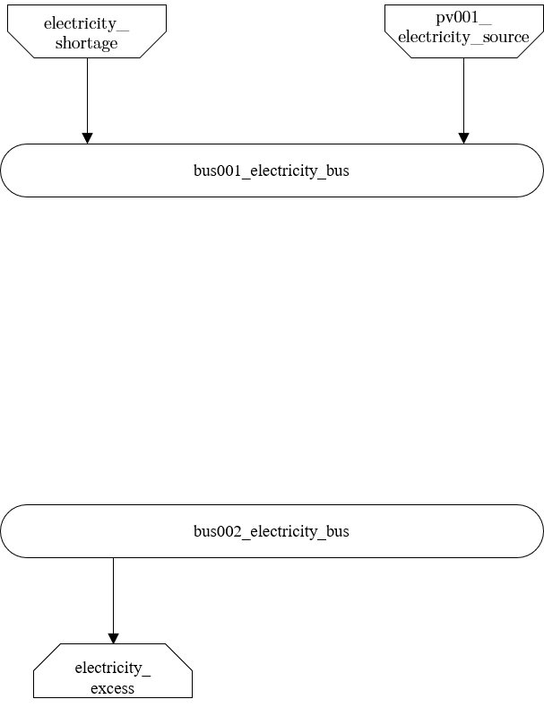

   Graph of the energy system, which is created by entering the example components. By the input in the sources-sheet one sink has been created.
   
Transformers
^^^^^^^^^^^^

Within this sheet, the transformers of the energy system are defined. The following parameters have to be entered:

- **label**: Unique designation of the transformer. The following format is recommended: "ID_energy sector_transformer".
- **comment**: Space for an individual comment, e.g. an indication of which measure this component belongs to.
- **active**: Specifies whether the transformer shall be included to the model. 0 = inactive, 1 = active.
- **transformer type**: Indicates what kind of transformer it is. Possible entries: "GenericTransformer" for linear transformers with constant efficiencies; "GenericCHP" for transformers with varying efficiencies.
- **input**: Specifies the bus from which the input to the transformer comes from.
- **output**: Specifies bus to which the output of the transformer is forwarded to.
- **output2**: Specifies the bus to which the output of the transformer is forwarded to, if there are several outputs. If there is no second output, the fill character "x" must be entered here.
- **efficiency**: Specifies the efficiency of the first output. Values between 0 and 1 are allowed entries.
- **efficiency2**: Specifies the efficiency of the second output, if there is one. Values  between 0 and 1 are entered. If there is no second output, the fill character "x" must be entered here.
- **variable input costs**: Variable costs incurred per kWh of input energy supplied.
- **existing capacity/(kW)**: Already installed capacity of the transformer.
- **max investment capacity/(kW)**: Maximum  installable transformer capacity in addition to the previously existing one.
- **min investment capacity/(kW)**: Minimum transformer capacity to be installed.
- **periodical costs /(CU/a)**: Costs incurred per kW for investments within the time horizon.

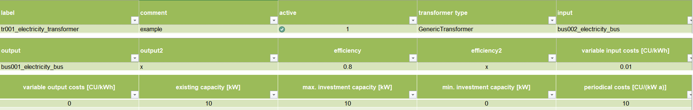

   Exemplary input for the transformers sheet
  

	
.. figure:: images/BSP_Graph_transformer.png
   :width: 60 %
   :alt: Transformer_Graph
   :align: center

   Graph of the energy system, which is created by entering the example components. One transformer has been created by including the transformers sheet 

Storages
^^^^^^^^

Within this sheet, the sinks of the energy system are defined. The following parameters have to be entered:

- **label**: Unique designation of the storage. The following format is recommended: "ID_energy sector_storage".
- **comment**: Space for an individual comment, e.g. an indication of which measure this component belongs to.
- **active**: Specifies whether the storage shall be included to the model. 0 = inactive, 1 = active.
- **bus**: Specifies which bus the storage is connected to.
- **capacity inflow**: Indicates the performance with which the memory can be charged.
- **capacity outflow**: Indicates the performance with which the memory can be discharged.
- **capacity loss**: Indicates the storage loss per time unit.
- **efficiency inflow**: Specifies the charging efficiency.
- **efficiency outflow**: Specifies the discharging efficiency.
- **initial capacity**: Specifies how far the memory is loaded at time 0 of the simulation. Value must be between 0 and 1.
- **capacity min**: Specifies the minimum amount of memory that must be loaded at any given time. Value must be between 0 and 1.
- **capacity max**: Specifies the maximum amount of memory that can be loaded at any given time. Value must be between 0 and 1.
- **variable input costs**: Indicates how many costs arise for charging with one kWh.
- **variable output costs**: Indicates how many costs arise for charging with one kWh.
- **existing capacity/(kW)**: Previously installed capacity of the storage.
- **periodical costs /(CU/a)**: Costs incurred per kW for investments within the time horizon.
- **max. investment capacity/(kW)**: Maximum in addition to existing capacity, installable storage capacity.
- **min. investment capacity/(kW)**: Minimum storage capacity to be installed.

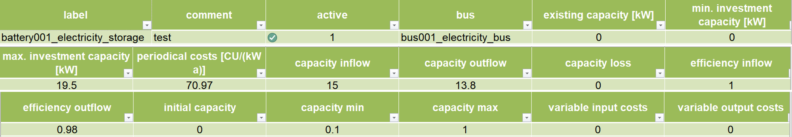

   Exemplary input for the storages sheet
  

	
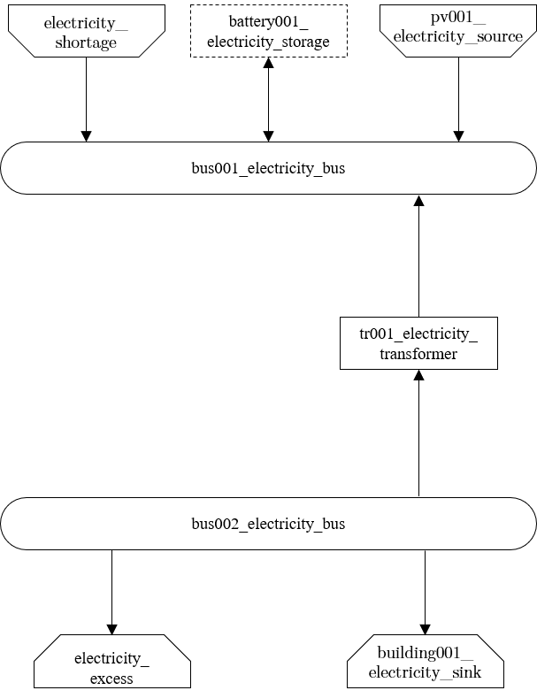

   Graph of the energy system, which is created after entering the example components. One storage has been created by the storage sheet.
   
Links
^^^^^

Within this sheet, the links of the energy system are defined. The following parameters have 
to be entered:

- **label**: Unique designation of the link. The following format is recommended: "ID_energy sector_transformer"
- **comment**: Space for an individual comment, e.g. an indication of  which measure this component belongs to.
- **active**: Specifies whether the link shall be included to the model. 0 = inactive, 1 = active. 
- **bus_1**: First bus to which the link is connected. If it is a directed link, this is the input bus.
- **bus_2**: Second bus to which the link is connected. If it is a directed link, this is the output bus.
- **(un)directed**: Specifies whether it is a directed or an undirected link. Input options: "directed", "undirected".
- **efficiency**: Specifies the efficiency of the link. Values between 0 and 1 are allowed entries.
- **existing capacity/(kW)**: Already installed capacity of the link.
- **min. investment capacity/(kW)**: Minimum, in addition to existing capacity, installable capacity.
- **max. investment capacity/(kW)**: Maximum capacity to be installed.
- **variable costs/(CU/kWh)**: Specifies the efficiency of the first output. Values between 0 and 1 are allowed entries.
- **periodical costs/(CU/(kW a))**: Costs incurred per kW for investments within the time horizon.

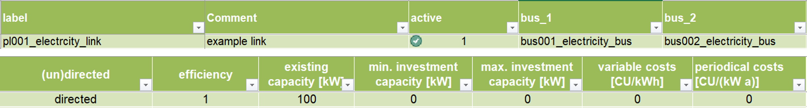

   Exemplary input for the input in the storages sheet
  

	
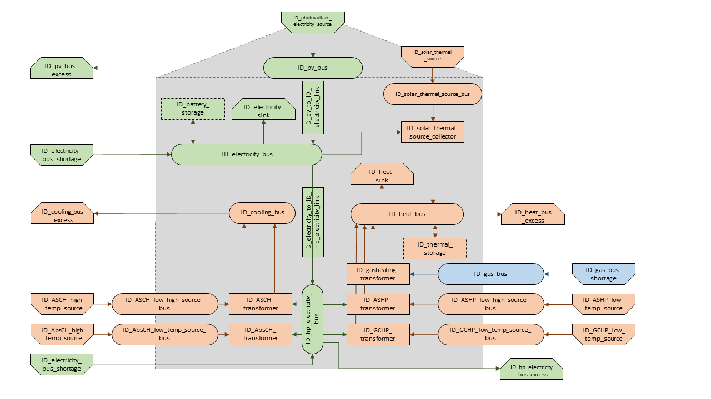

   Graph of the energy system, which is created by entering the example components. One link has been created by the addition of the links sheet
   
Time Series
^^^^^^^^^^^

Within this sheet, time series of components of which no automatically created time series exist, are stored. More 
specifically, these are sinks to which the property "load profile" have been assigned as "timeseries" and sources 
with the "technology" property "others". The following parameters have to be entered:

- **timestamp**: Points in time to which the stored time series are related. Should be within the time horizon defined in the sheet "timeseries".
- **timeseries**: Time series of a sink which has been assigned the property "timeseries" under the attribute "load profile" or source which has been assigned the property "other" under the attribute "technology". Time series contain a value between 0 and 1 for each point in time, which indicates the proportion of installed capacity accounted for by the capacity produced at that point in time. In the header line, the name must be entered in the format "componentID.actual_value".

 
 
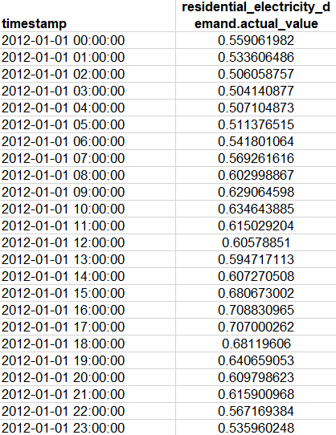

   Exemplary input for time series sheet

Weather Data
^^^^^^^^^^^^

If electrical load profiles are simulated with the Richardson tool, heating load profiles with the demandlib or 
photovoltaic systems with the feedinlib, weather data must be stored here. The weather 
data time system should be in conformity with the model’s time system, defined in the sheet "timesystem".

- **timestamp**: Points in time to which the stored weather data are related. 
- **dhi**: diffuse horizontal irradiance in W/m:sup:`2
- **dirhi**: direct horizontal irradiance in W/m:sup:`2
- **pressure**: air pressure in Pa
- **windspeed**: Wind speed, measured at 10 m height, in unit m/s
- **z0**: roughness length of the environment in units m

.. figure:: images/BSP_weatherdata.PNG
   :width: 100 %
   :alt: weatherdata-Example
   :align: center

   Exemplary input for weather data
   
Analyzing the Results
---------------------

Interactive Results
^^^^^^^^^^^^^^^^^^^

If the Spreadsheet Energy System Model Generator was executed via the exe.cmd-file, 
a browser window with interactive results will be opened automatically after successful 
modeling. Alternatively, the results of the last modelling run can be accessed by executing the 
Interactive_Results.py file.

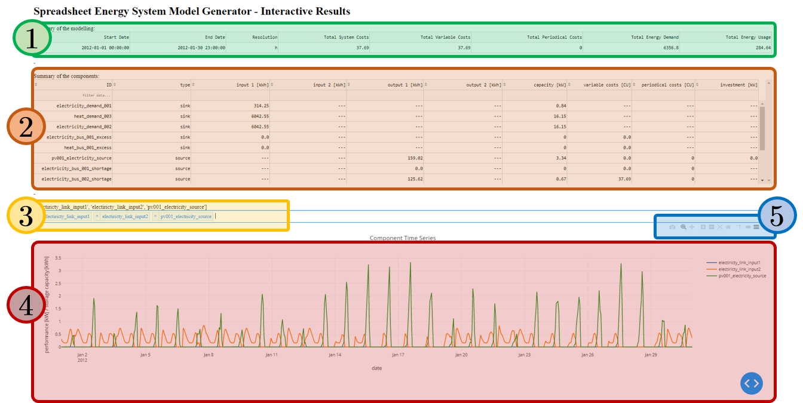

   Screenshots of the interactive results browser interface

The results interface has the following elements:

- **Table with a summary of the modelling (1).**

- **Table with information about every component (2):** The entries can be filtered and sorted according to their content.

- **Graph, where time series of the different components can be shown (4).** With the help of a selection window (drop-down menu and search function) (3) time series to be shown can be selected. With the help of a number of tools (5) the graphs can be scaled, sections can be displayed and images can be saved.

Results as Spreadsheets and Log-Files
^^^^^^^^^^^^^^^^^^^^^^^^^^^^^^^^^^^^^

The results of the modeling are stored in the "results" folder in two formats:
- as summarizing log files, under
- as detailed xlsx-files.

The log-file gives an overview of which components are created and which of the investment options should be implemented. 
In addition, it is indicated which costs for the supply of the energy system are incurred in the optimized case.
For each implemented bus, an xlsx-file is created in which incoming and outgoing energy flows are specified for each time step of the model 
are.

Troubleshooting
===============
During execution of the model generator, error messages and associated program aborts may occur. 

**General debugging**:

Pay attention to the correct spelling:

- Pay attention to correct upper and lower case.
- Do not use spaces in the entire spreadsheet (except for the "comment" columns).
- Make sure that every column of the used lines is filled. Columns that are not used can be filled with an "x".

Make sure that the displayed system can stay in balance. 
- It must always be possible to take off all of the supplied energy and vice versa. 
- The use of excess-sinks and shortage-sources can help to keep the system in balance.

**Known error messages**:

.. warning:: 

	flowsum = source['sequences'].sum()
	
	KeyError: 'sequences'
	
or

.. warning:: 

	ApplicationError: Solver (cbc) did not exit normally

- **Possible Error Cause**: A system component was entered incorrectly in the input file. 
- **Debugging**: For all components, make sure that 1) each column is filled correctly, and 2) the first component of a sheet is entered in the row directly below the header row, and that there are no blank rows between the individual components of a sheet

.. warning:: 

	Memory Error
	
- **Possible Error Cause**: The available memory is not sufficient to solve the model.
- **Debugging**: Take the following measures gradually until the error no longer occurs:

	- Restart the used Python interpreter
	- Close unnecessary programs on the computer
	- Make sure that  python 64 bit version is used (Python 32 bit can manage only 2 GB of memory).
	- Start the program on a more powerful computer.

.. warning:: 

	AttributeError: module 'time' has no attribute 'clock'

- **Possible Error Cause**: You are using a Python version not compatible with oemof.
- **Debugging**: Use Pyhton 3.7

.. warning:: 

	ValueError: operands could not be broadcast together with shapes (8784,) (8760,) 

- **Possible Error Cause**: The weather dataset contains the wrong number of data points for using feedinlib.
- **Debugging**: Make sure that the number of weather data points corresponds to the time steps of the model (At hourly resolution, one year has 8760 time steps). When simulating a leap year, it is recommended limiting the time horizon to 8760 hours.

.. warning:: 

	ValueError: pyutilib.common._exceptions.ApplicationError: Solver (cbc) did not exit normally
	
- **Possible Error Cause**: A value for the use of the investment module (e.g., "min Investment Capacity") was not filled in.
- **Debugging**: Make sure, that all necessary cells of the spreadsheet have been filled in.

.. warning::

	KeyError: '*__any component name__*'
	
- **Possible Error Cause**: Incorrectly assigned bus name for the input or output of a component
- **Debugging**: Check that all bus references are correct. Also check for typos.

.. warning::
	
	TypeError: ufunc 'true_divide' not supported for the input types, and the inputs could not be safely 
	coerced to any supported types according to the casting rule ''safe''
	
- **Possible Error Cause**: The column "annual demand" was not filled in correctly for a sink. 
- **Debugging**: Make sure to use the "annual demand" column for SLP and Richardson sinks and the "nominal value" column for time series sinks.

..warning::

	AttributeError: 'str' object has no attribute 'is_variable_type'
	
- **Possible Error Cause**: The cost value for an activated excess sink or shortage source was not correctly specified in the bus sheet
- **Debugging**: Make sure that all excess/sortage prices consist of real numbers. Also check for typos.

Your error message is not included? Do not hesitate to contact the developers.

Program Functions
=================

.. container::
   :name: top

   .. container::
      :name: titlearea

      +———————————————————————–+ \| ::: {#projectname} \| \| My Project
      \| \| ::: \| +———————————————————————–+

   .. container::
      :name: main-nav

   .. container::
      :name: MSearchSelectWindow

   .. container::
      :name: MSearchResultsWindow

.. container:: header

   .. container:: summary

      `Namespaces <#namespaces>`__ \| `Functions <#func-members>`__

   .. container:: headertitle

.. container:: contents

   .. rubric::  Namespaces
      :name: namespaces
      :class: groupheader

 

`program_files.create_energy_system <namespaceprogram__files_1_1create__energy__system.html>`__

 

 Functions
=========

def 

`program_files.create_energy_system.import_scenario <namespaceprogram__files_1_1create__energy__system.html#a230c7d68904cba8e136a4ab0db48fec4>`__
(filepath)

 

| Imports data from a spreadsheet scenario file.
  `More... <namespaceprogram__files_1_1create__energy__system.html#a230c7d68904cba8e136a4ab0db48fec4>`__

 

def 

`program_files.create_energy_system.define_energy_system <namespaceprogram__files_1_1create__energy__system.html#a6b8053b5f7956e9286fc7dd814f0625e>`__
(filepath, nodes_data)

 

--------------

Generated by  \ |doxygen|\ 1.8.17

.. |doxygen| image:: doxygen.png
   :class: footer
   :target: http://www.doxygen.org/index.html

General Information
===================

Related links
---------------------------------

`Spreadsheet Energy System Model Generator on GIT <https://git.fh-muenster.de/ck546038/spreadsheet-energy-system-model-generator>`_

`Open Energy Modelling Framework (oemof) documentation <https://oemof.readthedocs.io/en/stable/>`_

`Open Energy Modelling Framework (oemof) on Github <https://github.com/oemof>`_

`Feedinlib Documentation <https://feedinlib.readthedocs.io/en/latest/>`_

`Demandlib Documentation <https://demandlib.readthedocs.io/en/latest/>`_

`Richardsonpy on Github <https://github.com/RWTH-EBC/richardsonpy>`_

`R2Q research project <https://www.fh-muenster.de/forschungskooperationen/r2q/index.php>`_

License
-------
MIT License

Copyright (c) 2020 Christian Klemm

Permission is hereby granted, free of charge, to any person obtaining a copy
of this software and associated documentation files (the "Software"), to deal
in the Software without restriction, including without limitation the rights
to use, copy, modify, merge, publish, distribute, sublicense, and/or sell
copies of the Software, and to permit persons to whom the Software is
furnished to do so, subject to the following conditions:

The above copyright notice and this permission notice shall be included in all
copies or substantial portions of the Software.

THE SOFTWARE IS PROVIDED "AS IS", WITHOUT WARRANTY OF ANY KIND, EXPRESS OR
IMPLIED, INCLUDING BUT NOT LIMITED TO THE WARRANTIES OF MERCHANTABILITY,
FITNESS FOR A PARTICULAR PURPOSE AND NONINFRINGEMENT. IN NO EVENT SHALL THE
AUTHORS OR COPYRIGHT HOLDERS BE LIABLE FOR ANY CLAIM, DAMAGES OR OTHER
LIABILITY, WHETHER IN AN ACTION OF CONTRACT, TORT OR OTHERWISE, ARISING FROM,
OUT OF OR IN CONNECTION WITH THE SOFTWARE OR THE USE OR OTHER DEALINGS IN THE
SOFTWARE.

Contact
-------

Münster University of Applied Sciences

Christian Klemm

christian.klemm@fh-muenster.de

Acknowledgements
----------------

The authors thank the German Federal Ministry of Education (BMBF) for funding the R2Q project within grant 033W102A.

.. figure:: images/R2Q_Logos.png
   :width: 100 %
   :alt: R2Q_logos
   :align: center

