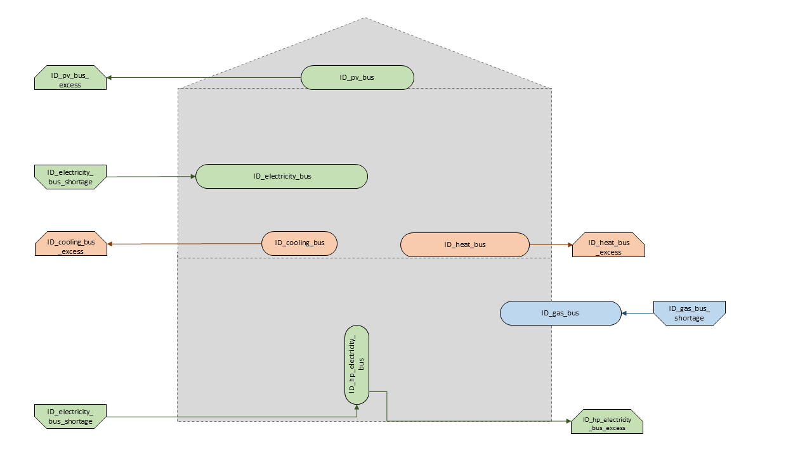
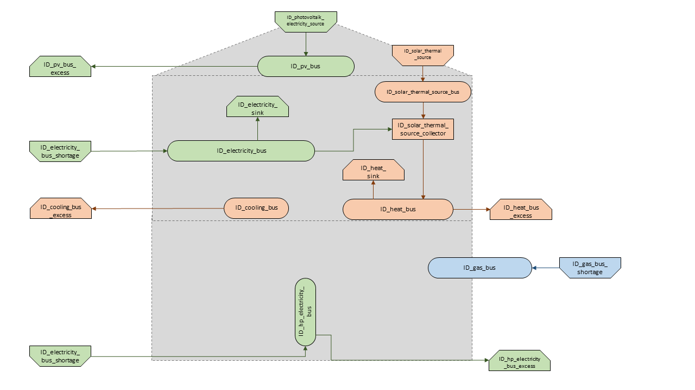
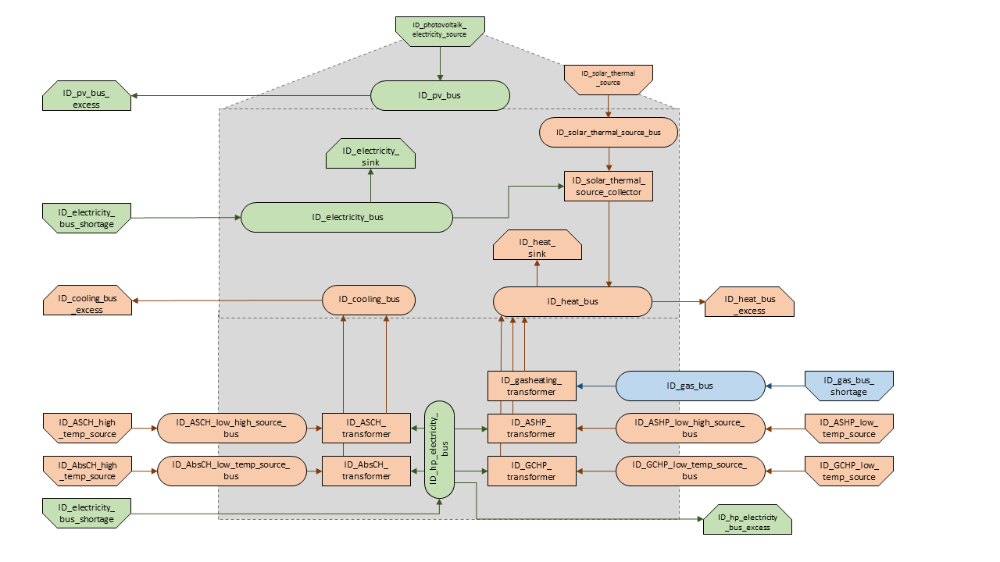

Scenario Spreadsheet
*************************************************

For the modeling and optimization of an energy system, parameters for all system components must be given in the model 
generator using the enclosed .xlsx file (editable with Excel, LibreOffice, …). The .xlsx file is divided into nine 
input sheets. In the "energysystem" sheet, general parameters are defined for the time horizon to be examined, in the 
sheets "buses", "sinks", "sources", "transformers", "storages" and "links" corresponding components are defined. In 
the sheet "time series", the performance of individual components can be stored. In the "weather data" sheet, the 
required weather data is stored. When completing the input file, it is recommended to enter the energy system step by 
step and to perform test runs in between, so that potential input errors are detected early and can be localized more 
easily. In addition to the explanation of the individual input sheets, an example energy system is built step by step 
in the following subchapters. The input file for this example is stored in the program folder "examples" and viewed on 
`GitHub <https://github.com/chrklemm/SESMG_examples>`_. The following units are used throughout:

- capacity/performance in kW,
- energy in kWh,
- angles in degrees, and
- costs in cost units (CU).

Cost units are any scalable quantity used to optimize the energy system, such as euros or grams of carbon dioxide emissions.

Energysystem
=================================================

Within this sheet, the time horizon and the temporal resolution of the model is defined. The following parameters have to be entered:

- **start date**: Start of the modelling time horizon. Format: "YYYY-MM-DD hh:mm:ss";
- **end date**: End date of the modelling time horizon. Format: "YYYY-MM-DD hh:mm:ss"; and
- **temporal resolution**: For the modelling considered temporal resolution. Possible inputs: "a" (years), "d" (days), "h" (hours) "min" (minutes), "s" (seconds), "ms" (milliseconds).
- **periods**: Number of periods within the time horizon (one year with hourly resolution equals 8760 periods).
- **constraint cost limit** in (CU): Value in order to set a limit for the whole energysystem, e.g. carbon dioxide emissions. Set this field to "None" in order to ignore the limit. If you want to set a limit, you have to set specific values for each components seen below.
- **minimum final energy reduction** in (kWh): This value can be used to regulate how much final energy reduction (e.g. through insulation) must be achieved. test
- **weather data lat**: Latitude (WGS84) of the area under investigation. This value is used to import weather data from `Open Energy Platform <https://openenergy-platform.org>`_ using feedinlib's OpenFred.
- **weather data lon**: Longitude (WGS84) of the area under investigation. This value is used to import weather data from `Open Energy Platform <https://openenergy-platform.org>`_ using feedinlib's OpenFred.
   
.. csv-table:: Exemplary input for the energy system
   :header: start date,end date,temporal resolution,periods,constraint cost limit, minimum final energy reduction, weather data lat, weather data lon

   ,,,,(CU)
   2012-01-01 00:00:00,2012-12-30 23:00:00,h,8760,None,None,None,None
   
Competition Constraints
=================================================
The spreadsheet "Competition Constraints" allows you to match two components against a predefined limit.
For example, an area competition. If you do not want to use this spreadsheet, it simply remains empty. To use this worksheet, the following values must be filled in:

- **component 1**: First component that lays claim to the parameter which size set as the limit.
- **factor 1**: Factor that defines how many units of the target unit component 1 needs to provide 1 kW of power.
- **component 2**: Second component that lays claim to the parameter which size set as the limit.
- **factor 2**: Factor that defines how many units of the target unit component 2 needs to provide 1 kW of power.
- **limit**: Maximum size suitable for providing power (e.g. **roof area** for providing electricity and heat).

.. csv-table:: Exemplary input for the competition constraints sheet
   :header: component 1,factor 1,component 2,factor 2,limit

	,unit/KW,,unit/kW,unit
	ID_photovoltaic_electricity_source,5.26,ID_solar_thermal_source,1.79,168

Buses
=================================================

Within this sheet, the buses of the energy system are defined. The following parameters need to be entered:

- **label**: Unique designation of the bus. The following format is recommended: "ID_energy sector_bus".
- **comment**: Space for an individual comment, e.g. an indication of which measure this component belongs to.
- **active**: Specifies whether the bus shall be included to the model. 0 = inactive, 1 = active. 
- **excess**: Specifies whether a sink is to be generated, which consumes excess energy. 0 = no excess sink will be generated; 1 = excess sink will be generated.
- **shortage**: Specifies whether to generate a shortage source that can compensate energy deficits or not. 0 = no shortage source will be generated; 1 = shortage source will be generated.
- **excess costs** in (CU/kWh): Assigns a price per kWh to the release of energy to the excess sink. If the excess sink was deactivated, the fill character "0" is used.
- **shortage costs** in (CU/kWh): Assigns a price per kWh to the purchase of energy from the shortage source. If the shortage source was deactivated, the fill character "0" is used.
- **excess constraint costs** in (CU/kWh): Assigns a price per kWh to the release of energy to the excess sink referring to the constraint limit set in the "energysystem" sheet. If the excess sink was deactivated, the fill character "0" is used. If not considering constraints fill character "0" is used.
- **shortage constraint costs** in (CU/kWh): Assigns a price per kWh to the purchase of energy from the shortage source referring to the constraint limit set in the "energysystem" sheet. If the shortage source was deactivated, the fill character "0" is used. If not considering constraints fill character "0" is used.
- **district heating conn.**: This column allows you to specify whether the bus should be connected to the heating network. If not, select 0. If yes, either the nearest point of the heating network can be used as a connection (in this case the column must be filled with "dh-system"), or one of the street points from the "District Heating" sheet is used (in this case the column must be filled according to the following pattern: street-label-1 for the first node or street-label-2 for the second).
- **lat**: This column must be filled if dh-system was specified in the "district heating conn." column. In this case, this column must be filled with the latitude (WGS84).
- **lon**: This column must be filled if dh-system was specified in the "district heating conn." column. In this case, this column must be filled with the longitude (WGS84).

.. csv-table:: Exemplary input for the buses sheet
   :header: label,comments,active,excess,shortage,excess costs,shortage costs,excess constraint costs,shortage constraint costs, district heating conn., lat, lon

   ,,,,,(CU/kWh),(CU/kWh),(CU/kWh),(CU/kWh),,,
   ID_electricity_bus,,1,0,1,0.000,0.300,0.00,474.00,0,0,0
   ID_heat_bus,,1,1,0,0.000,0.000,0.00,0.00,0,0,0
   ID_gas_bus,,1,0,1,0.000,0.070,0.00,0.00,0,0,0
   ID_cooling_bus,chiller,1,1,0,0.000,0.000,0.00,0.00,0,0,0
   ID_pv_bus,,1,1,0,-0.068,0.000,-56.00,0.00,0,0,0
   ID_hp_electricity_bus,heat pumps,1,1,1,0.000,0.220,0.00,474.00,0,0,0
   district_electricity_bus,delivering electr. to neighb. subsystems,0,0,0,0.000,0.000,0.00,0.00,0,0,0
   district_heat_bus,delivering heat to neighb. subsystems,0,0,0,0.000,0.000,0.00,0.00,dh-system, 50.000000, 10.000000
   district_chp_electricity_bus,,0,0,1,0.000,0.000,-375.00,0.00,0,0,0
   district_gas_bus,,0,0,1,0.000,0.070,0.00,0.00,0,0,0
   

   Graph of the energy system, which is created by entering the example components. The non-active components are not included in the graph above.

District Heating
=================================================

Within this sheet, the road network structure of the energy system is defined. The following parameters need to be entered:

- **street section name**: Unique designation of the street section.
- **active**: Specifies whether the street section shall be included to the model. 0 = inactive, 1 = active.
- **lat. 1st intersection**: Latitude (WGS84) of the first point of the given street part.
- **lon. 1st intersection**: Longitude (WGS84) of the first point of the given street part.
- **lat. 2nd intersection**: Latitude (WGS84) of the second point of the given street part.
- **lon. 2nd intersection**: Longitude (WGS84) of the second point of the given street part.

.. csv-table:: Exemplary input for the district heating sheet
   :header: label,active,lat. 1st intersection,lon. 1st intersection,lat. 2nd intersection,lon. 2nd intersection

   ,,,,,
   street1, 1, 50.000000, 10.000000, 55.000000, 11.000000

Sinks
=================================================

Within this sheet, the sinks of the energy system are defined. The following parameters need to be entered:

- **label**: Unique designation of the sink. The following format is recommended: "ID_energy sector_sink".
- **comment**: Space for an individual comment, e.g. an indication of which measure this component belongs to.
- **active**: Specifies whether the sink shall be included to the model. 0 = inactive, 1 = active.
- **fixed**: Indicates whether it is a fixed sink or not. 0 = not fixed; 1 = fixed.
- **input**: Specifies the bus from which the input to the sink comes from.
- **load profile**: Specifies the basis onto which the load profile of the sink is to be created. If the Richardson tool is to be used, "richardson" has to be inserted. For standard load profiles, its acronym is used. If a time series is used, "timeseries" must be entered and must be provided in the `Time series sheet`_. If the sink is not fixed, the fill character "x" has to be used.
- **nominal value** in (kW): Nominal performance of the sink. Required when "time series" has been entered into the "load profile". When SLP or Richardson is used, use the fill character "0" here.
- **annual demand** in (kWh/a): Annual energy demand of the sink. Required when using the Richardson Tool or standard load profiles. When using time series, the fill character "0" is used.
- **occupants** [RICHARDSON]: Number of occupants living in the respective building. Only required when using the Richardson tool, use fill character "0" for other load profiles.
- **building class** [HEAT SLP ONLY]: BDEW building classes that coincide with the building locations are explained `here <https://spreadsheet-energy-system-model-generator.readthedocs.io/en/latest/structure_of_energy_system/structure.html#sinks>`_.
- **wind class** [HEAT SLP ONLY]: wind classification for building location (0=not windy, 1=windy)

.. csv-table:: Exemplary input for the sinks sheet
   :header: label,comment,active,fixed,input,load profile,nominal value,annual demand,occupants,building class,wind class

   ,,,,,,(kW),(kWh/a),(richardson),(heat slp),(heat slp)
   ID_electricity_sink,H0 standard load profile sink,1,1,ID_electricity_bus,h0,0,5000.0,0,0,0
   ID_heat_sink,EFH standard load profile sink,1,1,ID_heat_bus,efh,0,30000.0,0,3,0
   ID_cooling_sink,fixed timeseries cooling demand,0,1,ID_cooling_bus,timeseries,1,0,0,0,0

.. figure:: ../images/manual/ScenarioSpreadsheet/BSP_Graph_sink.png
   :width: 100 %
   :alt: Sink_Graph
   :align: center

   Graph of the energy system, which is created by entering the example components. The non-active components are not included in the graph above.

Sources
=================================================
Within this sheet, the sources of the energy system are defined. Technology specific data (see 2nd line), must be filled in only if the respective technology is selected otherwise use 0. The following parameters have to be entered:

- **label**: Unique designation of the source. The following format is recommended: "ID_energy sector_source".
- **comment**: Space for an individual comment, e.g. an indication of which measure this component belongs to.
- **active**: Specifies whether the source shall be included to the model. 0 = inactive, 1 = active.
- **fixed**: Indicates whether it is a fixed source or not. 0 = not fixed; 1 = fixed.
- **output**: Specifies which bus the source is connected to.
- **technology**: Technology type of source. Input options: "photovoltaic", "windpower", "timeseries", "other", "solar_thermal_flat_plate", "concentrated_solar_power". Time series are automatically generated for photovoltaic systems and wind turbines. If "timeseries" is selected, a time series must be provided in the `Time series sheet`_.
Costs
-------------------------
- **variable costs** in (CU/kWh): Defines the variable costs incurred for a kWh of energy drawn from the source.
- **variable constraint costs** in (CU/kWh): Defines the variable costs incurred for a kWh of energy drawn from the source referring to the constraint limit set in the "energysystem" sheet. If not considering constraints fill character "0" is used.
- **existing capacity** in (kW): Existing capacity of the source before possible investments.
- **min. investment capacity** in (kW): Minimum capacity to be installed in case of an investment.
- **max. investment capacity** in (kW): Maximum capacity that can be added in the case of an investment. If no investment is possible, enter the value "0" here.
- **periodical costs** in (CU/(kW a)): Costs incurred per kW for investments within the time horizon. Periodical costs only apply for newly invested capacities but not for existing capacities.
- **periodical constraint costs** in (CU/(kW a)): Costs incurred per kW for investments within the time horizon referring to the constraint limit set in the "energysystem" sheet. If not considering constraints fill character "0" is used.
- **Non-Convex Investment**: Specifies whether the investment capacity should be defined as a mixed-integer variable, i.e. whether the model can decide whether NOTHING OR THE INVESTMENT should be implemented. Explained `here <https://spreadsheet-energy-system-model-generator.readthedocs.io/en/latest/structure_of_energy_system/structure.html#investment>`_.
- **Fix Investment Costs** in (CU/a): Fixed costs of non-convex investments (in addition to the periodic costs).
Wind
-------------------------
The wind speed timeseries entered in the sheet "weather data" (measured at 10 m heigth) will get converted into wind speeds at specified hub height. With the specified turbine model an energy timeseries will then be calculated.

- **Turbine Model**: Reference wind turbine model. Possible turbine types are listed `here <https://github.com/wind-python/windpowerlib/blob/dev/windpowerlib/oedb/turbine_data.csv>`_. Write the value of the column "turbine_type" of the .csv in your spreadsheet.
- **Hub Height**: Hub height of the wind turbine. Which hub heights are possible for the selected reference turbine can be viewed `here <https://github.com/wind-python/windpowerlib/blob/dev/windpowerlib/oedb/turbine_data.csv>`_.
PV
-------------------------
- **Modul Model**: Module name, according to the database used. Possible Modul Models are presented `here <https://github.com/chrklemm/SESMG/blob/master/docs/manual/modul_name.csv>`_.
- **Inverter Model**: Inverter name, according to the database used. Possible Inverter Models are presented `here <https://github.com/chrklemm/SESMG/blob/master/docs/manual/inverter_names.csv>`_.
- **Azimuth**: Specifies the orientation of the PV module in degrees. Values between 0 and 360 are permissible (0 = north, 90 = east, 180 = south, 270 = west). Use fill character "0" for other technologies.
- **Surface Tilt**: Specifies the inclination of the module in degrees (0 = flat). Use fill character "0" for other technologies.
- **Albedo**: Specifies the albedo value of the reflecting floor surface. Only required for photovoltaic sources, use fill character "0" for other technologies.
- **Altitude**: Height (above mean sea level) in meters of the photovoltaic module. Only required for photovoltaic sources, use fill character "0" for other technologies.
- **Latitude**: Geographic latitude (decimal number) of the photovoltaic module. Only required for photovoltaic sources, use fill character "0" for other technologies.
- **Longitude**: Geographic longitude (decimal number) of the photovoltaic module. Only required for photovoltaic sources, use fill character "0" for other technologies.
Concentrated Solar Power
------------------------------
- **Azimuth**: Specifies the orientation of the PV module in degrees. Values between 0 and 360 are permissible (0 = north, 90 = east, 180 = south, 270 = west). Use fill character "0" for other technologies.
- **Surface Tilt**: Specifies the inclination of the module in degrees (0 = flat). Use fill character "0" for other technologies.
- **ETA 0**: Optical efficiency of the collector. Use fill character "0" for other technologies.
- **A1**: Collector specific linear heat loss coefficient. Use fill character "0" for other technologies.
- **A2**: Collector specific quadratic heat loss coefficient. Use fill character "0" for other technologies.
- **C1**: Collector specific thermal loss parameter. Only required for Concentrated Solar Power source, use fill character "0" for other technologies.
- **C2**: Collector specific thermal loss parameter. Only required for Concentrated Solar Power source, use fill character "0" for other technologies.
- **Temperature Inlet** in (°C): Inlet temperature of the solar heat collector module. Use fill character "0" for other technologies.
- **Temperature Difference** in (°C): Temperature Difference between in- and outlet temperature of the solar heat collector module. Use fill character "0" for other technologies.
- **Cleanliness**: Cleanliness of a parabolic through collector. Only required for Concentrated Solar Power source, use fill character "0" for other technologies.
- **Electric Consumption**: Electric consumption of the collector system. Example: If value is set to 0,05, the electric consumption is 5 % of the energy output. Use fill character "0" for other technologies.
- **Peripheral Losses**: Heat loss coefficient for losses in the collector's peripheral system. Use fill character "0" for other technologies.

**Exemplary values for concentrated_solar_power technology**:

.. csv-table:: Exemplary values for concentrated_solar_power technology (The parameters refer to `Janotte, N; et al <https://www.sciencedirect.com/science/article/pii/S1876610214004664>`_)
   :header: Cleanliness,ETA 0,A1,A2,C1,C2
   
   solar heat,solar heat,solar heat,solar heat,solar heat,solar heat
   0.9,0.816,-0.00159,0.0000977,0.0622,0.00023

Solar Thermal Flatplate
------------------------------
- **Azimuth**: Specifies the orientation of the PV module in degrees. Values between 0 and 360 are permissible (0 = north, 90 = east, 180 = south, 270 = west). Use fill character "0" for other technologies.
- **Surface Tilt**: Specifies the inclination of the module in degrees (0 = flat). Use fill character "0" for other technologies.
- **ETA 0**: Optical efficiency of the collector. Use fill character "0" for other technologies.
- **A1**: Collector specific linear heat loss coefficient. Use fill character "0" for other technologies.
- **A2**: Collector specific quadratic heat loss coefficient. Use fill character "0" for other technologies.
- **Temperature Inlet** in (°C): Inlet temperature of the solar heat collector module. Use fill character "0" for other technologies.
- **Temperature Difference** in (°C): Temperature Difference between in- and outlet temperature of the solar heat collector module. Use fill character "0" for other technologies.
- **Electric Consumption**: Electric consumption of the collector system. Example: If value is set to 0,05, the electric consumption is 5 % of the energy output. Use fill character "0" for other technologies.
- **Peripheral Losses**: Heat loss coefficient for losses in the collector's peripheral system. Use fill character "0" for other technologies.
- **Conversion Factor** in m²/kW: The factor is explained `here <https://spreadsheet-energy-system-model-generator.readthedocs.io/en/latest/structure_of_energy_system/structure.html#sources>`_.
Timeseries
-------------------------
If you have choosen the technology "timeseries", you have to include a timeseries in the  `Time series sheet`_ or use default one.

Commodity
-------------------------
If you have choosen the technology "other", the solver has the opportunity to continuously adjust the power.

.. csv-table:: Exemplary input for the sources sheet
   :header: label,comment,active,fixed,technology,output,input,existing capacity,min. investment capacity,max. investment capapcity,non-convex investment,fix investment costs,variable costs,periodical costs,variable constraint costs,periodical constraint costs,Turbine Model,Hub Height,technology database,inverter database,Modul Model,Inverter Model,Albedo,Altitude,Azimuth,Surface Tilt,Latitude,Longitude,ETA 0,A1,A2,C1,C2,Temperature Inlet,Temperature Difference,Conversion Factor,Peripheral Losses,Electric Consumption,Cleanliness

   ,,,,,,solar heat,(kW),(kW),(kW),,(CU/a),(CU/kWh),(CU/(kW a)),(CU/kWh),(CU/(kW a)),windpower,windpower,PV,PV,PV,PV,PV,(m)| PV,(°),(°),(°),(°),solar heat,solar heat,solar heat,solar heat,solar heat,(°C) | solar heat,(°C)|solar heat,(sqm/kW) | solar heat,solar heat,solar heat,solar heat
   ID_photovoltaic_electricity_source,,1,1,photovoltaic,ID_pv_bus,None,0,0,20,0,0,0,90,56,0,0,0,SandiaMod,sandiainverter,Panasonic_VBHN235SA06B__2013_,ABB__MICRO_0_25_I_OUTD_US_240__240V_,0.18,60,180,35,52.13,7.36,0,0,0,0,0,0,0,0,0,0,0
   ID_solar_thermal_source,,1,1,solar_thermal_flat_plate,ID_heat_bus,ID_electricity_bus,0,0,20,0,0,0,40,25,0,0,0,0,0,0,0,0,0,20,10,52.13,7.36,0.719,1.063,0.005,0,0,40,15,1.79,0.05,0.06,0
   wind_turbine,,0,1,windpower,electricity_bus,None,0,0,30,0,0,0,100,9,0,E-126/4200,135,0,0,0,0,0,0,0,0,0,0,0,0,0,0,0,0,0,0,0,0,0

   Graph of the energy system, which is created by entering the example components of sources sheet. The non-active components are not included in the graph above.
   
Transformers
=================================================

Within this sheet, the transformers of the energy system are defined. 

The following parameters have to be entered:

- **label**: Unique designation of the transformer. The following format is recommended: "ID_energy sector_transformer".
- **comment**: Space for an individual comment, e.g. an indication of which measure this component belongs to.
- **active**: Specifies whether the transformer shall be included to the model. 0 = inactive, 1 = active.
- **transformer type**: Indicates what kind of transformer it is. Possible entries: "GenericTransformer" for linear transformers with constant efficiencies; "GenericTwoInputTransformer" for transformers with two inputs and constant efficiencies (e. g. Pumping units with water and electricity intake); "GenericCHP" for transformers with varying efficiencies; "CompressionHeatTransformer"; "AbsorptionHeatTransformer".
- **mode**: Specifies, if a compression or absorption heat transformer is working as "chiller" or "heat_pump". Only required if "transformer type" is set to "CompressionHeatTransformer" or "AbsorptionHeatTransformer". Otherwise has to be set to "None", "none", "0".
- **input**: Specifies the bus from which the input to the transformer comes from.
- **input2**: Specifies the bus from which the input2 to the transformer comes from. Only required if "transformer type" is set to "GenericTwoInputTransformer". If there is no second input, the fill character "0" must be entered here.
- **output**: Specifies bus to which the output of the transformer is forwarded to. For CHP Transformers it should be the electric output.
- **output2**: Specifies the bus to which the output of the transformer is forwarded to, if there are several outputs. If there is no second output, the fill character "0" must be entered here.
- **input2 / input**: Specifies the ratio of input2 to input (e. g. kWh/m³). Only required if "transformer type" is set to "GenericTwoInputTransformer". If there is no second input, the fill character "0" must be entered here.

Costs
---------------------
- **variable input costs** in (CU/kWh): Variable costs incurred per kWh of input energy supplied.
- **variable input costs 2** in (CU/kWh): Variable costs incurred per kWh of input2 energy supplied.
- **variable output costs** in (CU/kWh): Variable costs incurred per kWh of output energy supplied.
- **variable output costs 2** in (CU/kWh): Variable costs incurred per kWh of output 2 energy supplied.
- **variable input constraint costs** in (CU/kWh): Variable constraint costs incurred per kWh of input energy supplied referring to the constraint limit set in the "energysystem" sheet. If not considering constraints fill character "0" is used.
- **variable input constraint costs 2** in (CU/kWh): Variable constraint costs incurred per kWh of input2 energy supplied referring to the constraint limit set in the "energysystem" sheet. If not considering constraints fill character "0" is used.
- **variable output constraint costs** in (CU/kWh): Variable constraint costs incurred per kWh of output energy supplied referring to the constraint limit set in the "energysystem" sheet. If not considering constraints fill character "0" is used.
- **variable output constraint costs 2** in (CU/kWh): Variable constraint costs incurred per kWh of output 2 energy supplied referring to the constraint limit set in the "energysystem" sheet. If not considering constraints fill character "0" is used.
- **existing capacity** in (kW): Already installed capacity of the transformer.
- **min investment capacity** in (kW): Minimum transformer capacity to be installed.
- **max investment capacity** in (kW): Maximum  installable transformer capacity regarding the output of the transformer, in addition to previously installed capacity, if existing.
- **periodical costs** in (CU/a): Costs incurred per kW for investments within the time horizon. Periodical costs only apply for newly invested capacities but not for existing capacities.
- **periodical constraint costs** in (CU/(kW a)): Constraint costs incurred per kW for investments within the time horizon. If not considering constraints fill character "0" is used.
- **Non-Convex Investment**: Specifies whether the investment capacity should be defined as a mixed-integer variable, i.e. whether the model can decide whether NOTHING OR THE INVESTMENT should be implemented. Explained `here <https://spreadsheet-energy-system-model-generator.readthedocs.io/en/latest/structure_of_energy_system/structure.html#investment>`_.
- **Fix Investment Costs** in (CU/a): Fixed costs of non-convex investments (in addition to the periodic costs)
Generic Transformer
------------------------
- **efficiency**: Specifies the efficiency of the first output. Values between 0 and 1 are allowed entries.
- **efficiency2**: Specifies the efficiency of the second output, if there is one. Values between 0 and 1 are entered. If there is no second output, the fill character "0" must be entered here.
GenericCHP
------------------------
- **min. share of flue gas loss**: Percentage flue gas losses of the operating point with maximum heat extraction.
- **max. share of flue gas loss**:  Percentage flue gas losses of the operating point with minimum heat extraction.
- **min. electric power** in (kW): Minimum electrical power supply without heat extraction (district heating).
- **max. electric power** in (kW): Maximum electrical power supply without heat extraction (district heating).
- **min. electric efficiency**: Specifies the minimum electric efficiency without heat extraction (district heating). Values between 0 and 1 are allowed entries.
- **max. electric efficiency**: Specifies the minimum electric efficiency without heat extraction (district heating). Values between 0 and 1 are allowed entries.
- **minimal thermal output power** in (kW): Heat output taken from the exhaust gas via a condenser even in purely electric operation.
- **electric power loss index**: Reduction of the electrical power by "electric power loss index * extracted thermal power".
- **back pressure**: Defines rather the end pressure of "Turbine CHP" is higher than ambient pressure (input value has to be "1") or not (input value has to be "0"). For "Motoric CHP" it has to be "0".
Compression Heat Transformer
---------------------------------
The following parameters are only required, if "transformer type" is set to "CompressionHeatTransformer":

- **heat source**: Specifies the heat source. Possible heat sources are "GroundWater", "Ground", "Air" and "Water" possible.
- **temperature high** in (°C): Temperature of the high temperature heat reservoir. Only required if "mode" is set to "heat_pump".
- **temperature low** in (°C): Cooling temperature needed for cooling demand. Only required if "mode" is set to "chiller".
- **quality grade**: To determine the COP of a real machine a scale-down factor (the quality grade) is applied on the Carnot efficiency (see `oemof.thermal <https://github.com/wind-python/windpowerlib/blob/dev/windpowerlib/oedb/turbine_data.csv>`_).
- **area** in (sqm): Open spaces for ground-coupled compression heat transformers (GC-CHT).
- **length of the geoth. probe** in (m): Length of the vertical heat exchanger, only for GC-CHT.
- **heat extraction** in (kW/(m*a)): Heat extraction for the heat exchanger referring to the location, only for GC-CHT.
- **min. borehole area** in (sqm): Limited space due to the regeneation of the ground source, only for GC-CHT.
- **temp threshold icing**: Temperature below which icing occurs (see `oemof.thermal <https://oemof-thermal.readthedocs.io/en/latest/>`_). Only required if "mode" is set to "heat_pump".
- **factor icing**: Factor to which the COP is reduced caused by icing (e.g. 0.8 if you have a reduction of 20%). (see `oemof.thermal <https://oemof-thermal.readthedocs.io/en/latest/>`_). Only required if "mode" is set to "heat_pump".
Absorption Heat Transformer
--------------------------------
The following parameters are only required, if "transformer type" is set to "AbsorptionHeatTransformer":

- **name**: Defines the way of calculating the efficiency of the absorption heat transformer. Possible inputs are: "Rotartica", "Safarik", "Broad_01", "Broad_02", and "Kuehn". "Broad_02" refers to a double-effect absorption chiller model, whereas the other keys refer to single-effect absorption chiller models.
- **high temperature** in (°C): Temperature of the heat source, that drives the absorption heat transformer.
- **chilling temperature** in (°C): Output temperature which is needed for the cooling demand.
- **electrical input conversion factor**: Specifies the relation of electricity consumption to energy input. Example: A value of 0,05 means, that the system comsumes 5 % of the input energy as electric energy.
- **recooling temperature difference** in (°C): Defines the temperature difference between temperature source for recooling and recooling cycle.
- **heat capacity of source**: Defines the heat capacity of the connected heat source e.g. extracted waste heat.

  
.. csv-table:: Exemplary input for the transformers sheet
   :header: label,comment,active,transformer type,mode,input,input2,output,output2,input2 / input,efficiency,efficiency2,existing capacity,min. investment capacity,max. investment capacity,non-convex investment,fix investment costs,variable input costs,variable input costs 2,variable output costs,variable output costs 2,periodical costs,variable input constraint costs,variable input constraint costs 2,variable output constraint costs,variable output constraint costs 2,periodical constraint costs,heat source,temperature high,temperature low,quality grade,area,length of the geoth. probe,heat extraction,min. borehole area,temp. threshold icing,factor icing,name,high temperature,chilling temperature,electrical input conversion factor,recooling temperature difference,min. share of flue gas loss,max. share of flue gas loss,min. electric power,max. electric power,min. electric efficiency, max. electric efficiency,minimal thermal output power,elec. power loss index,back pressure

	,,,,,,,,,,,,(kW),(kW),(kW),,(CU/a),(CU/kWh),(CU/kWh),(CU/kWh),(CU/kWh),(CU/(kW a)),(CU/kWh),(CU/kWh),(CU/kWh),(CU/kWh),(CU/(kW a)),,(°C),(°C),,(m²),(`m`),(kW/(m*a)),(m²),(°C),,,(°C),(°C),,(°C),,,(kW),(kW),,,(kW)
 	ID_gasheating_transformer,,1,GenericTransformer,0,ID_gas_bus,0,ID_heat_bus,None,0,0.85,0,10,0,20,0,0,0,0,0,0,70,0,0,200,0,0,0,0,0,0,0,0,0,0,0,0,0,0,0,0,0,0,0,0,0,0,0,0,0,0
	ID_TwoInput_transformer,high pressure pump,0,GenericTwoInputTransformer,None,ID_water_intake_bus,ID_electricity_intake_bus,ID_water_output_bus,None,0.84,0.88,0,0,0,4000,0,0,0,0,0,0,6.600,0,0,0,0,0,0,0,0,0,0,0,0,0,0,0,0,0,0,0,0,0,0,0,0,0,0,0,0,0
	ID_GCHP_transformer,ground-coupled heat pump,1,CompressionHeatTransformer,heat_pump,ID_hp_electricity_bus,0,ID_heat_bus,None,0,1,0,0,0,20,0,0,0,0,0,0,115.57,0,0,0,0,0,Ground,60,0,0.6,1000,100,0.05,100,3,0.8,0,0,0,0,0,0,0,0,0,0,0,0,0,0
	ID_ASCH_transformer,air source chiller,1,CompressionHeatTransformer,chiller,ID_hp_electricity_bus,0,ID_cooling_bus,None,0,1,0,0,0,20,0,0,0,0,0,0,100,0,0,0,0,0,Air,0,-10,0.4,0,0,0,0,0,0,0,0,0,0,0,0,0,0,0,0,0,0,0,0
	ID_AbsCH_transformer,absorption chiller,1,AbsorptionHeatTransformer,chiller,ID_hp_electricity_bus,0,ID_cooling_bus,None,0,1,0,0,0,20,0,0,0,0,0,0,100,0,0,0,0,0,0,0,0,0,0,0,0,0,0,0,Kuehn,85,10,0.05,6,0,0,0,0,0,0,0,0,0
	ID_ASHP_transformer,air source heat pump,1,CompressionHeatTransformer,heat_pump,ID_hp_electricity_bus,0,ID_heat_bus,None,0,1,0,0,0,20,0,0,0,0,0,0,112.78,0,0,0,0,0,Air,60,0,0.4,0,0,0,0,3,0.8,0,0,0,0,0,0,0,0,0,0,0,0,0,0
	ID_chp_transformer,,0,GenericTransformer,0,district_gas_bus,0,district_chp_electricity_bus,district_heat_bus,0,0.35,0.55,0,0,20,0,0,0,0,0,0,50,130,0,375,0,0,0,0,0,0,0,0,0,0,0,0,0,0,0,0,0,0,0,0,0,0,0,0,0,0
	

   Graph of the energy system, which is created by entering the example components. The non-active components are not included in the graph above.

Storages
=================================================

Within this sheet, the storages of the energy system are defined. The following parameters have to be entered:

- **label**: Unique designation of the storage. The following format is recommended: "ID_energy sector_storage".
- **comment**: Space for an individual comment, e.g. an indication of which measure this component belongs to.
- **active**: Specifies whether the storage shall be included to the model. 0 = inactive, 1 = active.
- **storage type**: Defines whether the storage is a "Generic" or a "Stratified" sorage. These two inputs are possible.
- **bus**: Specifies which bus the storage is connected to.
- **input/capacity ratio** (invest): Indicates the performance with which the storage can be charged (see also  `here <https://oemof-solph.readthedocs.io/en/latest/usage.html#using-an-investment-object-with-the-genericstorage-component>`_).
- **output/capacity ratio** (invest): Indicates the performance with which the storage can be discharged (see also  `here <https://oemof-solph.readthedocs.io/en/latest/usage.html#using-an-investment-object-with-the-genericstorage-component>`_).
- **efficiency inflow**: Specifies the charging efficiency.
- **efficiency outflow**: Specifies the discharging efficiency.
- **initial capacity**: Specifies how far the storage is loaded at time 0 of the simulation. Value must be between 0 and 1.
- **capacity min**: Specifies the minimum amount of storage that must be loaded at any given time. Value must be between 0 and 1.
- **capacity max**: Specifies the maximum amount of storage that can be loaded at any given time. Value must be between 0 and 1.

Costs
--------------------
- **existing capacity** in (kW): Previously installed capacity of the storage.
- **min. investment capacity** in (kW): Minimum storage capacity to be installed.
- **max. investment capacity** in (kW): Maximum in addition to existing capacity, installable storage capacity.
- **Non-Convex Investment**: Specifies whether the investment capacity should be defined as a mixed-integer variable, i.e. whether the model can decide whether NOTHING OR THE INVESTMENT should be implemented.  Explained `here <https://spreadsheet-energy-system-model-generator.readthedocs.io/en/latest/structure_of_energy_system/structure.html#investment>`_.
- **Fix Investment Costs** in (CU/a): Fixed costs of non-convex investments (in addition to the periodic costs)
- **variable input costs**: Indicates how many costs arise for charging with one kWh.
- **variable output costs**: Indicates how many costs arise for charging with one kWh.
- **periodical costs** in (CU/a): Costs incurred per kW for investments within the time horizon. Periodical costs only apply for newly invested capacities but not for existing capacities.
- **variable input constraint costs**: Indicates how many costs arise for charging with one kWh referring to the constraint limit set in the "energysystem" sheet. If not considering constraints fill character "0" is used.
- **variable output constraint costs**: Indicates how many costs arise for charging with one kWh referring to the constraint limit set in the "energysystem" sheet. If not considering constraints fill character "0" is used.
- **periodical constraint costs** in (CU/a): Costs incurred per kW for investments within the time horizon referring to the constraint limit set in the "energysystem" sheet. If not considering constraints fill character "0" is used.
Generic Storage
---------------------
- **capacity loss** (Generic only): Indicates the percentage storage loss per time unit. Only required, if the "storage type" is set to "Generic".
Stratified Storage
---------------------
- **diameter** in (m) | (Stratified Storage): Defines the diameter of a stratified thermal storage, which is necessary for the calculation of thermal losses.
- **temperature high** in (°C) | (Stratified Storage): Outlet temperature of the stratified thermal storage.
- **temperature low** in (°C) | (Stratified Storage): Inlet temperature of the stratified thermal storage.
- **U value** in (W/(sqm*K)) | (Stratified Storage): Thermal transmittance coefficient

.. csv-table:: Exemplary input for the storages sheet
   :header: label,comment,active,storage type,bus,input/capacity ratio,output/capacity ratio,efficiency inflow,efficiency outflow,initial capacity,capacity min,capacity max,existing capacity,min. investment capacity,max. investment capacity,non-convex investment,fix investment costs,variable input costs,variable output costs,periodical costs,variable input constraint costs,variable output constraint costs,periodical constraint costs,capacity loss,diameter,temperature high,temperature low,U value

	,,,,,(invest),(invest),,,,,,(kWh),(kWh),(kWh),,(CU/a),(CU/kWh),(CU/kWh),(CU/(kWh a)),(CU/kWh),(CU/kWh),(CU/(kWh a)),Generic Storage,(`m`) | Stratified Storage,(°C) | Stratified Storage,Stratified Storage,(W/(m²*K)) | Stratified Storage
	ID_battery_storage,,1,Generic,ID_electricity_bus,0.17,0.17,1,0.98,0,0.1,1,0,0,100,0,0,0,0,70,0,0,400,0,0,0,0,0
	ID_thermal_storage,,1,Generic,ID_heat_bus,0.17,0.17,1,0.98,0,0.1,0.9,0,0,100,0,0,0,20,35,0,0,100,0,0,0,0,0
	ID_stratified_thermal_storage,,0,Stratified,ID_heat_bus,0.2,0.2,1,0.98,0,0.05,0.95,0,0,100,0,0,0,20,35,0,0,100,0,0.8,60,40,0.04
	district_battery_storage,,0,Generic,district_electricity_bus,0.17,0.17,1,0.98,0,0.1,1,0,0,1000,0,0,0,0,10,0,0,10,0,0,0,0,0
	
.. figure:: ../images/manual/ScenarioSpreadsheet/BSP_Graph_Storage.png
   :width: 100 %
   :alt: Transformer_Graph
   :align: center

   Graph of the energy system, which is created after entering the example components. The non-active components are not included in the graph above.
   
Links
=================================================

Within this sheet, the links of the energy system are defined. The following parameters have 
to be entered:

- **label**: Unique designation of the link. The following format is recommended: "ID_energy sector_transformer"
- **comment**: Space for an individual comment, e.g. an indication of  which measure this component belongs to.
- **active**: Specifies whether the link shall be included to the model. 0 = inactive, 1 = active. 
- **bus1**: First bus to which the link is connected. If it is a directed link, this is the input bus.
- **bus2**: Second bus to which the link is connected. If it is a directed link, this is the output bus.
- **(un)directed**: Specifies whether it is a directed or an undirected link. Input options: "directed", "undirected".
- **efficiency**: Specifies the efficiency of the link. Values between 0 and 1 are allowed entries.
Costs
-------------------
- **variable output costs** in (CU/kWh): Specifies the efficiency of the first output. Values between 0 and 1 are allowed entries.
- **variable constraint costs** in (CU/kWh): Costs incurred per kWh referring to the constraint limit set in the "energysystem" sheet. If not considering constraints fill character "0" is used.
- **existing capacity** in (kW): Already installed capacity of the link.
- **min. investment capacity** in (kW): Minimum, in addition to existing capacity, installable capacity.
- **max. investment capacity** in (kW): Maximum capacity to be installed.
- **periodical costs** in (CU/(kW a)): Costs incurred per kW for investments within the time horizon. Periodical costs only apply for newly invested capacities but not for existing capacities.
- **Non-Convex Investment**: Specifies whether the investment capacity should be defined as a mixed-integer variable, i.e. whether the model can decide whether NOTHING OR THE INVESTMENT should be implemented. Explained `here <https://spreadsheet-energy-system-model-generator.readthedocs.io/en/latest/structure_of_energy_system/structure.html#investment>`_.
- **Fix Investment Costs** in (CU/a): Fixed costs of non-convex investments (in addition to the periodic costs)

.. csv-table:: Exemplary input for the link sheet
   :header: label,comment,active,(un)directed,bus1,bus2,efficiency,existing capacity,min. investment capacity,max. investment capacity,non-convex investment,fix investment costs,variable output costs,periodical costs,variable constraint costs,periodical constraint costs

	,,,,,,,(kW),(kW),(kW),,(CU/a),(CU/kWh),(CU/(kW a)),(CU/kWh),(CU/(kW a))
	ID_pv_to_ID_electricity_link,,1,directed,ID_pv_bus,ID_electricity_bus,1,0,0,0,0,0,0,0,0,0
	ID_electricity_to_ID_hp_electricity_bus,,1,directed,ID_electricity_bus,ID_hp_electricity_bus,1,0,0,0,0,0,0,0,0,0
	districtheat_directed_link,,0,directed,district_heat_bus,ID_heat_bus,0.85,0,0,0,0,0,0,0,0,0
	districtheat_undirected_link,,0,undirected,district_heat_bus,ID_heat_bus,0.85,0,0,0,0,0,0,0,0,0
	district_electricity_link,,0,directed,district_electricity_bus,ID_electricity_bus,1,0,0,0,0,0,0.1438,0,0,0
	district_chp_to_district_electricity_bus,,0,directed,district_chp_electricity_bus,district_electricity_bus,1,0,0,0,0,0,0.1438,0,0,0
	ID_pv_to_district_electricity_link,,0,directed,ID_pv_bus,ID_electricity_bus,1,0,0,0,0,0,0.1438,0,0,0
	
.. figure:: ../images/manual/ScenarioSpreadsheet/BSP_Graph_link.png
   :width: 100 %
   :alt: bsp-graph-link
   :align: center

   Graph of the energy system, which is created by entering the example components. The non-active components are not included in the graph above.

Insulation
=================================================

Within this sheet, the energy system insulation options are defined. The following parameters have
to be entered:

- **label**: Unique designation of the insulation. The following format is recommended: "ID_sink_label_insulation_type"
- **comment**: Space for an individual comment, e.g. an indication of which measure this component belongs to.
- **active**: Specifies whether the insulation shall be included to the model. 0 = inactive, 1 = active.
- **sink**: Sink influenced by the insulation.
- **temperature indoor** in (°C): Definition of the living space temperature.
- **heat limit temperature** in (°C): Temperature from which the heating is switched on.
- **U-value old** in (W/(`m`:sup:`2` *K)): U-value before insulation.
- **U-value new** in (W/(`m`:sup:`2` *K)): U-value after insulation.
- **area** in (`m`:sup:`2`): Area that can be considered for isolation.
- **periodical costs** in (CU/(`m`:sup:`2` *a)): Costs incurred per `m`:sup:`2` for investments within the time horizon.
- **periodical constraint costs** in (CU/(`m`:sup:`2` *a)): Costs incurred per `m`:sup:`2` for investments within the time horizon referring to the constraint limit set in the "energysystem" sheet. If not considering constraints fill character "0" is used.

.. _`Time series sheet`:

Time Series
=================================================

Within this sheet, time series of components of which no automatically created time series exist, are stored. More 
specifically, these are sinks to which the property "load profile" have been assigned as "timeseries" and sources 
with the "technology" property "timeseries". The following parameters have to be entered:

- **timestamp**: Points in time to which the stored time series are related. Should be within the time horizon defined in the sheet "timesystem".
- **timeseries**: Time series of a sink or a source  which has been assigned the property "timeseries" under the attribute "load profile" or "technology. Time series contain a value between 0 and 1 for each point in time, which indicates the proportion of installed capacity accounted for by the capacity produced at that point in time. In the header line, the name must rather be entered in the format "componentID.fix" if the component enters the power system as a fixed component or it requires two columns in the format "componentID.min" and "componentID.max" if it is an unfixed component. The columns "componentID.min/.max" define the range that the solver can use for its optimisation.

 
 
.. csv-table:: Exemplary input for time series sheet
   :header: timestamp,residential_electricity_demand.actual_value,fixed_timeseries_electricty_source.fix, unfixed_timeseries_electricty_source.min,unfixed_timeseries_electricty_source.max,fixed_timeseries_electricity_sink.fix,unfixed_timeseries_electricity_sink.min,unfixed_timeseries_electricity_sink.max,fixed_timeseries_cooling_demand_sink.fix

   2012-01-01 00:00:00,0.559061982,0.000000,0.000000,1.000000,0.000000,0.000000,1.000000,100
   2012-01-01 01:00:00,0.533606486,0.041667,0.000000,0.500000,0.041667,0.000000,0.500000,100
   2012-01-01 02:00:00,0.506058757,0.083333,0.000000,0.333333,0.083333,0.000000,0.333333,100
   2012-01-01 03:00:00,0.504140877,0.125000,0.000000,0.250000,0.125000,0.000000,0.250000,100
   2012-01-01 04:00:00,0.507104873,0.166667,0.000000,0.200000,0.166667,0.000000,0.200000,100
   2012-01-01 05:00:00,0.511376515,0.208333,0.000000,0.166667,0.208333,0.000000,0.166667,100
   2012-01-01 06:00:00,0.541801064,0.250000,0.000000,0.142857,0.250000,0.000000,0.142857,100
   2012-01-01 07:00:00,0.569261616,0.291667,0.000000,0.125000,0.291667,0.000000,0.125000,100
   2012-01-01 08:00:00,0.602998867,0.333333,0.000000,0.111111,0.333333,0.000000,0.111111,100
   2012-01-01 09:00:00,0.629064598,0.375000,0.000000,0.100000,0.375000,0.000000,0.100000,100

Weather Data
=================================================

If electrical load profiles are simulated with the Richardson tool, heating load profiles with the demandlib or
photovoltaic systems with the feedinlib, weather data must be stored here. The weather
data time system should be in conformity with the model’s time system, defined in the sheet "timesystem".

- **timestamp**: Points in time to which the stored weather data are related. 
- **dhi**: diffuse horizontal irradiance in W/m\ :sup:`2`
- **dirhi**: direct horizontal irradiance in W/m\ :sup:`2`
- **pressure**: air pressure in Pa
- **temperature**: air temperature in °C
- **windspeed**: wind speed, measured at 10 m height, in unit m/s
- **z0**: roughness length of the environment in units m
- **ground_temp**: constant ground temperature at 100 m depth
- **water_temp**: varying water temperature of a river depending on the air temperature
- **groundwater_temp**: constant temperatur of the ground water at 6 - 10 m depth in North Rhine-Westphalia

.. csv-table:: Exemplary input for weather data
   :header: timestamp,dhi,dirhi,pressure,temperature,windspeed,z0,ground_temp,water_temp,groundwater_temp

   2012-01-01 00:00:00,0.00,0.00,98405.70,10.33,7.2,0.15,13.7,14.62,13.06
   2012-01-01 01:00:00,0.00,0.00,98405.70,10.33,7.8,0.15,13.7,14.62,13.06
   2012-01-01 02:00:00,0.00,0.00,98405.70,10.48,7.7,0.15,13.7,14.71,13.06
   2012-01-01 03:00:00,0.00,0.00,98405.70,10.55,7.7,0.15,13.7,14.75,13.06
   2012-01-01 04:00:00,0.00,0.00,98405.70,10.93,7.8,0.15,13.7,14.99,13.06
   2012-01-01 05:00:00,0.00,0.00,98405.70,10.90,8.5,0.15,13.7,14.97,13.06
   2012-01-01 06:00:00,0.00,0.00,98405.70,10.88,8.5,0.15,13.7,14.96,13.06
   2012-01-01 07:00:00,0.00,0.00,98405.70,11.22,7.9,0.15,13.7,15.17,13.06
   2012-01-01 08:00:00,0.00,0.00,98405.70,11.68,8.7,0.15,13.7,15.46,13.06
   2012-01-01 09:00:00,0.56,0.56,98405.70,11.87,8.6,0.15,13.7,15.57,13.06
   2012-01-01 10:00:00,13.06,13.06,98405.70,11.65,8.0,0.15,13.7,15.44,13.06

