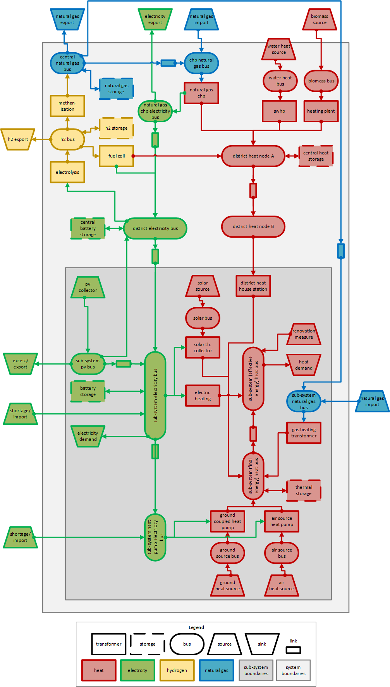

Urban District Upscaling Tool
*****************************

Documentation to be completed soon.

.. figure:: ../images/manual/UpscalingTool/sesmg_process.png
   :width: 50 %
   :alt: Process of the SESMG [1].
   :align: center

Using the Upscaling Tool
------------------------

The upscaling tool can be used with the following steps:

1. Fill the `upscaling sheet`_.
2. If necessary, adjust the "standard_parameters"-xlsx-sheet, for example if electricity prices have increased. 
3. Execute the upscaling tool to generate a energy system model with the structure described below.
4. Execute the automatically generated model_definition-xlsx-sheet.

Upscaling Model
---------------

.. list-table:: Components
   :widths: 25 25 50
   :header-rows: 1
   :align: center

   * - component
     - system level
     - description
   * - sub-system electricity bus
     - sub-system
     - The electric distribution within sub-systems is considered to be loss free. Therefore, the sub-system electricity bus represents the entire distribution system of a sub-system [1].
   * - sub-system electricity demand
     - sub-system
     - The **sub-system electricity demand**-sink is directly connected to the **sub-system electricity bus** [1].
   * - sub-system electricity import
     - sub-system
     - Due to different prices for electricity import, a shortage/import source is connected to every sub-systemssub-system electricity bus [1].
   * - photovoltaic system
     - 
     - 
   * - decentral battery storage
     - sub-system
     - 
   * - renovation measures
     - sub-system
     - 
   * - gas heating system
     - sub-system
     - 
   * - solar heat system
     - sub-system
     - 
   * - surface competition constraint
     - sub-system
     - 
   * - heat pumps
     - sub-system
     - 
   * - electric heating system
     - sub-system
     - 
   * - decentral thermal storage
     - sub-system
     - 
   * - electricity exchange
     - main-system
     - 
   * - district heating system
     - main-system
     - 
   * - biomass heating plant
     - main-system
     - 
   * - central heat storage
     - main-system
     - 
   * - natural gas CHP
     - main-system
     - 
   * - biogas CHP
     - main-system
     - 
   * - central thermal storage
     - main-system
     -
   * - central hydrogen system
     - main-system
     -  
    

     

.. _`upscaling sheet`:
Upscaling sheet
=========================
This part of the documentation is taken from Budde's master's thesis [1].

Category 1
-----------------------

.. csv-table:: Input for the upscaling sheet. Category 1: Building-specific data.
   :header:  label,comment,active,year of construction,distance of electric vehicles,electricity demand,heat demand,building type,units,occupants per unit,gross building area,latitude,longitude,year of construction wall,area outer wall,year of construction windows,area windows,year of construction roof,rooftype,area roof,cluster ID,flow temperature

   x,,,,km/a,kWh / (sqm * a),kWh / (sqm * a),,,,sqm,° WGS 84,° WGS 84,,sqm,,sqm,,,sqm,,°C
   001_building,,1,1800,0,400,400,COM_Food,1,1,100,52.000000,7.000000,1800,50,0,0,1967,flat roof,25,0,60
   002_building,,1,1800,0,0,0,MFB,1,1,50,52.000000,7.000000,1979,100,1999,20,1993,flat roof,50,0,60
   003_building,,1,1800,10000,30,20,SFB,1,1,120,52.000000,7.000000,1994,250,2001,125,1992,step roof,125,0,40
   
- **label**: The building name can be chosen by the user and is the identification number (ID) of a building. The ID must be unique for each building, because all the following columns are assigned to it.
- **comment**: Space for an individual comment, e.g. an indication of which measure this component belongs to.
- **active**: In this cell, users decide whether a building should be considered in the modeling.
- **year of construction**: The year of construction of a building is relevant for the calculation of the heat demand.
- **distance of electric vehicles (km/a)**: The annual kilometers driven are used to create the charging profile of an electric car. The electricity demand for the electric car is considered separately from the building electricity demand.
- **electricity demand (kWh / (m²  a))**: The specific electricity demand is multiplied by the useful building area to calculate the annual demand. If the annual electricity demand is not available as a function of the building floor area, 1 m^2 must be entered for the building floor area.
- **heat demand (kWh / (m² a))**: The specific heat demand is multiplied by the useful building area to calculate the annual demand. If the annual heat demand is not available as a function of the building floor area, 1 m^2 must be entered for the building floor area.
- **building type**: The building usage influences the calculation of the energy demand and the selection of the load profile for buildings. The different building types can be found in the standard parameter documentation (see `standard parameter`_). The following input values are valid: SFB, MFB, COM_Food, COM_Retail, COM_Office, COM_School, COM_Stable, COM_Sports, COM_Workshop, COM_Restaurant and COM_Hotel.
- **units**: The number of housing units is required for calculating the heat demand of residential buildings.
- **occupants per unit**: The occupants per housing unit are required to calculate the electricity demand of the households. If the occupants per housing unit are multiplied by the housing units, the number of occupants per building can be calculated. The summed occupants of all buildings represent the total modeled neighborhood residents and provide a good basis for validation with real data.
- **gross building area	(m²)**: The gross building area is required to calculate the annual electricity and heat demand of commercial buildings and the heat demand of residential buildings. For this purpose, the gross building area is multiplied by the specific electricity and heat demand and a building area factor (see `standard parameter`_). The building area factor depends on the building use and reduces the gross building area by non-usable areas such as the base areas of walls.
- **latitude	(° WGS 84)**: The latitude of the building are required to connect the building to a heating network. In addition, the coordinates are used to obtain weather data for PV systems from an external database. The World Geodetic System 1984 (WGS 84) is used as a reference system.
- **longitude	(° WGS 84)**: The longitude of the building are required to connect the building to a heating network. In addition, the coordinates are used to obtain weather data for PV systems from an external database. The World Geodetic System 1984 (WGS 84) is used as a reference system.
- **year of construction wall**: The year of construction of a walls is relevant for the calculation of the savings potential of insulation measures. For each building, the U-value (also heat transfer coefficient) is obtained from the standard parameter sheet (see `standard parameter`_), depending on the year of construction of the building. In the Energy Saving Ordinance 2014, U-values are defined to achieve the desirable efficiency level 1. These U-values can be maximally achieved in the modeling. The difference between current and minimum U-value is the possible saving of heat demand. The calculation is explained in the standard parameter documentation (see `standard parameter`_).
- **area outer wall	(m²)**: The external wall area is relevant for the calculation of insulation measures.
- **year of construction windows**: The year of construction of windows is relevant for the calculation of the savings potential of insulation measures. For each building, the U-value (also heat transfer coefficient) is obtained from the standard parameter sheet (see `standard parameter`_), depending on the year of construction of the building. In the Energy Saving Ordinance 2014, U-values are defined to achieve the desirable efficiency level 1. These U-values can be maximally achieved in the modeling. The difference between current and minimum U-value is the possible saving of heat demand. The calculation is explained in the standard parameter documentation (see `standard parameter`_).
- **area windows	(m²)**: The window area is relevant for the calculation of insulation measures.
- **year of construction roof**: The year of construction of a roof is relevant for the calculation of the savings potential of insulation measures. For each building, the U-value (also heat transfer coefficient) is obtained from the standard parameter sheet (see `standard parameter`_), depending on the year of construction of the building. In the Energy Saving Ordinance 2014, U-values are defined to achieve the desirable efficiency level 1. These U-values can be maximally achieved in the modeling. The difference between current and minimum U-value is the possible saving of heat demand. The calculation is explained in the standard parameter documentation (see `standard parameter`_).
- **rooftype**: The roof type is differentiated between flat roofs and step roofs. The roof type is relevant for the calculation of insulation measures.
- **area roof	(m²)**: The roof areas are relevant for the calculation of insulation measures.
- **cluster ID**: The cluster ID is used to spatially assign a building to a specific area. The area can be, for example, a settlement or neighborhood. The cluster ID is crucial for spatial clustering.
- **flow temperature	(°C)**: The flow temperature may differ depending on the heating system. The flow temperature should not fall below the heat source temperature of a heat pump. If the outdoor temperature is 35 °C and the flow temperature is 30 °C, the air heat pump is switched off and an alternative technology is used for heat supply.
 

Category 2
-----------------------

.. csv-table:: Input for the upscaling sheet. Category 2: Building investment data.
   :header:  label,HS,ashp,gchp,parcel ID,oil heating,gas heating,battery storage,thermal storage,central heat,electric heating,st or pv 1,roof area 1,surface tilt 1,azimuth 1,st or pv 2,roof area 2,surface tilt 2,azimuth 2

   x,,,,,,,,,,,,(m²),(°),(°),,(m²),(°),(°)
   001_building,1,no,no,no,no,no,no,no,yes,no,0,0,0,0,0,0,0,0
   002_building,1,no,no,no,no,yes,no,no,no,no,pv&st,150,75,100,0,0,0,0
   003_building,1,yes,yes,GCHP25,no,no,yes,yes,yes,no,pv&st,200,50,180,0,0,0,0

- **label**: The building name can be chosen by the user and is the identification number (ID) of a building. The ID must be unique for each building, because all the following columns are assigned to it.
- **ashp**: Air source heat pumps (ASHP) can be considered in the optimization of a building if the air-regenerated noise of the fans does not exceed the limits of the Technical Instructions on Noise Abatement (TA Lärm). There are already some ASHP on the market that meet the requirements.
- **gchp**: Ground-coupled heat pumps are limited by the area required for geothermal collectors or probes. If there is a potential area for the GCHP, the so-called parcel must be assigned to the buildings.
- **parcel ID**: The parcel ID assigns a potential area for GCHP to the buildings. On an additional auxiliary data sheet, users enter the parcel ID and the potential area.
- **heat extraction (kW/m)**: The extraction capacity of the geothermal probes or collectors is crucial for the performance of the heat pumps. The extraction rate should be determined specifically for the location.
- **oil heating, gas heating, electric heating, battery storage, thermal storage**: The technologies are not subject to restrictions and can be considered as an investment alternative.
- **central heat**: If a heating network is available, a network connection can be considered as an investment alternative.
- **st or pv 1**: In this column it is decided whether the roof potential area applies to solar thermal (ST) systems, photovoltaic (PV) systems or to both systems. As soon as both systems are relevant for one area, an area competition arises, which is automatically considered.
- **roof area 1	(m²)**: The roof potential area of a building can be divided into several partial roof areas with respect to the radiation intensity. In total, users can add 30 partial roof areas.
- **surface tilt 1	(°)**: The surface tilt is decisive for the dimensioning of the solar systems and depends on the construction of the roof.
- **azimuth 1	(°)**: The azimuth is also critical to solar system sizing and depends on the orientation of the building.

Category 3
-----------------------

.. csv-table:: Input for the upscaling sheet. Category 3: Central investment data.
   :header:  label,comment,active,technology,latitude,longitude,area,dh_connection,azimuth,surface tilt,flow temperature

   ,,,,° WGS 84,° WGS 84,sqm,,°,°,°C
   electricity_exchange,,1,electricity_exchange,,,,,,, 
   battery_storage,,1,battery,,,,,,, 
   ng_chp,,0,naturalgas_chp,,,,heat_input,,, 
   bg_chp,,0,biogas_chp,,,,heat_input,,, 
   pe_chp,,0,pellet_chp,,,,heat_input,,, 
   wc_chp,,1,woodchips_chp,,,,heat_input,,, 
   swhp,,0,swhp_transformer,,,,heat_input,,, 
   ashp,,0,ashp_transformer,,,,heat_input,,, 
   gchp,free area needed,1,gchp_transformer,,,2500,heat_input,,, 
   ng_heating,,0,naturalgas_heating_plant,,,,heat_input,,, 
   bg_heating,,0,biogas_heating_plant,,,,heat_input,,, 
   pe_heating,,0,pellet_heating_plant,,,,heat_input,,, 
   wc_heating,,1,woodchips_heating_plant,,,,heat_input,,, 
   thermal_storage,,1,thermal_storage,,,,heat_input,,, 
   p2g,,0,power_to_gas,,,,heat_input,,, 
   heat_input,heat center,1,heat_input_bus,52,7,,,,,40
   central_pv_st,free area needed,1,pv&st,52,7,15000,heat_input,180,22.5, 
   screw_turbine,,1,timeseries_source,,,,,,, 

- **label**: The technology name can be chosen arbitrarily by the user and represents the ID of a central technology. The ID must be unique for each technology, because all following columns are assigned to it.
- **comment**: Space for an individual comment, e.g. an indication of which measure this component belongs to.
- **active**: In this cell, users decide whether a technology should be considered in the modeling.
- **technology**: In this cell, the central technologies are considered (see table below).
- **latitude, longitude (° WGS 84)**: The WGS 84 coordinates are required when heat grid centers or ground-mounted solar systems are selected as technologies. The coordinates are used to locate the technologies.
- **area (m²)**: This is where the area for central solar and GCHP systems is entered.
- **dh_connection**: In this cell, the central heat supply technologies are connected to a heat network center. The label of the heat network center must be entered. In addition, the corner points of the street pipes must be located in the auxiliary data sheet. Two WGS 84 coordinates are required for each corner point. The length of the house connection lines (distance between distribution line and house connection point) is calculated automatically. With the perpendicular point method, the shortest path for the house connection lines is always calculated. Twelve different pipe diameters are stored in the standard parameter sheer (see `standard parameter`_), which can be considered as investment alternatives.
- **azimuth	(°)**: For ground-mounted solar systems, the azimuth must be specified. 
- **surface tilt	(°)**: For ground-mounted solar systems, the surface tilt must be specified.
- **flow temperature	(°C)**: For each heat network center, it is necessary to specify the flow temperature at which the technologies feed into the heat network.

.. csv-table:: All possible central technologies.
   :header:  key word,meaning

   electricity_exchange, local energy market
   battery, battery storage
   naturalgas_chp, natrual gas combined heat and power (CHP)
   biogas_chp, biogas CHP
   pellet_chp, pellet CHP
   woodchips_chp, woodchip CHP
   swhp_transformer, surface water heat pump (SWHP)
   ashp_transformer, ASHP
   gchp_transformer, GCHP
   naturalgas_heating_plant, natural gas heating plant
   biogas_heating_plant, biogas heating plant
   pellet_heating_plant, pellet heating plant
   woodchips_heating_plant, woodchips heating plant
   thermal_storage, central thermal storage
   power_to_gas, Power-to-Gas system (electrolyzer; hydrogen storage; fuel cell; methanation; natural gas storage)
   heat_input_bus, heat network center 
   pv&st, central photovoltaic or solar thermal system
   timeseries_source, time series e.g. hydropower plants

Category 4
-----------------------

.. csv-table:: Input for the upscaling sheet. Category 4: Time series.
   :header:  timestamp,dhi,pressure,temperature,windspeed,z0,dni,ghi,ground_temp,water_temp,groundwater_temp,screw_turbine.fix,electric_vehicle.fix

   01.01.2012 00:00,0,100119.3125,8.656125,5.9235,0.159,0,0,12.6,14.62006667,13.06,0.420911041,0
   01.01.2012 01:00,0,100113.836,8.9435,6.455,0.159,0,0,12.6,14.62006667,13.06,0.420911041,0
   01.01.2012 02:00,0,100102.5625,9.210125,6.8535,0.159,0,0,12.6,14.71342667,13.06,0.420911041,0
   01.01.2012 03:00,0,100075.5,9.6415,7.318,0.159,0,0,12.6,14.75492,13.06,0.420911041,0
   01.01.2012 04:00,0,100026.8555,9.9285,7.916,0.159,0,0,12.6,14.99350667,13.06,0.420911041,0
   …,…,…,…,…,…,…,…,…,…,…,…,…

- **timestamp**: The time stamp is entered with an hourly accuracy for one year (8 760 time steps). All further time series are assigned to this time stamp.
- **dhi**: description coming soon
- **pressure**: description coming soon
- **temperature**: description coming soon
- **windspeed**: description coming soon
- **z0**: description coming soon
- **dni**: description coming soon
- **ghi**: description coming soon
- **ground_temp**: The ground temperature serves as a heat source for GCHP.
- **water_temp**: The water temperature serves as a heat source for SWHP.
- **groundwater_temp**: The ground-water temperature serves as a heat source for ground-water heat pumps (GWHP).
- **screw_turbine.fix**: This is a dimensionless time series that indicates the relative utilization of the hydropower screw. Multiplication by the maximum electrical power gives the power per time step.
- **electric_vehicle.fix**: The time series represents the charging power of an electric car. Each time series value is automatically multiplied by the annual kilometers driven and transferred to the model_definition.xlsx.

.. _`standard parameter`:
Standard parameter sheet
=========================
The standard parameter sheet contains all technology-specific data (costs, emissions, efficiencies) as well as all other data (e.g. specific energy requirements) required for energy system modeling. The parameters used are included in the following standard parameter documentation:
https://doi.org/10.5281/zenodo.6974401

The documents contain all values, formulas and related sources used. The standard parameter documentation is intended to ensure the reproducibility of the results. The documentation is continuously updated.

Clustering
----------

References
==========
[1] Budde J., *Leitfaden zur Modellierung von Energiesystemen (2022)*, master thesis.
[2] Klemm, C., Budde J., Vennemann P., *Model Structure for urban energy system optimization models*, unpublished at the time of publication of this documentation, 2021.
