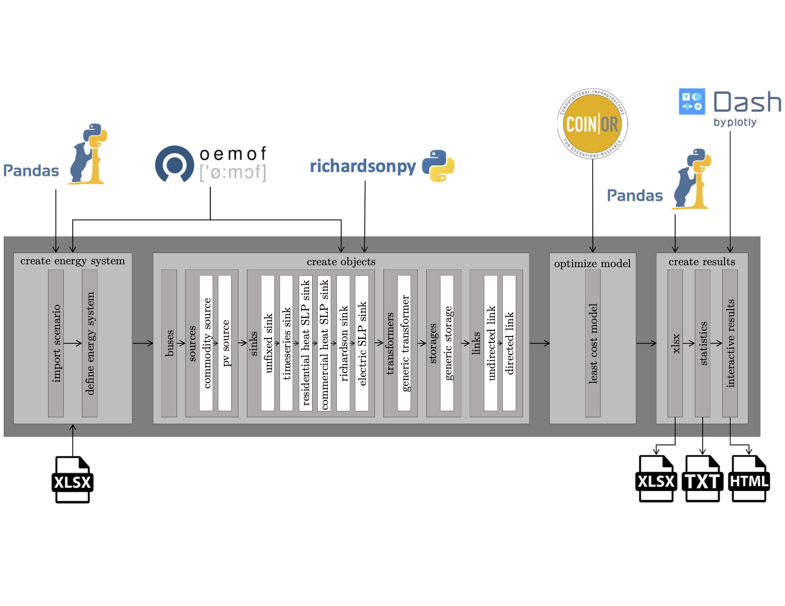

Sourcecode documentation
*************************************************
The Spreadsheet Energy System Model Generator has a hierarchical structure and
consists of a total of four work blocks, which in turn consist of various functions and subfunctions.
The individual (sub-)functions are documented with docstrings according to
the PEP 257 standard. Thus, the descriptions of functions, any information about
input and output variables and further details can be easily accessed via the python
help function. The model generator’s flow chart is shown in the following figure, including all
input and output data, used functions and Python libraries.

	
	Program flow of the Spreadsheet Energy System Model Generator (grey,
	center), as well as local inputs and outputs (bottom) and used Python libraries
	(top).
	
**Create Energy System**. In the first block, the Python library Pandas is used to read
the input xlsx-spreadsheet file. Subsequently, an oemof time index (time steps for a
time horizon with a resolution defined in the input file) is created on the basis of the
parameters imported. This block is the basis for creating the model. The model does
not yet contain any system components, these must be added in the following blocks.

**Create Objects**. In the second block, the system components defined in the xlsxscenario
file are created according to the oemof specifications, and added to the model.
At first, the buses are initialized, followed by the sources, sinks, transformers, storages
and links. With the creation of sources, commodity sources are created first and photovoltaic
sources second. The creation of sinks is divided into six sub-functions, one for
each type of sinks: unfixed sinks, sinks with a given time series, sinks using standard
load profiles (residential heat, commercial heat, electricity) as well as sinks using load
profiles that were created with the Richardson tool. Although it is untypical to convert
a function into a single sub-function, this alternative was chosen for the creation of
transformers and storages. This offers the option to add further sub-functions such as
additional types of transformers and storages lateron. Lastly, the creation of links is
divided into the creation of undirected and directed links.

**Optimize Model**. Within the third block, the CBC solver is utilized to solve the energy
system for minimum costs. It returns the “best” scenario. This block only contains one
function. Again, further functions may be added lateron, for example the combination
of more than one assessment criterion.

**Create Results**. In the last block, the scenario as returned from the CBC solver is
analyzed and prepared for further processing. With the first function of this block, the
results are saved within xlsx-files. It contains ingoing and outgoing energy flows for
every time step of the entire time horizon. With the second function, a set of statistics
for every component is returned into a log-file. Finally, the results are illustrated as
shown in the chapters above.

create energy system 
-------------------------------------------------       

def import_scenario(filepath)
^^^^^^^^^^^^^^^^^^^^^^^^^^^^^^^^^^^^^^^^^^^^^^^^^
	+-----------------------------------------------------+
    | Imports Data from a Spreadsheet Scenario File.	  |
	|													  |
	| The excel sheet has to contain the following sheets:|
	|													  |
    |  -  timesystem									  |
    |  -  buses											  |
    |  -  transformers									  |
    |  -  sinks											  |
    |  -  sources										  |
    |  -  storages										  |
    |  -  powerlines									  |
    |  -  time_series									  |
	|													  |
    +-----------------------------------------------------+
	+-----------------------------------------------------+
    | Parameters										  |
    |     												  |
    |     -  String filename : path to excel scenario file|
    +-----------------------------------------------------+     

      --------------

      Return values
         
         -  dict nodes_data : dictionary containing data from excel scenario file
		 
		 
def define_energy_system(nodes_data)
^^^^^^^^^^^^^^^^^^^^^^^^^^^^^^^^^^^^^^^^^^^^^^^^^

      Creates an energy system.

      Creates an energy system with the parameters defined in the given
      .xlsx-file. The file has to contain a sheet called "timesystem",
      which must have the following structure:

      =================== =================== ===================
      start_date          end_date            temporal resolution
      =================== =================== ===================
      YYYY-MM-DD hh:mm:ss YYYY-MM-DD hh:mm:ss h
      =================== =================== ===================

      --------------

      Parameters
         
         -  dict   nodes_data : dictionary containing data from excel scenario file
         

      --------------

      Return values
         
         -  dict esys : oemof energy system
		 
create objects
-------------------------------------------------
		                
def buses(nodes_data, nodes)
^^^^^^^^^^^^^^^^^^^^^^^^^^^^^^^^^^^^^^^^^^^^^^^^^

      Creates bus objects.

      Creates bus objects with the parameters given in 'nodes_data' and
      adds them to the list of components 'nodes'.

      --------------

      Parameters
         
          -  dict nodes_data : dictionary containing parameters 
		  the buses to be created. The following parameters have to be provided: 
		  		- label,
				- active, 
				- excess, 
				- shortage,
				- shortage costs /(CU/kWh), 
				- excess costs /(CU/kWh)  
				         
          -  list nodes : list of components created before (can be empty)                            
         
      --------------

      Return values
         
         -  dict busd : dictionary containing all buses created
		 
class Sources
^^^^^^^^^^^^^^^^^^^^^^^^^^^^^^^^^^^^^^^^^^^^^^^^^
	  Creates source objects.

	      There are four options for labeling source objects to be created:
	          - 'commodity' : a source with flexible time series
	          - 'timeseries' : a source with predefined time series
	          - 'photovoltaic' : a photovoltaic component
	          - 'wind power' : a wind power component
	  
	def create_source(self, so, timeseries_args)
	+++++++++++++++++++++++++++++++++++++++++++++++++
		Creates an oemof source with fixed / unfixed timeseries
	
		--------------
		
		Paramters
		
			- dict so: dictionary containing all information for the
                   creation of an oemof source.
                   At least the following key-value-pairs have to be
                   included:
                   - 'label'
                   - 'output'
                   - 'periodical costs /(CU/(kW a))'
                   - 'min. investment capacity /(kW)'
                   - 'max. investment capacity /(kW)'
                   - 'existing capacity /(kW)'
                   - 'Non-Convex Investment'
                   - 'Fix Investment Costs /(CU/a)'
                   - 'variable costs /(CU/kWh)'
				   
			- dict timeseries_args: dictionary rather containing the 'fix-attribute'  or the 
					'min-' and 'max-attribute' of a source  
	
	def commodity_source(self,so)
	+++++++++++++++++++++++++++++
		Creates an oemof source with flexible time series (no maximum or minimum) with the use of the
		create_source method.
		
		--------------
		
		Parameters
			
			 - dict so: dictionary containing all information for the
                   creation of an oemof source.
                   At least the following key-value-pairs have to be
                   included:
                   - 'label'
	
	def timeseries_source(self, so ,filepath)
	+++++++++++++++++++++++++++++++++++++++++
		Creates an oemof source object from a pre-defined timeseries with the use of 
		the create_source method.
		
		--------------
		
		Parameters 
			
			 - dict so: dictionary containing all information for the
                  creation of an oemof source.
                  At least the following key-value-pairs have to be
                  included:
                  - 'label'
                  - 'fixed'
				  
			- String filepath: path to .xlsx scenario-file containing a "time_series" sheet
			
	def pv_source(self, so)
	++++++++++++++++++++++
		Creates an oemof photovoltaic source object.

		Simulates the yield of a photovoltaic system using feedinlib and
		creates a source object with the yield as time series 
		and the use of the create_source method.
		
		--------------
		
		Parameters 
			
		 	- dict so: dictionary containing all information for the
                 creation of an oemof source.
                 At least the following key-value-pairs have to be
                 included:
				 - 'label'
				 - 'fixed'
				 - 'Azimuth (PV ONLY)'
				 - 'Surface Tilt (PV ONLY)'
				 - 'Modul Model (PV ONLY)'
				 - 'Inverter Model (PV ONLY)'
				 - 'Albedo (PV ONLY)'
				 - 'Latitude (PV ONLY)'
				 - 'Longitude (PV ONLY)'				                        
			
	def windpower_source(self, so)
	++++++++++++++++++++++++++++++
		Creates an oemof windpower source object.

		Simulates the yield of a windturbine using feedinlib and
		creates a source object with the yield as time series 
		and the use of the create_source method.
			
		--------------
		
		Parameters 
		
		 	- dict so: dictionary containing all information for the
                 creation of an oemof source.
                 At least the following key-value-pairs have to be
                 included:
				 - 'label'
				 - 'fixed'
				 - 'Turbine Model (Windpower ONLY)'
				 - 'Hub Height (Windpower ONLY)'
	
	def __init__(self, nodes_data, nodes, busd, filepath)
	+++++++++++++++++++++++++++++++++++++++++++++++++++++
		Inits the source class.
		
        --------------

        Parameters
         
        	-  dict nodes_data : dictionary containing parameters of sources to be created. 
		   		The following data have to be provided: 
					- 'label'
				    - 'active'
					- 'fixed'
				    - 'output'
				    - 'technology'
				    - 'variable costs / (CU / kWh)'
				    - 'existing capacity / (kW)'
				    - 'min.investment capacity / (kW)'
				    - 'max.investment capacity / (kW)'
				    - 'periodical costs / (CU / (kW a))'
				    - 'Non-Convex Investment'
				    - 'Fix Investment Cost / (CU/a)'
				    - 'Turbine Model (Windpower ONLY)'
				    - 'Hub Height (Windpower ONLY)'
				    - 'technology database(PV ONLY)'
				    - 'inverter database(PV ONLY)'
				    - 'Modul Model(PV ONLY)'
				    - 'Inverter Model(PV ONLY)'
				    - 'Azimuth(PV ONLY)'
				    - 'Surface Tilt(PV ONLY)'
				    - 'Albedo(PV ONLY)'
				    - 'Altitude(PV ONLY)'
				    - 'Latitude(PV ONLY)'
				    - 'Longitude(PV ONLY)'
				
			-  dict bus : dictionary containing the buses of the energy system 
			
			-  list nodes : list of components created before (can be empty) 
			
			-  String filepath : path to .xlsx scenario-file containing a "weather data" sheet 
		 		with timeseries for                                                     
  		 		-  "dhi" (diffuse horizontal irradiation) W/m^2             
  		 		-  "dirhi" (direct horizontal     irradiance) W/m^2              
  		 		-  "pressure" in Pa               
  		 		-  "temperature" in °C            
  		 		-  "windspeed" in m/s             
  		 		-  "z0" (roughness length) in m  
		
		--------------
		
		Other Variables
				
			- list nodes_sources : class intern list of sources that are already created
			
class Sinks
^^^^^^^^^^^^^^^^^^^^^^^^^^^^^^^^^^^^^^^^^^^^^^^^^
	Creates sink objects.

	There are four options for labeling source objects to be
	created:
		- 'unfixed' : a source with flexible time series
	    - 'timeseries' : a source with predefined time series
	    -  SLP : a VDEW standard load profile component
	    - 'richardson' : a component with stochatical generated timeseries
					
	def create_sink(self, de, timeseries_args)
	++++++++++++++++++++++++++++++++++++++++++
		Creates an oemof sink with fixed or unfixed timeseries.
		
        --------------
		
		Parameters
			
			- dict de: dictionary containing all information for the 
				creation of an oemof sink.
				At least the following key-value-pairs have to be 
				included:
			    	- 'label'
					- 'input'
	
			- dict timeseries_args: dictionary rather containing the 'fix-attribute'
            	or the 'min-' and 'max-attribute' of a sink
	
	def unfixed_sink(self, de)
	++++++++++++++++++++++++++
		Creates a sink object with an unfixed energy input and the
		use of the create_sink method.
		
		--------------
		
		Parameters:
		   
			- dict de: dictionary containing all information for the 
				creation of an oemof sink.
				At least the following key-value-pairs have to be 
				included:
			    	- 'label'
			    	- 'nominal value /(kW)'

	def timeseries_sink(self, de, filepath)
	+++++++++++++++++++++++++++++++++++++++
		Creates a sink object with fixed input. The input must be given as a time series 
		in the scenario file. In this context the method uses the create_sink method.
		
		--------------
		
		Parameters:
		
			- dict de: dictionary containing all information for the 
				creation of an oemof sink.
				At least the following key-value-pairs have to be 
				included:
			    	- 'label'
			    	- 'nominal value /(kW)'
					
			- String filepath: path to .xlsx scenario-file containing a "time_series" sheet
			
	def slp_sink(self, de, nd)
	++++++++++++++++++++++++++
		Creates a sink with a residential or commercial SLP time series.
		
		Creates a sink with inputs according to VDEW standard load profiles, 
		using oemofs demandlib. Used for the modelling of residential or commercial
	    electricity demand. In this context the method uses the create_sink method.
		
		--------------
		
		Parameters:
		
			- dict de: dictionary containing all information for the 
				creation of an oemof sink.
				At least the following key-value-pairs have to be 
				included:
					- 'label'
					- 'load profile'
					- 'annual demand /(kWh/a)'
					- 'building class [HEAT SLP ONLY]'
					- 'wind class [HEAT SLP ONLY]'
				
			- dict nd: dictionary containing the whole scenario file
			
	def richardson_sink(self, de, filepath)
	++++++++++++++++++++++++++
		Creates a sink with stochastical timeseries.

		Creates a sink with stochastical input, using richardson.py.
		Used for the modelling of residential electricity demands.
		In this context the method uses the create_sink method.
		
		--------------
		
		Parameters:
		
			- dict de: dictionary containing all information for the 
				creation of an oemof sink.
				At least the following key-value-pairs have to be 
				included:
					- 'label'
					- 'fixed'
					- 'annual demand /(kWh/a)'
					- 'occupants [RICHARDSON]'
				
			- String filepath: path to the .xlsx scenario-file containing a "timesysten" sheet
	
	def __init__(self, nodes_data, busd, nodes, filepath)
	++++++++++++++++++++++++++
		Creates a sink with stochastical timeseries.

		Creates a sink with stochastical input, using richardson.py.
		Used for the modelling of residential electricity demands.
		In this context the method uses the create_sink method.
		
		--------------
		
		Parameters:
		
			- dict de: dictionary containing all information for the 
				creation of an oemof sink.
				At least the following key-value-pairs have to be 
				included:
					- 'label'
					- 'active'
					- 'fixed'
				    - 'input'
				    - 'load profile'
				    - 'nominal value /(kW)'
				    - 'annual demand /(kWh/a)'
				    - 'occupants [Richardson]'
				    - 'building class [HEAT SLP ONLY]'
				    - 'wind class [HEAT SLP ONLY]'
			
			- dict busd: dicitionary containing the buses of the energy system
			
			- list nodes: list of components created before (can be empty)
				
			- String filepath: path to .xlsx scenario-file containing a
                    "weather data" sheet with timeseries for
                        -   "dhi"(diffuse horizontal irradiation)
                            W / m ^ 2
                        -   "dirhi"(direct horizontal irradiance)
                            W / m ^ 2
                        -   "pressure" in Pa
                        -   "temperature" in °C
                        -   "windspeed" in m / s
                        -   "z0"(roughness length) in m
   		
		--------------
		Other variables:
		
			- list nodes_sinks: class intern list of sinks that are already created 
			
class Transformers
^^^^^^^^^^^^^^^^^^^^^^^^^^^^^^^^^^^^^^^^^^^^^^^^^
	
	def generic_transformer(self, tf)
	+++++++++++++++++++++++++++++++++++++++++++++++++

	     Creates a Generic Transformer object.

	     Creates a generic transformer with the paramters given in
	     'nodes_data' and adds it to the list
	     of components 'nodes'.	 
		  
  		--------------
		
  		Parameters:
		
  			- dict de: dictionary containing all information for the 
  				creation of an oemof transformer.
  				At least the following key-value-pairs have to be 
  				included:
					- 'label'
					- 'input'
					- 'output'
					- 'output2'
					- 'efficiency'
					- 'efficiency2'
					- 'variable input costs / (CU/kWh)'
					- 'variable output costs / (CU/kWh)'
					- 'variable output costs 2 / (CU/kWh)'
					- 'periodical costs / (CU/kWh)'
					- 'min. investment capacity / (kW)'
					- 'max. investment capacacity / (kW)'
					- 'existing capacity / (kW)'
					- 'Non-Convex Investment'
					- 'Fix Investment Costs / (CU/a)'
transformers()
^^^^^^^^^^^^^^^^^^^^^^^^^^^^^^^^^^^^^^^^^^^^^^^^^

.. container:: memitem

   .. container:: memproto

      ============================================================================
      def program_files.create_objects.transformers (*nodes_data*, *nodes*, *bus*)   
      ============================================================================

   .. container:: memdoc

      Creates a transformer object.

      Creates transformers objects as defined in 'nodes_data' and adds
      them to the list of components 'nodes'.

      --------------

      Parameters
         
         -  dict nodes_data : dictionary containing data from excel scenario file. The following data have to be provided: label, active, transformer type, input, output, output2, efficiency, efficency2, variable input costs /(CU/kWh), variable output costs /(CU/kWh), existing capacity /(kW), max. investment capacity /(kW), min. investment capacity /(kW), periodical costs /(CU/(kW a))
         -  dict bus : dictionary containing the busses of the energy system  
         -  list nodes : list of components 
		

genericchp_transformer()
+++++++++++++++++++++++++++++++++++++++++++++++++

.. container:: memitem

   .. container:: memproto

      =======================================================================
      def program_files.create_objects.transformers.genericchp_transformer () 
      =======================================================================

   .. container:: memdoc

      Creates a Generic CHP transformer object.

      Creates a generic chp transformer with the paramters given in
      'nodes_data' and adds it to the list
      of components 'nodes'.
	  
class Storages 
^^^^^^^^^^^^^^^^^^^^^^^^^^^^^^^^^^^^^^^^^^^^^^^^^
	Creates oemof storage objects as defined in 'nodes_data' 
	and adds them to the list of components 'nodes'.
	
	def __init__(self, nodes_data, nodes, busd)
	+++++++++++++++++++++++++++++++++++++++++++++++++++++++++
	
		Inits the storage class.
		
  		--------------
		
  		Parameters:
			
			- dict nodes_data: dictionary containing parameters of storages to be
              created.The following data have to be provided:
              		- 'label'
                	- 'active'
                	- 'bus'
                	- 'existing capacity / (kWh)'
                	- 'min.investment capacity / (kWh)'
                	- 'max.investment capacity / (kWh)'
                	- 'Non-Convex Investments'
                	- 'Fix Investment Costs /(CU/a)'
                	- 'input/capacity ratio (invest)'
                    - 'output/capacity ratio (invest)'
                    - 'capacity loss'
                    - 'efficiency inflow'
                    - 'efficiency outflow'
                    - 'initial capacity'
                    - 'capacity min'
                    - 'capacity max'
                    - 'variable input costs'
                    - 'variable output costs' 
					
			- dict busd: dicitionary containing the buses of the energy system
			
			- list nodes: list of components created before (can be empty)
		
class Links:
^^^^^^^^^^^^^^^^^^^^^^^^^^^^^^^^^^^^^^^^^^^^^^^^^
	
	def create_link(self, link, label, outnum)
	+++++++++++++++++++++++++++++++++++++++++++++
	
		Creates an oemof link object with the given parameters and returns it.
		
  		--------------
		
  		Parameters:
			
			- dict link: dictionary containing parameters of link to be
			created.The following data have to be provided:
					- 'bus_1'
					- 'bus_2'
					- 'efficiency'
					- 'variable costs /(CU/kWh)'
					- 'existing capacity /(kW)'
					- 'min. investment capacity /(kW)'
					- 'max. investment capacity /(kW)'
					- 'periodical costs /(CU/(kW a))'
					- 'Non-Convex Investment'
					- 'Fix Investment Costs /(CU/a)'
					
			- String label: separate transmission of the label, because there are two
			labels for an undirected link
			
			- int outnum: Defines in which direction the link is directed.
	
	def __init__(self, nodes_data, nodes, bus)
	+++++++++++++++++++++++++++++++++++++++++++++++
	
		Inits the Links class.
		
  		--------------
		
  		Parameters:
		
			- dict nodes_data: dictionary containing data from excel scenario file. The
			following data have to be provided:
				- 'active'
				- 'label'
				- '(un)directed'
				
			- dict bus: dictionary containing the buses of the energy system
			
			- list nodes: list of components created before (can be empty)
	
optimize model
-------------------------------------------------

def least_cost_model(energy_system)
^^^^^^^^^^^^^^^^^^^^^^^^^^^^^^^^^^^^^^^^^^^^^^^^^

      Solves a given energy system model.

      Solves a given energy system for least costs and returns the
      optimized energy system.

      --------------

      Parameters
         
		  -  energy_system : energy system consisting a number of components 
		 
      --------------

      Return values
         
         -  Model om: solved oemof model
		                             
create_graph()
-------------------------------------------------

.. container:: memitem

   .. container:: memproto

      ============================================================================================
      def program_files.create_graph.create_graph (*filepath*, *nodes_data*, *legend* = ``False``)   
      ============================================================================================

   .. container:: memdoc

      Visualizes the energy system as graph.

      Creates, using the library Graphviz, a graph containing all
      components and connections from "nodes_data" and returns this as a
      PNG file.

      --------------

      Parameters
         
         -  String filepath : path, where the PNG-result shall be saved  
         -  dict nodes_data : dictionary containing data from excel scenario file.                    
         -  bool legend : specifies, whether a legend will be added to the graph or not   

         
charts()
-------------------------------------------------

.. container:: memitem

   .. container:: memproto

      =============================================================================================
      def program_files.create_results.charts (*nodes_data*, *optimization_model*, *energy_system*)   
      =============================================================================================

   .. container:: memdoc

      Plots model results.

      Plots the in- and outgoing flows of every bus of a given,
      optimized energy system

      --------------

      Parameters
         
          -  dict nodes_data : dictionary containing data from excel scenario file    
          -  oemof.solph.models.Model optimization_model: optimized energy system                     
          -  energy_system: original (unoptimized) energy system        

      --------------

      Return values
         
          -  plots plots displaying in and outgoing flows of the energy systems' buses.    
        

prepare_plotly_results()
-------------------------------------------------

.. container:: memitem

   .. container:: memproto

     ====================================================================================================
      def program_files.create_results.prepare_plotly_results (*nodes_data*, *optimization_model*, *energy_system*, *result_path*)
	 ====================================================================================================
   .. container:: memdoc

      Function which prepares the results for the creation of a HTML
      page.

      Creates three pandas data frames and saves them, which are
      required for creating an interactive HTML result page:

      -  df_list_of_components: Consists all components with several
         properties
      -  df_result_table: Consists timeseries of al components
      -  df_summary: Consists summarizing results of the modelling

      --------------

      Parameters
         
         -  dict nodes_data: dictionary containing data from excel scenario file      
         -  oemof.solph.models.Model optimization_model: optimized energy system                    
		 -  energy_system: original (unoptimized) energy system
         -  String result_path: path, where the data frames shall be saved as csv-file  

create results
-------------------------------------------------

xlsx()
^^^^^^^^^^^^^^^^^^^^^^^^^^^^^^^^^^^^^^^^^^^^^^^^^

.. container:: memitem

   .. container:: memproto

      =======================================================================================================
      def program_files.create_results.xlsx (*nodes_data*, *optimization_model*, *energy_system*, *filepath*)   
	  =======================================================================================================

   .. container:: memdoc

      Returns model results as xlsx-files.

      Saves the in- and outgoing flows of every bus of a given,
      optimized energy system as .xlsx file

      --------------

      Parameters
         
         -  dict nodes_data : dictionary containing data from excel scenario file         
         -  oemof.solph.models.Model optimization_model: optimized energy system        
         -  energy_system: original (unoptimized) energy system    
         -  String filepath: path, where the results will be stored 
         
      --------------

      Return values
         
         -  obj '.xlsx' results: xlsx files containing in and outgoing flows of the energy systems' buses.    
		 
statistics()
^^^^^^^^^^^^^^^^^^^^^^^^^^^^^^^^^^^^^^^^^^^^^^^^^

.. container:: memitem

   .. container:: memproto

      =================================================================================================
      def program_files.create_results.statistics (*nodes_data*, *optimization_model*, *energy_system*)   	  
	  =================================================================================================

   .. container:: memdoc

      Returns a list of all defined components with the following
      information:

      +--------------+------------------------------------------------------+
      | component    | information                                          |
      +==============+======================================================+
      | sinks        | Total Energy Demand                                  |
      +--------------+------------------------------------------------------+
      | sources      | Total Energy Input, Max. Capacity, Variable Costs,   |
      |              | Periodical Costs                                     |
      +--------------+------------------------------------------------------+
      | transformers | Total Energy Output, Max. Capacity, Variable Costs,  |
      |              | Investment Capacity, Periodical Costs                |
      +--------------+------------------------------------------------------+
      | storages     | Energy Output, Energy Input, Max. Capacity, Total    |
      |              | variable costs, Investment Capacity, Periodical      |
      |              | Costs                                                |
      +--------------+------------------------------------------------------+
      | links        | Total Energy Output                                  |
      +--------------+------------------------------------------------------+

      Furthermore, a list of recommended investments is printed.

      --------------

      Parameters
         
         -  dict nodes_data: dictionary containing data from excel scenario file 
         -  oemof.solph.models.Model optimization_model: optimized energy system                      
         -  energy_system: original (unoptimized) energy system 
        

           
