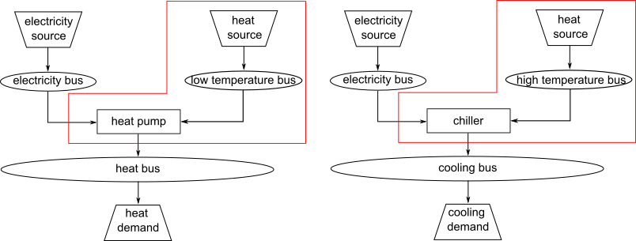
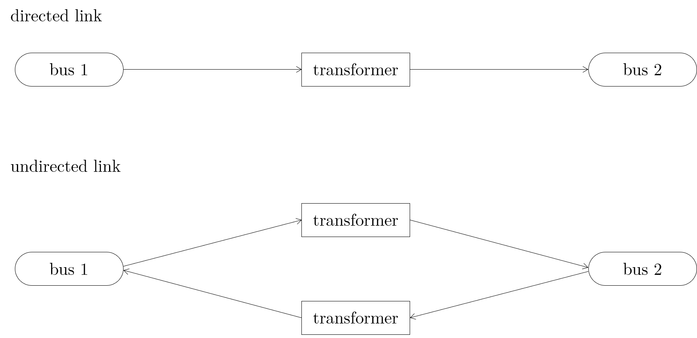
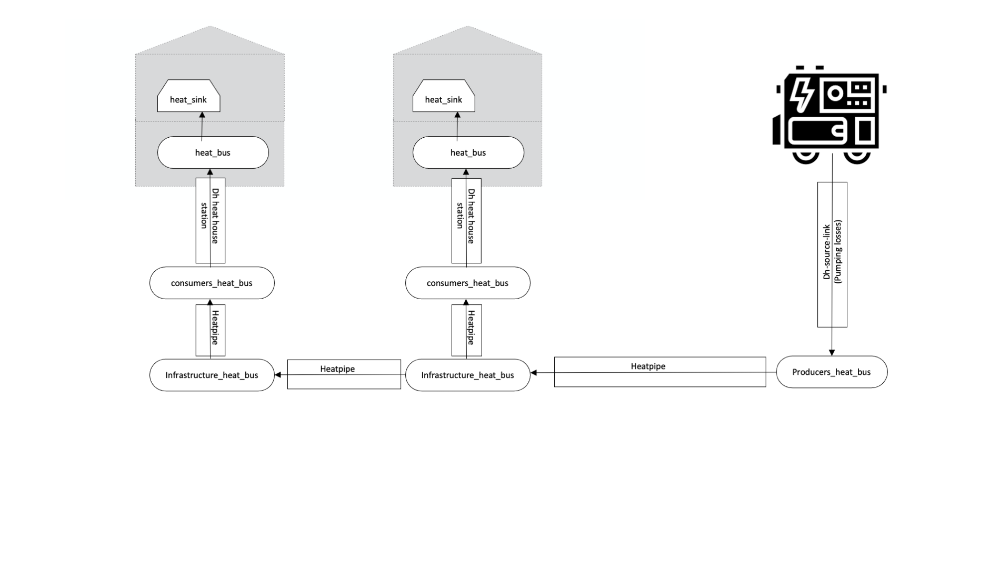

Structure of Energy Systems
*************************************************

Energy systems in the sense of the Spreadsheet Energy System Model Generator are designed according to the
specifications of the `oemof <https://oemof.org>`_ library. Accordingly, 
energy systems can be represented with the help of mathematical graph theory. Thus, energy systems are 
exemplified as "graphs" consisting of sets of "vertices" and "edges". In more specific terms, vertices 
stand for components and buses while directed edges connect them. The status variable of the energy flow 
indicates which amount of energy is transported between the individual nodes at what time. Possible 
components of an oemof energy system are 

- sources,
- sinks,
- transformers, and
- storages. 

Buses furthermore form connection points of an energy system. The graph of a simple energy system 
consisting of each one source, one transformer, one sink, as well as two buses, could look like the 
example displayed in the following figure.
  

   Graph of a simple energy system, consisting of one source, two buses, one transformer, and one a sink.
  
An oemof energy system must be in equilibrium at all times. 
Therefore sources must always provide exactly as 
much energy as the sinks and transformer losses consume. 
In turn, the sink must be able to consume the entire amount 
of energy supplied. If there is no balance, 
oemof is not able to solve the energy system.

Buses
=================================================

The modelling framework oemof does not allow direct connections 
between components. Instead, they must always 
be connected with a bus. The bus in turn can be connected 
to other components, so that energy can be transported via 
the bus. Buses can have any number of incoming and 
outgoing flows. Buses can not directly be connected with 
each other. They do not consider any conversion processes 
or losses.

Sources
=================================================

Sources represent the provision of energy. This can either 
be the exploitation of an energy source (e.g. 
gas storage reservoir or solar energy, no energy source in 
physical sense), or the simplified energy import from 
adjacent energy systems. While some sources may have 
variable performances, depending on the temporary needs of 
the energy system, others have fixed performances, 
which depend on external circumstances. In the latter case, 
the exact performances must be entered to the model in 
form of time series. With the help of oemofs "feedinlib" 
and "windpowerlib", electrical outputs of photovoltaik 
(pv)-systems and wind power plants can be generated 
automatically. In order to ensure a balance in the energy 
system at all times, it may be useful to add a "shortage"
source to the energy system, which supplies energy 
in the event of an energy deficit. In reality, such a 
source could represent the purchase of energy at a fixed price.

**Photovoltaic Systems**

The following Figure sketches the fractions of radiation
arriving at a PV-module as well as further relevant parameters. 

   Radiation on a photovoltaic module.

The global radiation is
composed of direct and diffuse radiation. The "direct horizontal
irradiance" dirhi is the amount of sun radiation as directly
received by a horizontal surface. The "diffuse horizontal irradiance"
dhi is the share of radiation, which arrives via scattering effects
on the same surface. A part of the global radiation is reflected on the ground surface and
can thus cause an additional radiation contribution on the photovoltaic
module. The amount of
the reflected part depends on the magnitude of the albedo of the ground material. Exemplary albedo values are
listed in the following table.

+----------------------------+------------------+
| Material                   | Consumer Group   |
+============================+==================+
| herbage (july, august)     | 0.25             |
+----------------------------+------------------+
| pasture                    | 0.18 - 0.23      |
+----------------------------+------------------+
| uncoppied fields           | 0.26             |
+----------------------------+------------------+
| woods                      | 0.05 - 0.18      |
+----------------------------+------------------+
| heath area                 | 0.10 - 0.25      |
+----------------------------+------------------+
| asphalt                    | 0.15             |
+----------------------------+------------------+
| concrete, clean            | 0.30             |
+----------------------------+------------------+
| concrete, weathered        | 0.2              |
+----------------------------+------------------+
| snow cover, fresh          | 0.80 - 0.90      |
+----------------------------+------------------+
| snow cover, old            | 0.45 - 0.70      |
+----------------------------+------------------+

**Wind Turbines**

For the modeling of wind turbines, the weather data set must
include wind speeds, as well as the roughness length z0 and the pressure. The wind speeds must be available for a 
measurement height of 10 m in the unit m/s.

The system data of the wind turbine to be modelled are obtained 
from the `"oedb" <https://github.com/wind-python/windpowerlib/tree/dev/windpowerlib/oedb>`_ 
database.

**Solar thermal collectors**

There are two collector types that can be modeled with this function.

- flat plate collectors
- concentrated solar power (parabolic through collector)

The irradiance on the flat plate collector is very similar to the 
photovoltaic source, although the reflected irradiance and the 
albedo are not a part of the calculation for flat plate collectors. 
For visualization you can take a look at the graph above. 

The heat output of a parabolic through collector is based on the direct
horizontal irradiance, the diffuse irradiance is not absorbed.

The solar thermal collector function automatically creates a heat
source, a collector bus object and a transformer object. The output 
of the source is the actual heat, the collector would produce due to
its technical parameters. The transformer object embodies the systems 
periphery (pipes, pumps). Thermal losses and the electricity demand
of this periphery can be considered by the transformer.

.. figure:: ../images/structure_of_energy_system/solar_thermal_collector_structure.png
   :width: 50%
   :alt: solar_thermal_system
   :align: center

   Graph of a solar thermal collector system.

The irradiance on the collector, its efficiency and the heat output is
calculated by using `"oemof.thermal" <https://github.com/oemof/oemof-thermal>`_.
Therefore specific values have to be given. Eta 0 is the optical
efficiency of the collector, A1 is the linear heat loss coefficient
and A2 is the quadratic heat loss coefficient. Values for Eta 0, A1
and A2 are collector specific values and can be found in data sheets.
These values are measured and calculated according to DIN EN ISO
9806. The parameters C1 and C2 for concentrated solar power are 
collector specific values as
well. An exemplary  set of values is given
in the documentation on how to use the `scenario file <https://spreadsheet-energy-system-model-generator.readthedocs.io/en/latest/manual/ScenarioSpreadsheet.html#concentrated-solar-power>`_.

The solar irradiance is given in W/sqm. Therefore the collector's heat
output is given in this unit as well. The investment object has to
be power (kW). So the energy output (kW/sqm) has to be multiplied
with a conversion factor. The conversion factor (sqm/kW) is calculated
by dividing the gross aperture area of a collector model by a measured
power output per module, e.g at 1000 W/sqm (DIN EN ISO 9806).

Some data sheets doesn't contain all the necessary data. So another
useful tool is the `"Keymark Certificate Database" <https://keymark.eu/en/certificates/certificates-data-base>`_.
The Keymark Certificate of a flat plate collector contains measured
collector specific test data (a1, a2, eta 0, different power outputs).

Example: `"Keymark Certificate 011-7S2432 F" <https://www.dincertco.de/logos/011-7S2432%20F.pdf>`_.
If this collector is part of the energy model, the conversion factor
is calculated by dividing the gross aperture area (2,53 sqm) by the
power output. Considering an average inside collector temperature
of 40 °C and an outside average temperature of 10°C result in a
temperature difference of 30 K. So, in this case the heat power
output is 1,504 kW and the conversion factor roundabout 1,68 (sqm/kW).

+---------------------------+--------+------+-----+------+-----+------+------+------+------+------+
|                                                              |Power output per collector module |
+                                                              +------+------+------+------+------+
|                                                              |G=1000W/sqm                       |
+---------------------------+--------+------+-----+------+-----+------+------+------+------+------+   
|                           |Aperture|      |     |      |Gross|Tm-Ta                             |
+                           +area    |Gross |Gross|Gross |area +------+------+------+------+------+
|                           |(Aa)    |length|width|heigth|(AG) |0K    |10K   |30K   |50K   |70K   |
+===========================+========+======+=====+======+=====+======+======+======+======+======+
|Collector name             |sqm     |mm    |mm   |mm    |sqm  |W     |W     |W     |W     |W     |
+---------------------------+--------+------+-----+------+-----+------+------+------+------+------+
|Flachkollektor FK 253 HA-4A|2.34    |2104  |1204 |80    |2.53 |1808  |1712  |1504  |1278  |1032  |
+---------------------------+--------+------+-----+------+-----+------+------+------+------+------+

Example for calculation of conversion factor.

.. note::

    If you are calculating a system with the concentrated solar power
    module, you need to be careful. Depending on the azimuth of the system
    some tests have shown, that for some hours of the considered period the
    calculated power output of the concentrated solar power module peaks
    by a factor of e.g. 100 compared to the rest of the period. This was
    observed with increasing azimuth e.g. an azimuth of 270 degrees.
    These peaks in power output are not possible, so the final results
    have to be evaluated carefully. The interactive results in the end
    can help to identify possible peaks very well.

Sinks
=================================================

Sinks represent either energy demands within the energy system or 
energy exports to adjacent systems. Like sources, sinks can either
have variable or fixed energy demands. 
Sinks with variable demands adjust their consumption to the amount 
of energy available. This could for example stand for the sale of 
surplus electricity. However, actual consumers usually have fixed 
energy demands, which do not respond to amount of energy available 
in the system. As with sources, the exact demands of sinks can be 
passed to the model with the help of time series. 

In order to ensure a balance in the energy system at all times, 
it may be appropriate to add an "excess" sink to the energy system, 
which consumes energy in the event of energy surplus. In reality, 
this could be the sale of electricity or the give-away of heat to 
the atmosphere.

**Standard Load Profiles**

Oemof's sub-library `demandlib <https://demandlib.readthedocs.io/en/latest/>`_ 
can be used for the estimation of heat and electricity demands of different 
consumer groups, as based on German standard load profiles (SLP). 
The following electrical standard load profiles of the Association 
of the Electricity Industry (VDEW) can be used:

+--------+---------------------------------------------------+
| Profil | Consumer Group                                    |
+========+===================================================+
|   H0   | households                                        |
+--------+---------------------------------------------------+
|   G0   | commercial general                                |
+--------+---------------------------------------------------+
|   G1   | commercial on weeks 8-18 h                        |
+--------+---------------------------------------------------+
|   G2   | commercial with strong consumption in the evening |
+--------+---------------------------------------------------+
|   G3   | commercial continuous                             |
+--------+---------------------------------------------------+
|   G4   | shop/hairdresser                                  |
+--------+---------------------------------------------------+
|   G5   | bakery                                            |
+--------+---------------------------------------------------+
|   G6   | weekend operation                                 |
+--------+---------------------------------------------------+
|   L0   | agriculture general                               |
+--------+---------------------------------------------------+
|   L1   | agriculture with dairy industry/animal breeding   |
+--------+---------------------------------------------------+
|   L2   | other agriculture                                 |
+--------+---------------------------------------------------+

The following heat standard load profiles of the Association of Energy and Water Management (BDEW) can be used:

+---------+----------------------------------------------------------------+
| Profile | House Type                                                     |
+=========+================================================================+
| EFH     | single family house                                            |
+---------+----------------------------------------------------------------+
| MFH     | multi family house                                             |
+---------+----------------------------------------------------------------+
| GMK     | metal and automotive                                           |
+---------+----------------------------------------------------------------+
| GHA     | retail and wholesale                                           |
+---------+----------------------------------------------------------------+
| GKO     | Local authorities, credit institutions and insurance companies |
+---------+----------------------------------------------------------------+
| GBD     | other operational services                                     |
+---------+----------------------------------------------------------------+
| GGA     | restaurants                                                    |
+---------+----------------------------------------------------------------+
| GBH     | accommodation                                                  |
+---------+----------------------------------------------------------------+
| GWA     | laundries, dry cleaning                                        |
+---------+----------------------------------------------------------------+
| GGB     | horticulture                                                   |
+---------+----------------------------------------------------------------+
| GBA     | bakery                                                         |
+---------+----------------------------------------------------------------+
| GPD     | paper and printing                                             |
+---------+----------------------------------------------------------------+
| GMF     | household-like business enterprises                            |
+---------+----------------------------------------------------------------+
| GHD     | Total load profile Business/Commerce/Services                  |
+---------+----------------------------------------------------------------+

In addition, the location of the building and whether the building is located 
in a "windy" or "non-windy" area are taken into account for the application 
of heat standard load profiles. The following location classes may be considered:

.. _`building classes`:

+-----------+-------------------------------------------------------------------------------+
| Category  | Building Location                                                             |
+===========+===============================================================================+
| 11        | Germany, nationwide                                                           |
+-----------+-------------------------------------------------------------------------------+
| 1         | Bremen                                                                        |
+-----------+-------------------------------------------------------------------------------+
| 2         | Hamburg, Saarland                                                             |
+-----------+-------------------------------------------------------------------------------+
| 3         | Berlin , Hessen, Lower Saxony, North Rhine-Westphalia                         |
+-----------+-------------------------------------------------------------------------------+
| 4         | Baden-Württemberg, Rhineland-Paatinate, Schleswig-Holstein, Saxony            |
+-----------+-------------------------------------------------------------------------------+
| 5         | Brandenburg, Bavaria, Mecklenburg-Western Pomerania, Saxony-Anhalt, Thuringia |
+-----------+-------------------------------------------------------------------------------+

**Stochastic Load Profiles (Richardson Tool)**

The use of standard load profiles has the disadvantage that they only represent 
the average of a larger number of households (> 200). Load peaks of individual 
households (e.g. through the use of hair dryers or electric kettles) are filtered 
out by this procedure. To counteract this, the Spreadsheet Energy System Model Generator offers the 
possibility to generate stochastic load profiles for residential buildings. 
These are generated on the basis of Richardsonpy. Thereby, an arbitrary number of different realistic load profiles
is simulated under consideration of statistic rules. The mean value of a large-enough
number of profiles should, again, result in the standard load profile. However, if calculations
are continued using the individual values before averaging – as in the above
calculation of costs – different values are obtained than when calculating with SLPs.

Transformers
=================================================
Transformers are components with one ore more input flows, which are 
transformed to one or more output flows. Transformers may be power 
plants, energy transforming processes 
(e.g., electrolysis, heat pumps), as well as transport lines with 
losses. The transformers’ efficiencies can be defined for every 
time step (e.g., the efficiency of a thermal 
powerplants in dependence of the ambient temperature).
 
These may have one or more different outputs, e.g., heat and electricity. For the modelling,
the nominal performance of a generic transformer with several outputs,
the respective output ratios, and an efficiency for each output need to be known.

**Compression Heat Transformers**

For the modeling of compression heat pumps and chillers, different heat sources are considered so the
weather data set must include different temperatures. The efficiency of 
the heat pump or chiller cycle process can be described by the coefficient of Performance (COP).
The compression heat transformer function automatically creates a heat source and a low or high 
temperature bus, depending on the mode of operation (see red bubble). So only a transformer
and a electricity bus needs to be created. An example is shown in the following figure.

   
   Graph of a compression heat pump (left) and compression chiller (right).

At the moment it is possible to use ground water, soil (vertical heat exchanger), surface water 
and ambient air as a heat source. 

The compression heat transformers are implemented by using  `"oemof.thermal" <https://github.com/oemof/oemof-thermal>`_ .

**Absorption Heat Transformers**

At this point this function implies the modeling of an absorption chiller. An absorption chiller
object contains a high temperature heat source, the necessary connection bus and a transformer
object, that describes the absorption chiller. The heat source can be waste heat for example.
The efficiency of the absorption chiller is described by the coefficient of Performance (COP).

The necessary parameters for the characteristic equation method are found in the
"characteristic_parameters.csv" in the folder "technical_parameters". According to the oemof.thermal
documentation the parameters for the absorption chillers ‘Rotartica’, ‘Safarik’, ‘Broad_01’ and
‘Broad_02’ are published by `"Puig-Arnavat et al" <https://www.sciencedirect.com/science/article/pii/S0140700709001947?casa_token=WPjcotFne6UAAAAA:ytQ9vrYSHR98goYWIFc-vElyZo98FCXk-DgvdE4mxxBvR2QLNT3y2-p2QQ08t5Cd3Txqmfw1NTs>`_.
The parameters for the machine named "Kuehn" is published by `"Kühn and Ziegler" <https://heatpumpingtechnologies.org/publications/operational-results-of-a-10-kw-absorption-chillerin-heat-pump-mode/>`_.
The labels refer to the following machine types:

+-----------+--------------------------------------------------------------------+
|   label   | Description                                                        |
+===========+====================================================================+
| Rotartica | Single-effect hot-water-fired H2O/LiBr 4.5 kW absorption chiller   |
+-----------+--------------------------------------------------------------------+
| Safarik   | Single-effect hot-water-fired H2O/LiBr 15 kW absorption chiller    |
+-----------+--------------------------------------------------------------------+
| Broad_01  | Single-effect hot-water-fired H2O/LiBr 768 kW absorption chiller   |
+-----------+--------------------------------------------------------------------+
| Broad_02  | Double-effect hot-water-fired H2O/LiBr 1163 kW absorption chiller  |
+-----------+--------------------------------------------------------------------+
| Kuehn     | Single-effect hot-water-fired H2O/LiBr 10 kW absorption chiller    |
+-----------+--------------------------------------------------------------------+

If data for other specific machines are available, they can be added to the
"characteristic_parameters.csv" mentioned above. Please note, that the values
in the "characteristic_parameters.csv" are measured by tests. Therefore the
values for the label "Kuehn" were measured for a machine with 10 kW nominal
cooling capacity. If you calculate a system with a maximum investment of e.g.
100 kW cooling capacity, you should consider that the model assumes, that
these values are linear and scalable. This is not yet proven, so the results
of such a model have to be validated further. Additionally the ambient
temperature dependence of the cooling capacity (cooling output) is not
considered by the model.

The absorption heat transformers are implemented by using  `"oemof.thermal" <https://github.com/oemof/oemof-thermal>`_ .

Links
=================================================
Links can be used to connect two buses or to display transport losses of
networks. Links are not represented by a separate oemof class, they are
rather represented by transformers. In order to map a loss-free
connection between two buses, an efficiency of 1 is used. If a link is
undirected, a separate transformer is used for each direction. 
In an energy system, links can represent, for
example, electrical powerlines, gas pipelines, district heating
distribution networks or similar.

   Representation of directed and undirected links with oemof transformers

Storages
=================================================
Storages are connected to a bus and can store energy from this bus and return it to a later point in time.

Stratified thermal storages use the thermal transmittance of the wall of the stratified thermal storage
(including thermal insulation) for calculating the losses. Specific values can be found in data sheets.

District Heating
=================================================
Different from the previously mentioned points, District Heating is not a component,
but a piped heat supply option, elaborated on the basis of the oemof package DHNx.
Within the district heating approach, a heat producer is connected to the consumers' heat sink
via a link, heat pipes (lossy transformers) and the district heating
house station.

   Representation of the district heating network as described above.

Insulation
=================================================
Thermal insulation represents a possibility to reduce the heat demand of a respective building. For this purpose, an investment decision is used to calculate a U-value and temperature difference dependent saving, which is substracted from the sinks.

Investment
=================================================
The investment costs help to compare the costs of building new components to the costs of further using existing
components instead. The annual savings from building new capacities should compensate the investment costs.
The investment method can be applied to any new component to be built. In addition to the usual component parameters,
the maximum installable capacity needs to be known. Further, the periodic costs need to be assigned to the investment
costs. The periodic costs refer to the defined time horizon. If the time horizon is one year, the periodical costs
correspond to the annualized capital costs of an investment.

Non-Convex-Investments
---------------------------
While a linear programming approach is used for normal investment decisions, a mixed
integer variable is defined for non-convex investment decisions. The model can thus decide, for example, whether
a component should be implemented FULL or NOT. Mixed-integer variables increase the computational effort
significantly and should be used with caution.
