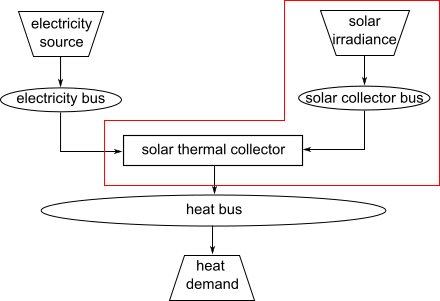

Structure of Energy Systems
*************************************************

Energy systems in the sense of the Spreadseet Energy System Model Generator are designed according to the 
specifications of the `oemof <https://oemof.readthedocs.io/en/stable/index.html>`_ library. Accordingly, 
energy systems can be represented with the help of mathematical graph theory. Thus, energy systems are 
exemplified as "graphs" consisting of sets of "vertices" and "edges". In more specific terms, vertices 
stand for components and buses while directed edges connect them. The status variable of the energy flow 
indicates which amount of energy is transported between the individual nodes at what time. Possible 
components of an oemof energy system are 

- sources,
- sinks,
- transformers, and
- storages. 

Buses furthermore form connection points of an energy system. The graph of a simple energy system 
consisting of each one source, one transformer, one sink, as well as two buses, could look like the 
example displayed in the following figure.
  
.. figure:: ../images/simple_energy_system.png
   :width: 100 %
   :alt: Bus-Example
   :align: center

   Graph of a simple energy system, consisting of one source, two buses, one transformer, and one a sink.
  
An oemof energy system must be in equilibrium at all times. 
Therefore sources must always provide exactly as 
much energy as the sinks and transformer losses consume. 
In turn, the sink must be able to consume the entire amount 
of energy supplied. If there is no balance, 
oemof is not able to solve the energy system.

Buses
=================================================

The modelling framework oemof does not allow direct connections 
between components. Instead, they must always 
be connected with a bus. The bus in turn can be connected 
to other components, so that energy can be transported via 
the bus. Buses can have any number of incoming and 
outgoing flows. Buses can not directly be connected with 
each other. They do not consider any conversion processes 
or losses.

Sources
=================================================

Sources represent the provision of energy. This can either 
be the exploitation of of an energy source (e.g. 
gas storage reservoir or solar energy, no energy source in 
physical sense), or the simplified energy import from 
adjacent energy systems. While some sources may have 
variable performances, depending on the temporary needs of 
the energy system, others have fixed performances, 
which depend on external circumstances. In the latter case, 
the exact performances must be entered to the model in 
form of time series. With the help of oemofs "feedinlib" 
and "windpowerlib", electrical outputs of photovoltaik 
(pv)-systems and wind power plants can be generated 
automatically. In order to ensure a balance in the energy 
system at all times, it may be useful to add a "shortage"
source to the energy system, which supplies energy 
in the event of an energy deficit. In reality, such a 
source could represent the purchase of energy at a fixed price.

**Photovoltaic Systems**

The following Figure sketches the fractions of radiation
arriving at a PV-module as well as further relevant parameters. 

.. figure:: ../images/PV_Aufbau.png
   :width: 100 %
   :alt: pv_systems
   :align: center

   Radiation on a photovoltaic module.

The global radiation is
composed of direct and diffuse radiation. The "direct horizontal
irradiance" dirhi is the amount of sun radiation as directly
received by a horizontal surface. The "diffuse horizontal irradiance"
dhi is the share of radiation, which arrives via scattering effects
on the same surface. A part of the global radiation is reflected on the ground surface and
can thus cause an additional radiation contribution on the photovoltaic
module. The amount of
the reflected part depends on the magnitude of the albedo of the ground material. Exemplary albedo values are
listed in the following table.

+---------------------------+--------------------------------+
| Material 					| Consumer Group                 |
+===========================+================================+
|   herbage (july, august)	| 0.25                           |
+---------------------------+--------------------------------+
|   pasture		   			| 0.18 - 0.23                    |
+---------------------------+--------------------------------+
|   uncoppied fields	   	| 0.26            		         |
+---------------------------+--------------------------------+
|   woods   				| 0.05 - 0.18 					 |
+---------------------------+--------------------------------+
|   heath area 		  		| 0.10 - 0.25                    |
+---------------------------+--------------------------------+
|   asphalt   				| 0.15                           |
+---------------------------+--------------------------------+
|   concrete, clean   		| 0.30                           |
+---------------------------+--------------------------------+
|   concrete, weathered		| 0.20                           |
+---------------------------+--------------------------------+
|   snow cover, fresh   	| 0.80 - 0.90                    |
+---------------------------+--------------------------------+
|   snow cover, old     	| 0.45 - 0.70                    |
+---------------------------+--------------------------------+

**Wind Turbines**

For the modelilng of wind turbines, the weather data set must 
include wind speeds. The wind speeds must be available for a 
measurement height of 10 m in the unit m/s.

The system data of the wind turbine to be modelled are obtained 
from the `"oedb" <https://github.com/wind-python/windpowerlib/tree/dev/windpowerlib/oedb>`_ 
database.

**Solar thermal collectors**

There are two collector types that can be modeled with this function.

- flat plate collectors
- concentrated solar power (parabolic through collector)

The irradiance on the flat plate collector is very similar to the 
photovoltaic source, although the reflected irradiance and the 
albedo are not a part of the calculation for flat plate collectors. 
For visualization you can take a look at the graph above. 

The irradiance on the parabolic through collector is based on the
direct horizontal irradiance dirhi or the direct normal irradiance 
dni. The direct normal irradiance is the amount of irradiance, that
hits a specific area at an angle of 90°. The following figure illustrates
this.

The solar thermal collector function automatically creates a heat
source, a collector bus object and a transformer object. The output 
of the source is the actual heat, the collector would produce due to
its technical parameters. The transformer object embodies the systems 
periphery (pipes, pumps). Thermal losses and the electricity demand
of this periphery can be considered by the transformer.

   Graph of a solar thermal collector system.

Sinks
=================================================

Sinks represent either energy demands within the energy system or 
energy exports to adjacent systems. Like sources, sinks can either
have variable or fixed energy demands. 
Sinks with variable demands adjust their consumption to the amount 
of energy available. This could for example stand for the sale of 
surplus electricity. However, actual consumers usually have fixed 
energy demands, which do not respond to amount of energy available 
in the system. As with sources, the exact demands of sinks can be 
passed to the model with the help of time series. 

In order to ensure a balance in the energy system at all times, 
it may be appropriate to add an "excess" sink to the energy system, 
which consumes energy in the event of energy surplus. In reality, 
this could be the sale of electricity or the give-away of heat to 
the atmosphere.

**Standard Load Profiles**

Oemof's sub-library `demandlib <https://demandlib.readthedocs.io/en/latest/>`_ 
can be used for the estimation of heat and electricity demands of different 
consumer groups, as based on German standard load profiles (SLP). 
The following electrical standard load profiles of the Association 
of the Electricity Industry (VDEW) can be used:

+--------+---------------------------------------------------+
| Profil | Consumer Group                                    |
+========+===================================================+
|   H0   | households                                        |
+--------+---------------------------------------------------+
|   G0   | commercial general                                |
+--------+---------------------------------------------------+
|   G1   | commercial on weeks 8-18 h                        |
+--------+---------------------------------------------------+
|   G2   | commercial with strong consumption in the evening |
+--------+---------------------------------------------------+
|   G3   | commercial continuous                             |
+--------+---------------------------------------------------+
|   G4   | shop/hairdresser                                  |
+--------+---------------------------------------------------+
|   G5   | bakery                                            |
+--------+---------------------------------------------------+
|   G6   | weekend operation                                 |
+--------+---------------------------------------------------+
|   L0   | agriculture general                               |
+--------+---------------------------------------------------+
|   L1   | agriculture with dairy industry/animal breeding   |
+--------+---------------------------------------------------+
|   L2   | other agriculture                                 |
+--------+---------------------------------------------------+

The following heat standard load profiles of the Association of Energy and Water Management (BDEW) can be used:

+---------+----------------------------------------------------------------+
| Profile | House Type                                                     |
+=========+================================================================+
| EFH     | single family house                                            |
+---------+----------------------------------------------------------------+
| MFH     | multi family house                                             |
+---------+----------------------------------------------------------------+
| GMK     | metal and automotive                                           |
+---------+----------------------------------------------------------------+
| GHA     | retail and wholesale                                           |
+---------+----------------------------------------------------------------+
| GKO     | Local authorities, credit institutions and insurance companies |
+---------+----------------------------------------------------------------+
| GBD     | other operational services                                     |
+---------+----------------------------------------------------------------+
| GGA     | restaurants                                                    |
+---------+----------------------------------------------------------------+
| GBH     | accommodation                                                  |
+---------+----------------------------------------------------------------+
| GWA     | laundries, dry cleaning                                        |
+---------+----------------------------------------------------------------+
| GGB     | horticulture                                                   |
+---------+----------------------------------------------------------------+
| GBA     | bakery                                                         |
+---------+----------------------------------------------------------------+
| GPD     | paper and printing                                             |
+---------+----------------------------------------------------------------+
| GMF     | household-like business enterprises                            |
+---------+----------------------------------------------------------------+
| GHD     | Total load profile Business/Commerce/Services                  |
+---------+----------------------------------------------------------------+

In addition, the location of the building and whether the building is located 
in a "windy" or "non-windy" area are taken into account for the application 
of heat standard load profiles. The following location classes may be considered:

+----------+--------------------------------------------------------------------------------+
| Category | Building Location                                             					|
+==========+================================================================================+
| 11       | Germany, nationwide                                           					|
+----------+--------------------------------------------------------------------------------+
| 1        | Bremen                                                       					|
+----------+--------------------------------------------------------------------------------+
| 2        | Hamburg, Saarland                                            					|
+----------+--------------------------------------------------------------------------------+
| 3        | Berlin , Hessen, Lower Saxony, North Rhine-Westphalia         					|
+----------+--------------------------------------------------------------------------------+
| 4        | Baden-Württemberg, Rhineland-Paatinate, Schleswig-Holstein, Saxony 			|
+----------+--------------------------------------------------------------------------------+
| 5        | Brandenburg, Bavaria, Mecklenburg-Western Pomerania, Saxony-Anhalt, Thuringia 	|
+----------+--------------------------------------------------------------------------------+

**Stochastic Load Profiles (Richardson Tool)**

The use of standard load profiles has the disadvantage that they only represent 
the average of a larger number of households (> 200). Load peaks of individual 
households (e.g. through the use of hair dryers or electric kettles) are filtered 
out by this procedure. To counteract this, the Spreadsheet Energy System Model Generator offers the 
possibility to generate stochastic load profiles for residential buildings. 
These are generated on the basis of Richardsonpy. Thereby, an arbitrary number of different realistic load profiles
is simulated under consideration of statistic rules. The mean value of a large-enough
number of profiles should, again, result in the standard load profile. However, if calculations
are continued using the individual values before averaging – as in the above
calculation of costs – different values are obtained than when calculating with SLPs.

Transformers
=================================================
Transformers are components with one ore more input flows, which are 
transformed to one or more output flows. Transformers may be power 
plants, energy transforming processes 
(e.g., electrolysis, heat pumps), as well as transport lines with 
losses. The transformers’ efficiencies can be defined for every 
time step (e.g., the efficiency of a thermal 
powerplants in dependence of  the ambient temperature).

Currently only Generic Transformers can be used within the Spreadsheet Energy System Model Generator. 
These may have one or more different outputs, e.g., heat and electricity. For the modelling,
the nominal performance of a generic transformer with several outputs,
the respective output ratios, and an efficiency for each output need to be known.

**Heat Pumps**

For the modelilng of heat pumps, different heat sources are considered so the 
weather data set must include different temperatures. The efficiency of 
the heat pump cycle process can be described by the Coefficient of Performance (COP).
The heat pump automatically creates a heat source and a low temperature bus (see red bubble).
So only a transformer and a electricity bus needs to be created.
An example is shown in the following figure.

   Graph of a heat pump system.

At the moment it is possible to use ground water, soil (vertical heat exchanger), surface water 
and ambient air as a heat source. 

The heat pumps are implemnted by using  `"oemof.thermal" <https://github.com/oemof/oemof-thermal>`_ .

Links
=================================================
Links can be used to connect two buses or to display transport losses of
networks. Links are not represented by a separate oemof class, they are
rather represented by transformers. In order to map a loss-free
connection between two buses, an efficiency of 1 is used. If a link is
undirected, a separate transformer must be used for each direction. 
In an energy system, links can represent, for
example, electrical powerlines, gas pipelines, district heating
distribution networks or similar.

.. figure:: ../images/link.png
   :width: 50 %
   :alt: links
   :align: center

   Representation of directed and undirected links with oemof transformers

Storages
=================================================
Storages are connected to a bus and can store energy from this bus and return it to a later point in time.

Investment
=================================================
The investment costs help to compare the costs of building new components to the costs of further using existing components instead. The annual savings from building new capacities 
should compensate the investment costs. The investment method can be applied to any new component to be built. In addition to the usual component parameters, the 
maximum installable capacity needs to be known. Further, the periodic costs need to be assigned to the investment costs. The periodic costs refer to the defined 
time horizon. If the time horizon is one year, the periodical costs correspond to the annualized capital costs of an investment.

**Non-Convex-Investments:** While a linear programming approach is used for normal investment decisions, a mixed integer variable is defined for non-convex investment decisions. The model can thus decide, for example, whether a component should be implemented FULL or NOT. Mixed-integer variables increase the computational effort significantly and should be used with caution.
